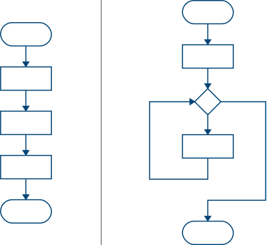
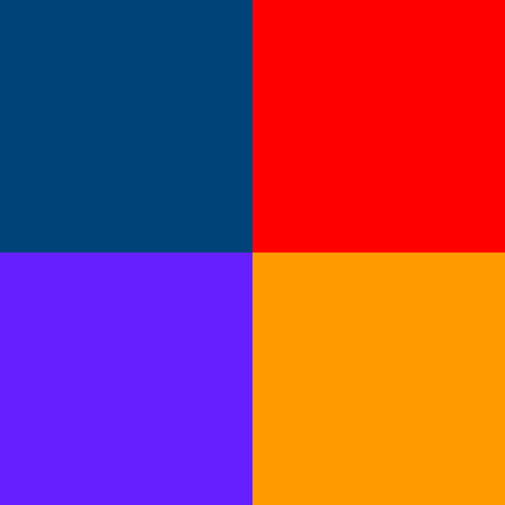
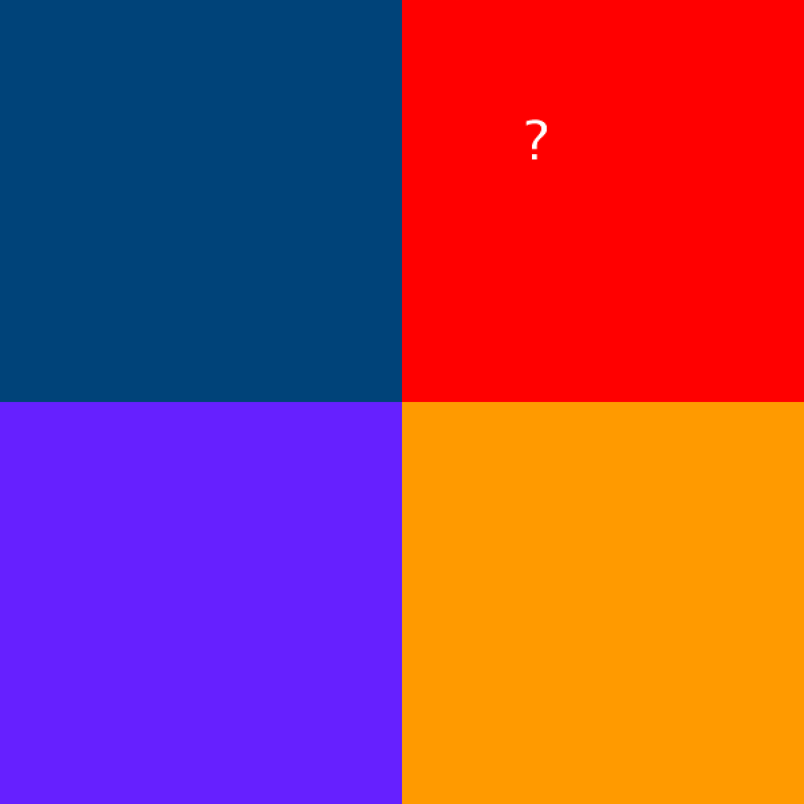
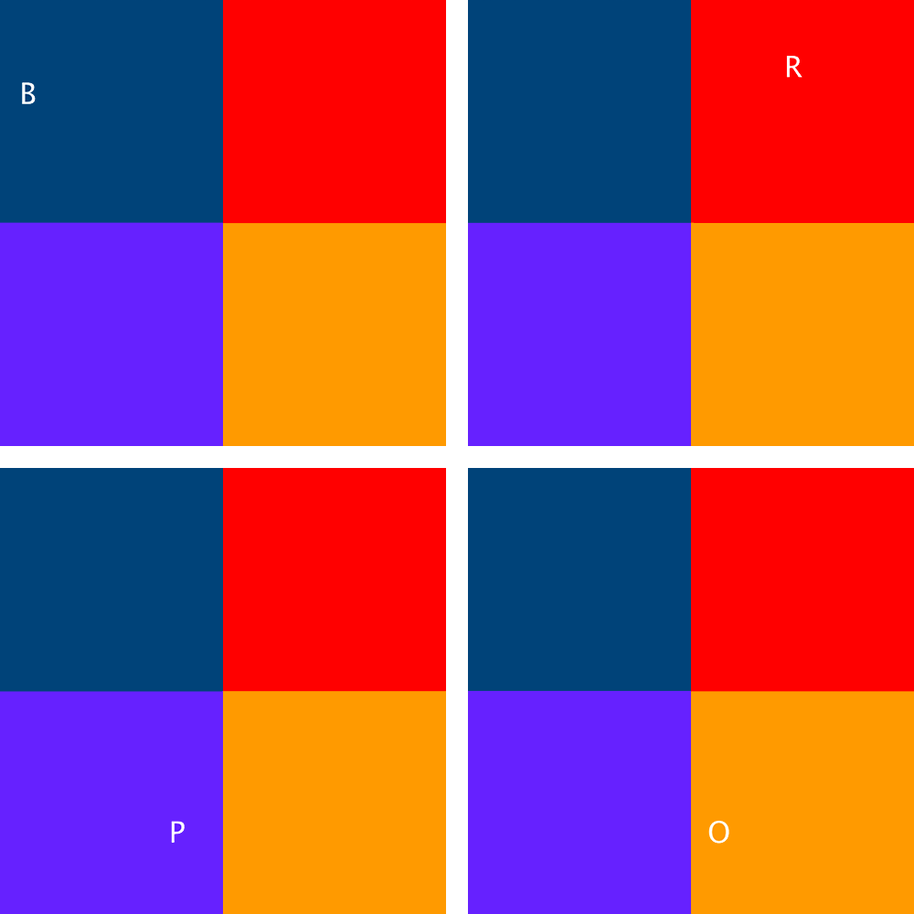

---
jupytext:
  formats: ipynb,md:myst
  text_representation:
    extension: .md
    format_name: myst
    format_version: 0.13
    jupytext_version: 1.14.0
kernelspec:
  display_name: py5bot
  language: python
  name: py5bot
---

By default, code written in py5 is just executed line by line, starting with the very top of the sketch and ending at the bottom. This linear arrangement of code is perfectly acceptable for simple programs, but as your sketches begin to get more complex, you'll often find that laying out divergent paths and loops of behaviors is necessary. Laying out the rules and conditions for the computer to follow these different paths is called *control flow*. 



## conditional statements

A *conditional statement* is really just a fancy way of saying that if a condition is true, the program will do something. If you were communicating with a human, it would be helpful to think of this as a question-and-answer approach, where the answer will lead to some sort of action. If you had blocks of several different colors and several different boxes to put them in, the conditional statement might look like this: 

*A human is shown a colored block.*

*Question*: Is the block red?

*Answer*: Yes.

*Action*: Place it in the box labelled "red blocks".

The way the computerized brain works is similar, but simple conditional statements don't separate these three steps in the same way the human brain does. It's a little more like this: 

*A computer is shown a colored block.*

*Condition*: IF the block is red...

*Action*: ...place it in the box labeled "red blocks."

The question is, how do you communicate these sorts of concepts to the computer? Let's break down ways it can evaluate and store this sort of data.

## boolean data types

There are many simple types of data in py5 (and other programming languages). A single character of text is a *character*, many characters of text form a *string*, a whole number is an *integer*, and a number with a decimal point is a *float*. For comparing conditions to a target like this (*is the block red*), computers use a data type called a *boolean*. 

Strings can hold pretty much any text, and integers/floats pretty much any number. Booleans only have two possible states: `True` or `False`. Let's write some simple code together to demonstrate how this works.

```{code-cell} ipython3
# Declaring and assigning two variables...
block_is_red = True
block_is_blue = False

# What happens when you print these? 
print(block_is_red)
print(block_is_blue)
```

As you might expect, running the above code will print:

```
True
False
```

The capitalization here is important! true, TRUE, and tRuE will all be assumed to be strings, or variables that haven't been assigned properly. If you did need a string that stored the text "True" in it, you would include those quotation marks when you assign the variable - but this is likely to get confusing quickly.

## relational operators

In isolation, variables like this are not always useful. However, when you begin to compare the relationship variables have to each other, the decision-making capabilities of your programs become more powerful. As an example, consider this basic mathematical statement:

```
3 > 2
```

The integers 3 and 2 (our *operands*) are being compared by the greater-than sign (our *operator*). Reading this line, you can immediately tell that it's correct: 3 is larger than 2. To put it in the terms of a computer, 3 > 2 is *True*. You can ask py5 to use relational operators and give you the result of that operation.

```{code-cell} ipython3
# Declaring and assigning a variable...
x = 2

print( x > 1 )        # displays: True
print( x < 1 )        # displays: False
```

Just like our first code, running this will print:

```
True
False
```

Our py5 sketch has received these lines and returned a boolean - true or false - based on whether the comparison is correct. When we start to get into more complex comparisons, this is still the case. When we ask the computer a question to determine its control flow, it evaluates whatever we give it, decides if the answer is `True` or `False`, and moves onwards from there. 

There are a handful of different relational operators we can use in py5 (and Python in general):

```
>    greater-than
<    less-than
>=   greater-than-or-equal-to
<=   less-than-or-equal-to
==   equal-to
!=   not-equal-to
```

As you can imagine, checking if a variable is greater than or less than something else will only work on numbers, whether they're floats and integers. However, you can use `==` and `!=` on other variables, too, to quickly check for a match.

```{code-cell} ipython3
# Declaring and assigning a variable with a string in it...
name = 'Jo'

# Checking if that name is equal to various strings of text...
print( name == 'Jo' ) # displays: True
print( name == 'Em' ) # displays: False
print( name != 'Em' ) # displays: True
```

We've uncovered only part of the puzzle: evaluating statements and figuring out if they're `True` or `False`. The missing piece is instructing our program to take action based on this result.

## if statements

Think back on our colored block example, above.

*A computer is shown a colored block.*

*Condition*: IF the block is red...

*Action*: ...place it in the box labeled "red blocks."

We'll be writing our first simple *if statement* here, to give our program a way to logically decide on its next step. Let's imagine that we were writing a simple program to grade submissions in a university course. We'll do the hard part ourselves - marking the submission with a number out of 100. How can we ask the computer to provide us with a proper grade using that mark?

```{code-cell} ipython3
mark = 60

# If the mark is greater than or equal to fifty, it's a pass!
if mark >= 50:
    print('PASS')
```

This is almost exactly the same as our colored block example, but in the Python syntax!

*A computer is shown a mark.*

*Condition*: IF the mark is greater than, or equal to, 50...

*Action*: ...print the word PASS.

The indenting before the `print()` line is necessary. When we begin the if statement, py5 will look for indented lines following it as the action to take. It doesn't matter how far you indent this code - four spaces or two spaces are common, but it can be a single space or a dozen if you really want - as long as you are consistent and use the same indentation throughout. This means that you can have multiple lines included in the if statement, as long as they are all indented equally.

```{code-cell} ipython3
mark = 60

# If the mark is greater than or equal to fifty, it's a pass!
if mark >= 50:
    print('PASS')
    print('Well done!')
```

If you unindented that second `print()` line, the program would print "Well done!" regardless of the grade. Awkward, but optimistic. 

These if statements can be *nested* inside one another, like Russian nesting dolls. You have to be careful about the indentation, but this can be a powerful - if occasionally inefficient - way to have multiple branching paths in your code. For example, what if you needed to support both an English and Spanish language option in this marking program?

```{code-cell} ipython3
# Setting language to EN - English - in our bilingual marking program
language = 'EN'

mark = 60

if mark >= 50:
    print('PASS')

    if language == 'EN':
        print('Well done!')

    if language == 'ES':
        print('Bien Hecho!')
```

As we know, booleans can only be `True` or `False`. This means that when you're just checking a boolean, you don't even have to compare it to anything. It's not more "correct" to use one or the other - leaving out the operator is efficient, but leaving it in is easy to read. You can also use a variation here, *if not*, to check if something is False without using a operator.

```{code-cell} ipython3
block_is_green = True
block_is_red = False

# This...

if block_is_green == True:
    print('The block is green')

# ...is the same as:

if block_is_green:
    print('The block is green')
    
# And this...
    
if block_is_red == False:
    print('The block is NOT red')
    
# ...is the same as:

if not block_is_red:
    print('The block is NOT red')
```

Let's return to our assignment marking program. Currently, it will only tell you if your mark was a pass. If we instead want it to output letter grades, we'll need multiple if statements.

```{code-cell} ipython3
mark = 60

if mark >= 50:
    print('C')

if mark >= 65:
    print('B')
```

Does that code work? Yes, but with an unintended problem: if you changed your mark to 70, both of those if statements are true, and so the program returns both B and C. Luckily, with flow control, there's a way around this. In addition to regular *if* statements, we can use *else* statements and *else if* statements. Imagine if our computer had to sort quite a few colors of blocks:

*A computer is shown a colored block.*

*Condition*: IF the block is red...

*Action*: ...place it in the box labeled "red blocks."

*But what if the block was NOT red?*

*Condition*: ELSE, IF the block is green...

*Action*: ...place it in the box labeled "green blocks."

*What if you only taught the computer about red and green, but there were a handful of other colors?

*Condition*: ELSE...

*Action*: ...place the block in the box labeled "other colors."

Using Python syntax, *else if* becomes *elif*. This statement will only be evaluated if the preceding statement was false. For our structure to make sense, it's a good idea to start at higher marks, and contain lower marks in an elif statement. That way, the code will continue trying to run through these marks, only moving to the next statement if the current one fails.

```{code-cell} ipython3
mark = 70

if mark >= 80:
    print('A')

# The previous statement wasn't true, so let's move on...
elif mark >= 65:
    print('B')

# And so on, and so forth
elif mark >= 50:
    print('C')

# Actually, none of the previous statements were true!
else:
    print('FAIL')
```

Note that although this is a chain of IF, ELIF and ELSE statements, you don't necessarily need to use all three. Just combining IF and ELIF statements, or an IF statement and an ELSE statement, are completely valid ways to use control flow. It all depends on what you want your program to do. 

## logical operators

So far, each of our if/elif statements have only been evaluating one thing at a time. *Is the mark greater than 50?* For more complex logic, or even to streamline the statements we've already written, you might need to ask something like *is the mark greater than 50, AND less than 65?* For this, we can use logical operators. Actually, you've already taken a sneak peek at one of them, *not*, which checks for the opposite of something. There are three of these logical operators available to us in Python: 

```
and   returns True if both (or all) operands are true
or    returns True if at least one operand is true
not   reverses the boolean (True becomes False and vice-versa)
```

Let's incorporate *and* and *or* into our marking program to handle a few other cases. For example, if I incorrectly put in a mark as 152 or -52, it's better for the program to reject it than to mark it as an A or a FAIL. Plus, maybe if someone is in a certain range below a C, there's still a chance to retrieve their grade and ask them to resubmit. Changing the mark below, you can see the different results. That *or* operator means either condition being true will run the code, and that *and* means both must be true for the code to run.

```{code-cell} ipython3
mark = 152

if mark < 0 or mark > 100:
    print('INVALID MARK')

elif mark >= 80:
    print('A')

elif mark >= 65:
    print('B')

elif mark >= 50:
    print('C')

elif mark >= 45 and mark < 50:
    print('RESUBMIT')

else:
    print('FAIL')
```

## four-square task

It's time for a challenge. This marking program is completely non-visual, which is just not in the spirit of py5. Instead, your task is to create a simple program, using the statements and logical operators we've just discussed, that includes a bit of visual output. 

Let's start off with this code (and you will quickly understand the name of the task):

```{code-cell} ipython3
size(600,600)
no_fill()
no_stroke()

fill('#FF0000') # red quadrant
rect(width/2,0, width/2,height/2)

fill('#004477') # blue quadrant
rect(0,0, width/2,height/2)

fill('#6633FF') # violet quadrant
rect(0,height/2, width/2,height/2)

fill('#FF9900') # orange quadrant
rect(width/2,height/2, width/2,height/2)
```



When run, this code will divide your sketch window into four colored quadrants. You can see we're using the built-in variables of *width* and *height* to easily make sure those quadrants are in the right place, and that they take up exactly one quarter of the window. (This means that your `size()` can be anything, of course.) Now, we'll create two variables for the x and y coordinate of a single character, and place the character at that location.

```{code-cell} ipython3
size(600,600)
no_fill()
no_stroke()

fill('#FF0000') # red quadrant
rect(width/2,0, width/2,height/2)

fill('#004477') # blue quadrant
rect(0,0, width/2,height/2)

fill('#6633FF') # violet quadrant
rect(0,height/2, width/2,height/2)

fill('#FF9900') # orange quadrant
rect(width/2,height/2, width/2,height/2)

x = 400
y = 100
txt = '?'

fill('#FFFFFF')
text_size(40)
text_align(CENTER, CENTER)
text(txt, x,y)
```



Your challenge is to write code that, depending on which quadrant the ? appears in, transforms it into a different character entirely: B for blue, R for red, P for purple or O for orange. If you can change x and y to any values and this works consistently, you've done well.



We'll run through the condition for red (R) together so that you can understand the principle. First, let's add a statement that checks if the character is on the right side of the screen. Of course, we can do this by checking the value of x and change the character accordingly.

```{code-cell} ipython3
size(600,600)
no_fill()
no_stroke()

fill('#FF0000') # red quadrant
rect(width/2,0, width/2,height/2)

fill('#004477') # blue quadrant
rect(0,0, width/2,height/2)

fill('#6633FF') # violet quadrant
rect(0,height/2, width/2,height/2)

fill('#FF9900') # orange quadrant
rect(width/2,height/2, width/2,height/2)

x = 400
y = 100
txt = '?'

if x >= width/2:
    txt = 'R'

fill('#FFFFFF')
text_size(40)
text_align(CENTER, CENTER)
text(txt, x,y)
```

This works because it checks our x value against `width/2`, the center point of the image's width. However, if you change the value of Y to 400, you'll have an R over the orange quadrant of the image. This is because we're only checking our X value, not our Y! Using a logical operator, you can check the values of X and Y simultaneously for a correct result.

```{code-cell} ipython3
size(600,600)
no_fill()
no_stroke()

fill('#FF0000') # red quadrant
rect(width/2,0, width/2,height/2)

fill('#004477') # blue quadrant
rect(0,0, width/2,height/2)

fill('#6633FF') # violet quadrant
rect(0,height/2, width/2,height/2)

fill('#FF9900') # orange quadrant
rect(width/2,height/2, width/2,height/2)

x = 400
y = 100
txt = '?'

if x >= width/2 and y < height/2:
    txt = 'R'

fill('#FFFFFF')
text_size(40)
text_align(CENTER, CENTER)
text(txt, x,y)
```

With that simple fix, our ? will change into an R only if it is in the top-right corner of the sketch window, and remain a ? in the other three corners. Now, write three more if statements to handle what happens in the other three corners. 

If you blaze through that, here's another question: how would you write a final if statement that checks to see if the character is off the edges of the screen, and places it at a position of `100, 100` if that's the case?
