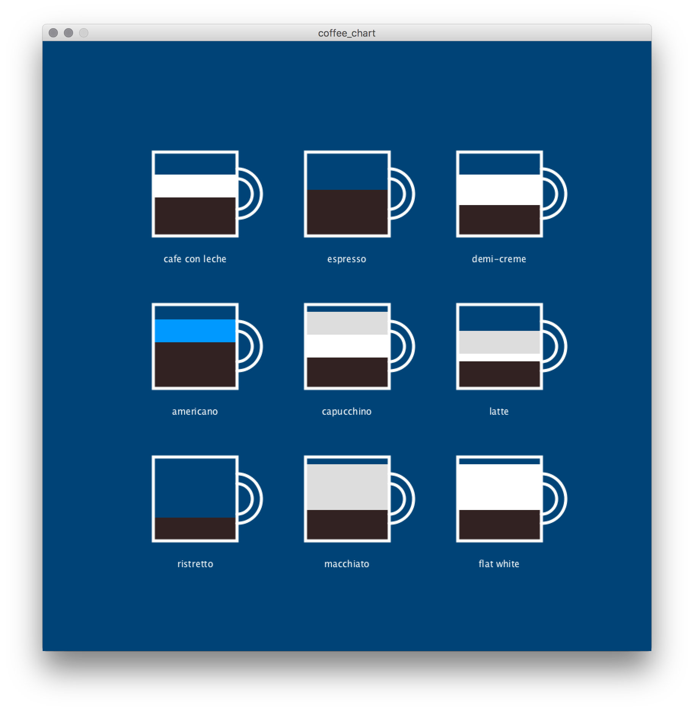
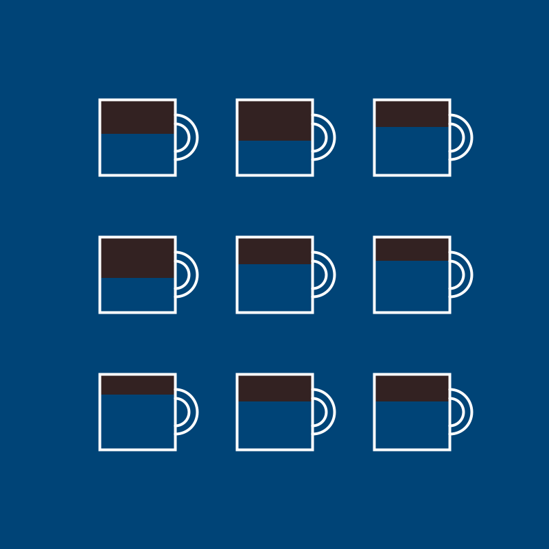
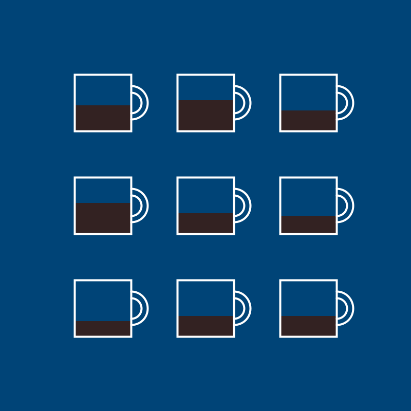

---
jupytext:
  formats: ipynb,md:myst
  text_representation:
    extension: .md
    format_name: myst
    format_version: 0.13
    jupytext_version: 1.14.0
kernelspec:
  display_name: py5
  language: python
  name: py5
---

## dictionaries

You can think of a dictionary as an extension or a variation on the concept of a Python list. In a list, each *value* (whether that's an integer, a string of text, or a second nested list) corresponds to a n index number that represents its position in the list. Dictionaries, instead, associate values with keywords. You'll often see this relationship referred to as *key-value pairs*. 

As with many other functions and coding techniques, there's no clear winner in how dictionaries and lists function, but in certain situations, using one will make more sense. If you wanted to store that you had a student named Sam, who was 24 years old, in a list, you might use code like:

```
studentlist = ['Sam', 24]
```

To store the same values in a dictionary, the syntax is different, but you can also see that these values are explicitly labeled. The *key* for each value comes first, and is wrapped in quotes, like a string of text. It's separated from the value by a colon.

```
studentdict = {'name':'Sam', 'age':24}
```

To get Sam's name from our student list you would use `studentlist[0]`, since it's the first item of the list. To get their name from our student *dictionary*, you have to use the key instead of a number! Just like a list, you can also use the name of a dictionary by itself to retrieve the whole thing. 

```{code-cell} ipython3
def setup():
    studentlist = ['Sam', 24]
    studentdict = {'name':'Sam', 'age':24}

    # print( studentlist[0] )     # would display Sam
    print( studentdict['name'] )  # displays Sam
    print( studentdict['age'] )   # displays 24
    
    print( studentdict )          # {'name': 'Sam', 'age': 24}

run_sketch()
```

Dictionaries have their own set of methods, and many of the Python list methods, like `append()`, `extend()`, `index()`, `insert()`, and `remove()`, do not work on them. You can look up additional dictionary methods, but there are a few which you might find particularly useful: 

*.keys()* returns a list of all keys in the dictionary.

*.values()* returns all of the values. 

*.items()* returns all of the pairs in the dictionary.

```{code-cell} ipython3
def setup():
    studentlist = ['Sam', 24]
    studentdict = {'name':'Sam', 'age':24}

    # print( studentlist[0] )     # would display Sam
    print( studentdict['name'] )  # displays Sam
    print( studentdict['age'] )   # displays 24
    
    print( studentdict )          # {'name': 'Sam', 'age': 24}
    print( studentdict.keys() )   # dict_keys(['name', 'age'])
    print( studentdict.values() ) # dict_values(['Sam', 24])
    print( studentdict.items() )  # dict_items([('name', 'Sam'), ('age', 24)])

run_sketch()
```

You might remember that lists are *ordered*; that is, a list will always have the same sequence, no matter how many times you access it. Dictionaries are not inherently ordered, so you can't rely on the positions of pairs remaining in the same place! 

You'll notice that the format of the values being returned to you is quite specific, defining them as *dict_keys*, *dict_values* or *dict_items*. Depending on what you're doing with it, you might also want to transform this output into a list first, using the `list()` function. 

```{code-cell} ipython3
def setup():
    studentlist = ['Sam', 24]
    studentdict = {'name':'Sam', 'age':24}

    # print( studentlist[0] )     # would display Sam
    print( studentdict['name'] )  # displays Sam
    print( studentdict['age'] )   # displays 24
    
    print( studentdict )          # {'name': 'Sam', 'age': 24}
    print( list( studentdict.keys() ) )   # ['name', 'age']
    print( list( studentdict.values() ) ) # ['Sam', 24]
    print( list( studentdict.items() ) )  # [('name', 'Sam'), ('age', 24)]

run_sketch()
```

So, what's up with those sets of round brackets that you may be seeing when you use the `.items()` method? Round brackets indicate that the items inside of them are a *tuple*. Tuple can be pronounced as "too-ple" or "tuh-ple" depending on who you want to annoy. While tuples are distinct from lists, you can use some of the same syntax to access their values. As an example, let's use the tuples we get from `.items()` as if they were lists.

```{code-cell} ipython3
def setup():
    studentlist = ['Sam', 24]
    studentdict = {'name':'Sam', 'age':24}
    
    # Putting our dictionary items in a variable 
    items = list( studentdict.items())
    # items[0] will access our first tuple
    print( items[0] )             # ('name', 'Sam')
    # Even though a tuple isn't exactly a list, items[0][0] gets the first item in that tuple
    print( items[0][0] )          # name
    # However, a tuple cannot be modified the same way a list can!
    # If uncommented, the below line gives an error.
    # items[0][0] = "test" 

run_sketch()
```

## modifying dictionaries 

Dictionaries are *dynamic*, which means you can modify them any time you like. To change an existing element, you can access it similarly to how you'd access a list item, but using the key instead of an index number. You can use the same syntax to add an entirely new key-value pair. 

```{code-cell} ipython3
def setup():
    studentlist = ['Sam', 24]
    studentdict = {'name':'Sam', 'age':24}
    
    # Changing an existing value
    studentdict['age'] = 25
    print(studentdict)  # {'name': 'Sam', 'age': 25}
    
    # Adding a new value
    studentdict['id'] = 19011501
    print( studentdict ) # {'name': 'Sam', 'id': 19011501, 'age': 25}
    
run_sketch()
```

Deleting items from dictionaries is a little different. You'll be using a statement you haven't encountered before, `del`. 

```{code-cell} ipython3
def setup():
    studentlist = ['Sam', 24]
    studentdict = {'name':'Sam', 'age':24}
    
    # Changing an existing value
    studentdict['age'] = 25
    print(studentdict)  # {'name': 'Sam', 'age': 25}
    
    # Adding a new value
    studentdict['id'] = 19011501
    print( studentdict ) # {'name': 'Sam', 'id': 19011501, 'age': 25}
    
    # Removing a value
    
    del studentdict['age']
    print(studentdict) # {'name': 'Sam', 'id': 19011501}
    
run_sketch()
```

## nested dictionaries

Just like you can have lists of lists, dictionaries can be nested - and when the two are combined, they can be a really good way to store large amounts data.

```{code-cell} ipython3
def setup():
    # This is a dictionary of lists!
    students = {
      'names':['Sam', 'Lee'],
      'ages':[24, 18]
    }
    
    print( students['names'][1] ) # displays Lee
    
run_sketch()
```

```{code-cell} ipython3
def setup():
    # This is a list of dictionaries!
    students = [
      {'name':'Sam', 'age':24},
      {'name':'Lee', 'age':18}
    ]
    print( students[1]['name'] )  # displays Lee

run_sketch()
```

The structure of the data you're using, and its uses, will often dictate which of these options is better. In these examples, if you're storing your student information as a large collection of data, and want to easily look at the ages of every student at once, the dictionary of lists might make more sense. If you're having to refer to these students as individuals, and want their data to be more strictly connected, you might prefer the list of dictionaries. 

## loops and dictionaries

Just like with lists, there will be many situations where you want to iterate through the information stored in dictionaries. This is slightly different than iterating through lists, and will sometimes use of the `.keys()`, `.values()` and `.items()` methods from earlier. This code...

```{code-cell} ipython3
def setup():
    studentdict = {'name':'Sam', 'age':24}
    
    for k in studentdict.keys():
        print(k)
        
run_sketch()
```

...will print the keys, *name* and then *age*, to the console. However, even if you *don't* use `.keys()`, it will be automatically assumed that you want to iterate through the keys in this dictionary. This code does the same thing!

```{code-cell} ipython3
def setup():
    studentdict = {'name':'Sam', 'age':24}
    
    for k in studentdict:
        print(k)
        
run_sketch()
```

If you want to just retrieve the values from a dictionary, you'll have to use `.values()`. 

```{code-cell} ipython3
def setup():
    studentdict = {'name':'Sam', 'age':24}
    
    for v in studentdict.values():
        print(v)
        
run_sketch()
```

Of course, you'll often want both. Using `.items()`, you'll have to name two variables, for the keys and the values. You can name them anything you like (k and v in the example below), but you should always assume the same order - keys, then values.

```{code-cell} ipython3
def setup():
    studentlist = ['Sam', 24]
    studentdict = {'name':'Sam', 'age':24}
    
    for k,v in studentdict.items():
        print(k,v)
    
run_sketch()
```

Want to get these items in a particular order? You might want the help of the `sorted()` function. By default, `sorted()` will order by alphabetical order, so in the below example, *age* takes priority over *name*. 

```{code-cell} ipython3
def setup():
    studentlist = ['Sam', 24]
    studentdict = {'name':'Sam', 'age':24}

    for k,v in sorted( studentdict.items() ):
        print(k,v)
    
run_sketch()
```

Now that we've learned a bit how to work with dictionaries, let's move onto a task.

## coffee chart task

In this task, you'll be combining dictionaries, lists, and loops. The result will be a chart advertising the ratios of espresso, hot water, steamed milk and foamed milk in different types of coffees. First, we'll set up some code to draw our mugs in the right places, and create a list of coffees. 

```{code-cell} ipython3
def setup():
    size(800,800)
    background('#004477')
    
    mug = 110
    col = 1
    row = 1
    coffees = [
      'cafe con leche', 'espresso', 'demi-creme',
      'americano', 'capucchino', 'latte',
      'ristretto', 'macchiato', 'flat white'
    ]

    for coffee in coffees:
        # Positioning the mug, based on current column/row count and sketch size
        x = width/4*col
        y = height/4*row

        # Drawing a mug
        stroke('#FFFFFF')
        stroke_weight(4)
        no_fill()
        arc(x+55,y, 40, 40, -HALF_PI, HALF_PI)
        arc(x+55,y, 65, 65, -HALF_PI, HALF_PI)
        rect(x-mug/2,y-mug/2, mug,mug)
        
        # This code just does the math for our rows and columns. 
        # There are other ways to do this, of course!
        if col%3 == 0:
            row += 1
            col = 1
        else:
            col += 1
            
run_sketch()
```


Great - but a regular list won't cut it for this exercise. Let's replace the list of coffees with a list of *dictionaries*, where each stores the name of the coffee and all of its ingredients in key/value pairs.

```{code-cell} ipython3
def setup():
    size(800,800)
    background('#004477')
    
    mug = 110
    col = 1
    row = 1
    coffees = [
        { 'name':'cafe con leche','espresso':50, 'hotwater':0, 'steamedmilk':30,'foamedmilk':0  },
        { 'name':'espresso',      'espresso':60, 'hotwater':0, 'steamedmilk':0, 'foamedmilk':0  },
        { 'name':'demi-creme',    'espresso':40, 'hotwater':0, 'steamedmilk':40,'foamedmilk':0  },
        { 'name':'americano',     'espresso':60, 'hotwater':30,'steamedmilk':0, 'foamedmilk':0  },
        { 'name':'capucchino',    'espresso':40, 'hotwater':0, 'steamedmilk':30,'foamedmilk':30 },
        { 'name':'latte',         'espresso':35, 'hotwater':0, 'steamedmilk':10,'foamedmilk':30 },
        { 'name':'ristretto',     'espresso':30, 'hotwater':0, 'steamedmilk':0, 'foamedmilk':0  },
        { 'name':'macchiato',     'espresso':40, 'hotwater':0, 'steamedmilk':0, 'foamedmilk':60 },
        { 'name':'flat white',    'espresso':40, 'hotwater':0, 'steamedmilk':60,'foamedmilk':0  }
    ]

    for coffee in coffees:
        x = width/4*col
        y = height/4*row

        stroke('#FFFFFF')
        stroke_weight(4)
        no_fill()
        arc(x+55,y, 40, 40, -HALF_PI, HALF_PI)
        arc(x+55,y, 65, 65, -HALF_PI, HALF_PI)
        rect(x-mug/2,y-mug/2, mug,mug)
        
        if col%3 == 0:
            row += 1
            col = 1
        else:
            col += 1
            
run_sketch()
```

When you're done, the chart will look like this:



Looks a bit daunting? Well, we know that each ingredient will be represented by a `rect()` inside of the mug. Since every one of these coffees contains espresso, it's a safe place to start. I've drawn the espresso before drawing the mug, since that way the mug's outlines will nicely cover it. As my first step, I've filled the mug to the top with espresso, by using the exact same parameters to draw the mug itself.

```{code-cell} ipython3
def setup():
    size(800,800)
    background('#004477')
    
    mug = 110
    col = 1
    row = 1
    coffees = [
        { 'name':'cafe con leche','espresso':50, 'hotwater':0, 'steamedmilk':30,'foamedmilk':0  },
        { 'name':'espresso',      'espresso':60, 'hotwater':0, 'steamedmilk':0, 'foamedmilk':0  },
        { 'name':'demi-creme',    'espresso':40, 'hotwater':0, 'steamedmilk':40,'foamedmilk':0  },
        { 'name':'americano',     'espresso':60, 'hotwater':30,'steamedmilk':0, 'foamedmilk':0  },
        { 'name':'capucchino',    'espresso':40, 'hotwater':0, 'steamedmilk':30,'foamedmilk':30 },
        { 'name':'latte',         'espresso':35, 'hotwater':0, 'steamedmilk':10,'foamedmilk':30 },
        { 'name':'ristretto',     'espresso':30, 'hotwater':0, 'steamedmilk':0, 'foamedmilk':0  },
        { 'name':'macchiato',     'espresso':40, 'hotwater':0, 'steamedmilk':0, 'foamedmilk':60 },
        { 'name':'flat white',    'espresso':40, 'hotwater':0, 'steamedmilk':60,'foamedmilk':0  }
    ]

    for coffee in coffees:
        x = width/4*col
        y = height/4*row
        
        # Adding some espresso!
        no_stroke()
        fill('#332222')
        rect(x-mug/2,y-mug/2, mug,mug)

        stroke('#FFFFFF')
        stroke_weight(4)
        no_fill()
        arc(x+55,y, 40, 40, -HALF_PI, HALF_PI)
        arc(x+55,y, 65, 65, -HALF_PI, HALF_PI)
        rect(x-mug/2,y-mug/2, mug,mug)
        
        if col%3 == 0:
            row += 1
            col = 1
        else:
            col += 1
            
run_sketch()
```


We've got espresso now, but a bit too much of it. One way we could approach this is by using the value attached to the *espresso* key to determine the height of our `rect()`. But there's a bit of lateral thinking in making it look right. 

```{code-cell} ipython3
def setup():
    size(800,800)
    background('#004477')
    
    mug = 110
    col = 1
    row = 1
    coffees = [
        { 'name':'cafe con leche','espresso':50, 'hotwater':0, 'steamedmilk':30,'foamedmilk':0  },
        { 'name':'espresso',      'espresso':60, 'hotwater':0, 'steamedmilk':0, 'foamedmilk':0  },
        { 'name':'demi-creme',    'espresso':40, 'hotwater':0, 'steamedmilk':40,'foamedmilk':0  },
        { 'name':'americano',     'espresso':60, 'hotwater':30,'steamedmilk':0, 'foamedmilk':0  },
        { 'name':'capucchino',    'espresso':40, 'hotwater':0, 'steamedmilk':30,'foamedmilk':30 },
        { 'name':'latte',         'espresso':35, 'hotwater':0, 'steamedmilk':10,'foamedmilk':30 },
        { 'name':'ristretto',     'espresso':30, 'hotwater':0, 'steamedmilk':0, 'foamedmilk':0  },
        { 'name':'macchiato',     'espresso':40, 'hotwater':0, 'steamedmilk':0, 'foamedmilk':60 },
        { 'name':'flat white',    'espresso':40, 'hotwater':0, 'steamedmilk':60,'foamedmilk':0  }
    ]

    for coffee in coffees:
        x = width/4*col
        y = height/4*row
        
        # Adding some espresso!
        no_stroke()
        fill('#332222')
        rect(x-mug/2,y-mug/2, mug, coffee['espresso']) # Using espresso as the height value

        stroke('#FFFFFF')
        stroke_weight(4)
        no_fill()
        arc(x+55,y, 40, 40, -HALF_PI, HALF_PI)
        arc(x+55,y, 65, 65, -HALF_PI, HALF_PI)
        rect(x-mug/2,y-mug/2, mug,mug)
        
        if col%3 == 0:
            row += 1
            col = 1
        else:
            col += 1
            
run_sketch()
```



The espresso is floating! We're drawing our espresso from the top of the cup, but it needs to be sitting on the bottom. This means that we also need to be *offsetting* the espresso, rather than drawing it at the top of the cup. Luckily, we have this value, *mug*, which tells us exactly how tall the cup is. This means that `mug - coffee['espresso']` will give us just the empty pixels meant to be at the top of the mug. Let's put this in a variable. We can then add this value to the Y position of our espresso `rect()` to move it downwards.

```{code-cell} ipython3
def setup():
    size(800,800)
    background('#004477')
    
    mug = 110
    col = 1
    row = 1
    coffees = [
        { 'name':'cafe con leche','espresso':50, 'hotwater':0, 'steamedmilk':30,'foamedmilk':0  },
        { 'name':'espresso',      'espresso':60, 'hotwater':0, 'steamedmilk':0, 'foamedmilk':0  },
        { 'name':'demi-creme',    'espresso':40, 'hotwater':0, 'steamedmilk':40,'foamedmilk':0  },
        { 'name':'americano',     'espresso':60, 'hotwater':30,'steamedmilk':0, 'foamedmilk':0  },
        { 'name':'capucchino',    'espresso':40, 'hotwater':0, 'steamedmilk':30,'foamedmilk':30 },
        { 'name':'latte',         'espresso':35, 'hotwater':0, 'steamedmilk':10,'foamedmilk':30 },
        { 'name':'ristretto',     'espresso':30, 'hotwater':0, 'steamedmilk':0, 'foamedmilk':0  },
        { 'name':'macchiato',     'espresso':40, 'hotwater':0, 'steamedmilk':0, 'foamedmilk':60 },
        { 'name':'flat white',    'espresso':40, 'hotwater':0, 'steamedmilk':60,'foamedmilk':0  }
    ]

    for coffee in coffees:
        empty_space = mug # An empty space variable...
        x = width/4*col
        y = height/4*row
        
        # Adding some espresso!
        empty_space -= coffee['espresso'] # Subtracting our espresso from empty space
        no_stroke()
        fill('#332222')
        rect(x-mug/2,y-mug/2 + empty_space, # Using empty space to offset the start position
             mug, coffee['espresso']) # Using espresso as the height value

        stroke('#FFFFFF')
        stroke_weight(4)
        no_fill()
        arc(x+55,y, 40, 40, -HALF_PI, HALF_PI)
        arc(x+55,y, 65, 65, -HALF_PI, HALF_PI)
        rect(x-mug/2,y-mug/2, mug,mug)
        
        if col%3 == 0:
            row += 1
            col = 1
        else:
            col += 1
            
run_sketch()
```



That's looking much more in line with the laws of gravity! 

Add in the other ingredients by making them their own blocks of code - positioning them using the variables given, and figuring out their height with the values in the dictionary. Delicious!


