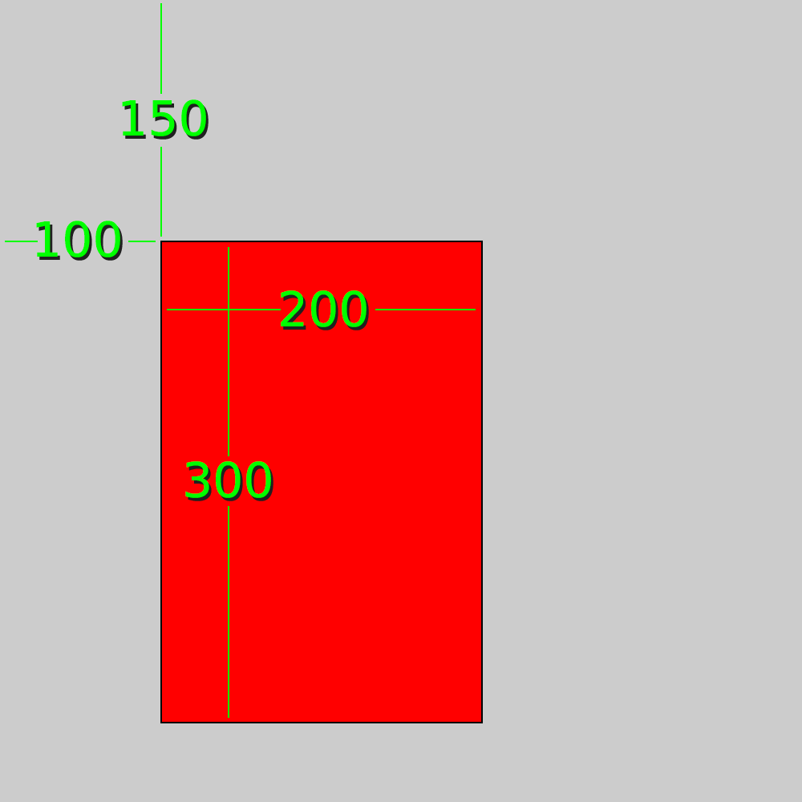
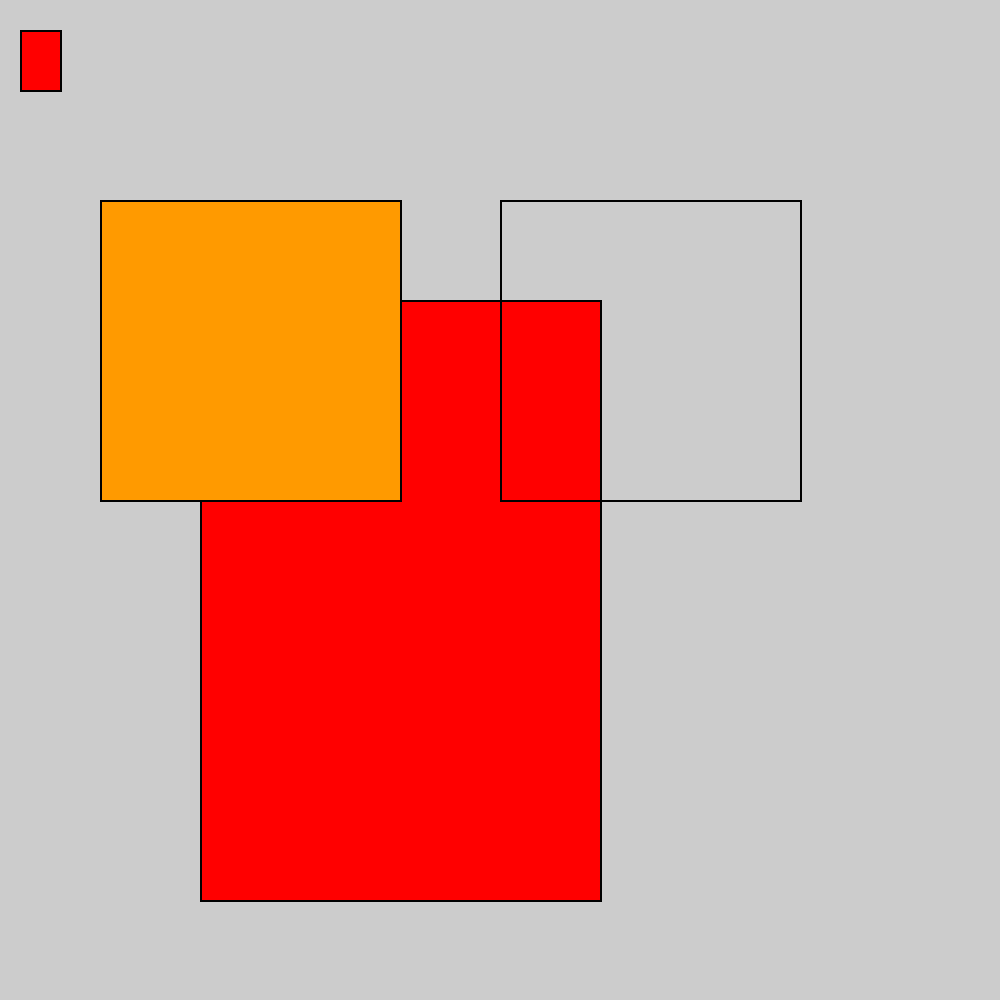
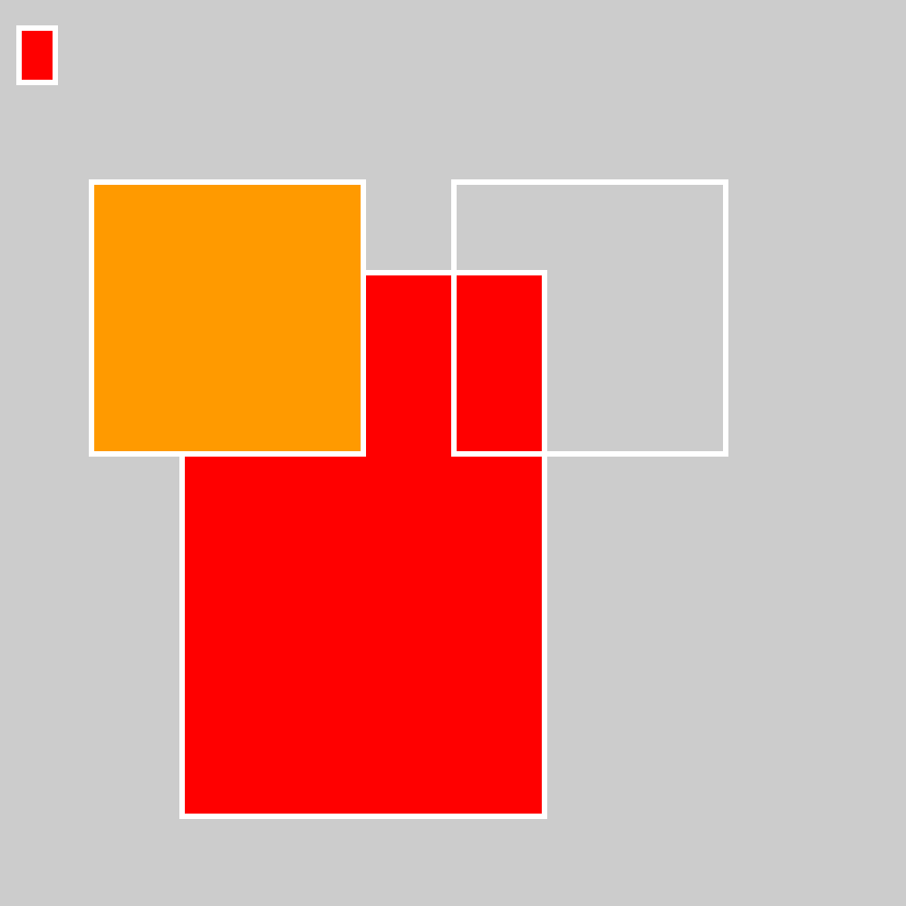
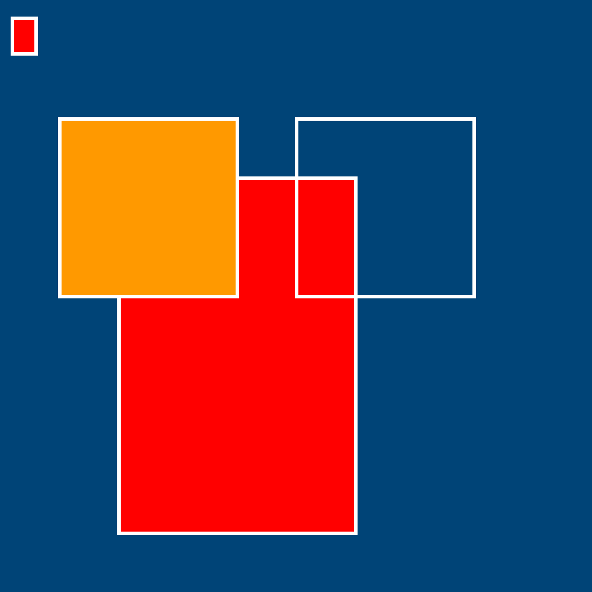
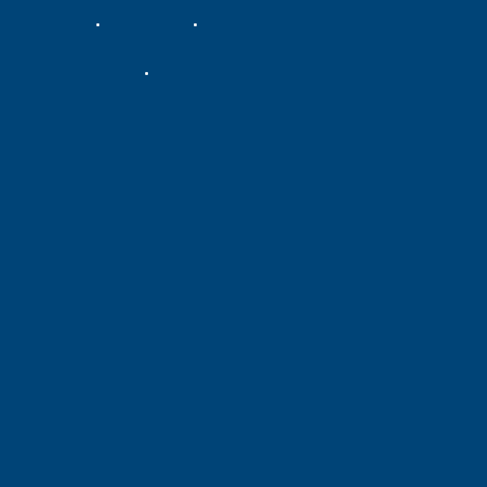
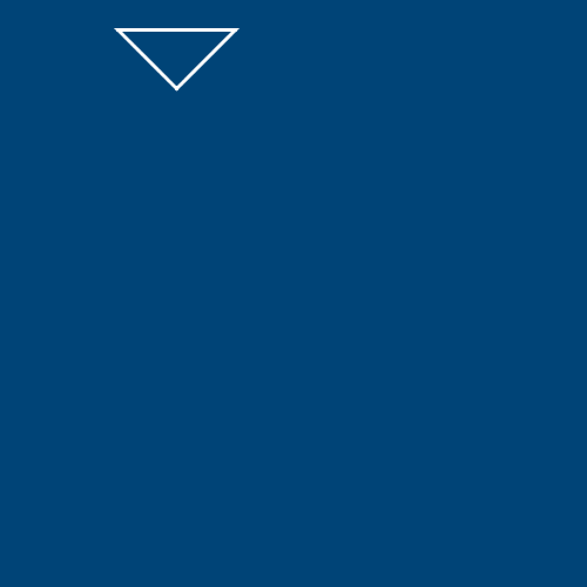
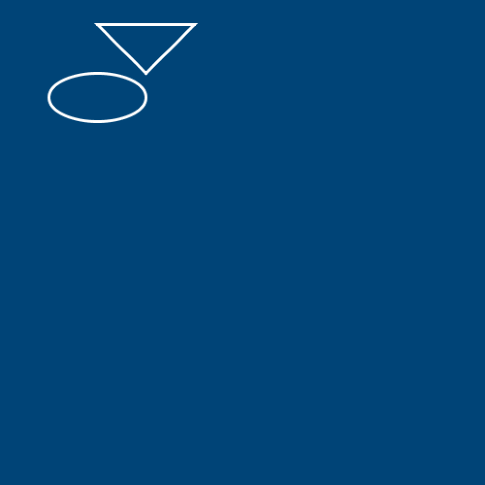
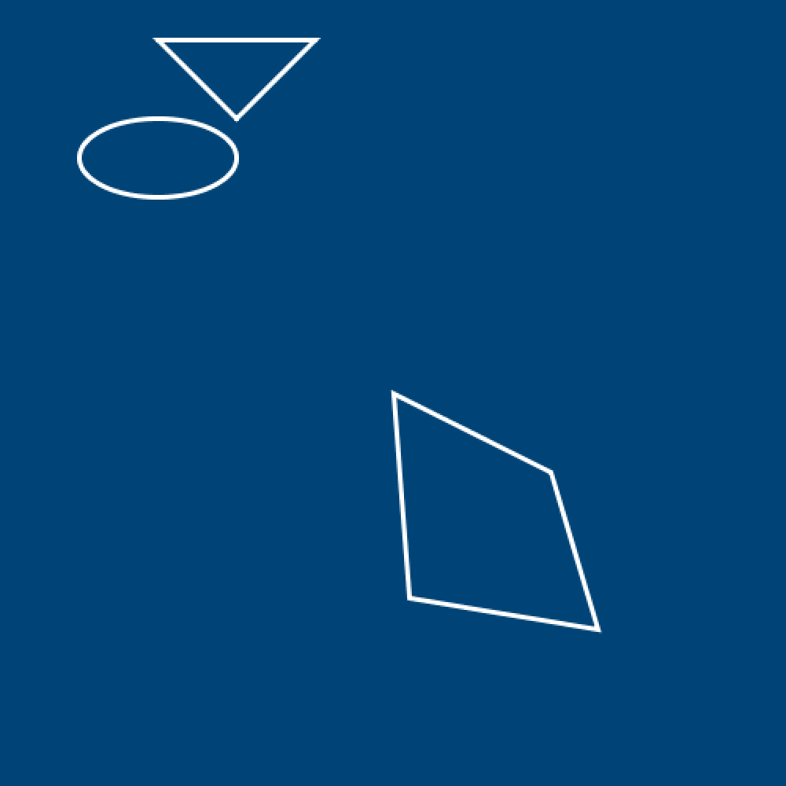
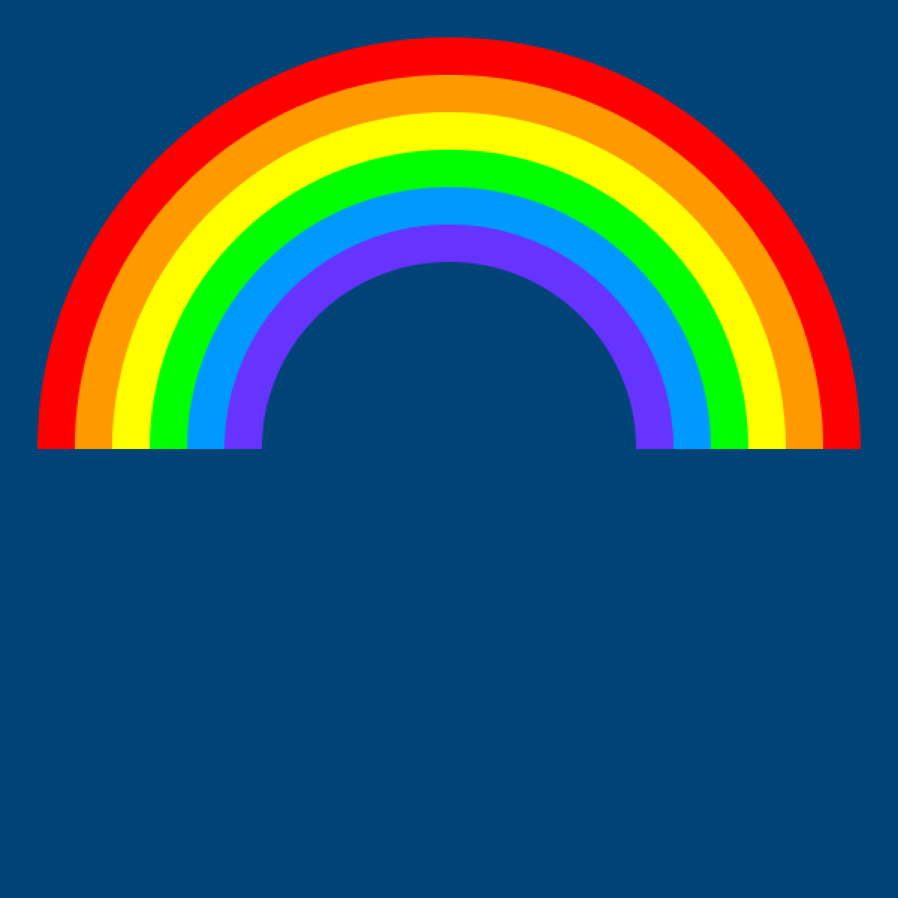

---
jupytext:
  formats: ipynb,md:myst
  text_representation:
    extension: .md
    format_name: myst
    format_version: 0.13
    jupytext_version: 1.14.0
kernelspec:
  display_name: py5bot
  language: python
  name: py5bot
---

# drawing basic elements

Although it's based on Python, which is a general-use or multi-purpose coding language, py5 is made for producing visual output, so you won't be surprised to learn that there are a variety of built-in functions to draw and color 2D shapes. The most basic shapes you can produce will be familiar to pretty much everyone - rectangles (and squares), uneven quadrilateral shapes, ellipses (ovals or circles), triangles, points, and lines. We call these basic shapes *primitives*. In addition to drawing primitives, this page will go into detail on color and controlling outlines in py5.

## color

If you've done any work with graphics editing software like Photoshop or GIMP, you might be familiar with some of the different ways of digitally defining color. For example, you can break a color down into its RGB (Red, Green, and Blue) values, or its HSB (Hue, Saturation, and Brightness). These can both be used in py5 to great effect - for now, we're using RGB values, in particular represented by a *hexadecimal color code* like #FF0000. 

In a hexadecimal (or hex, for short) code like this, each pair of letters or numbers represents a color. The hexadecimal system, instead of only using numbers from 0-9, has an extended counting system where A follows 9, and the highest possible single digit is F. Knowing this demystifies color codes quite a bit. For example, we can tell #FF0000 will be red because the first two digits (R) are at their highest possible value, while the G and B sets of digits are at their lowest possible value. Just like mixing light in a prism, #FFFFFF (RGB all at their highest value) is white, and #000000 is black.

When you're drawing a picture, you might do the linework and then fill it in with color afterwards. In py5, you do this in reverse - you tell the program what color something will be *before* you create it. As an example, let's create a red rectangle in our sketch. To do this, we will use the `fill()` function and the `rect()` function, which take the following arguments:

`fill(color)`

`rect(x_coordinate, y_coordinate, width, height)`

The function `fill()` will begin filling elements in your sketch with color if supplied with a color as its argument. `rect()` will draw a rectangle on your screen - the x coordinate is how far it is from the left edge of the screen, the y coordinate is how far it is from the top edge, and the width and height are simply its dimensions in pixels. Put together, and with those arguments swapped out, your code might look something like this:

```{code-cell} ipython3
# Sizing our sketch to 500 by 500 pixels
size(500,500)

fill('#FF0000')
rect(100, 150, 200, 300)
```

This system of positioning by coordinates is common in many digital spaces, and you'll get your head around it quickly if you haven't already. You can see exactly how it works in this diagram, which has marked the distance between the top-left corner of our `rect()` and the edges of the screen.



The `fill()` function will last until you tell it to stop - no matter how many shapes you draw beneath it, all will have the color you specified. If you'd like to end your `fill()` without replacing it with a different color, to have empty shapes entirely, you use a different function - `no_fill()`. It doesn't take any arguments at all.

```{code-cell} ipython3
size(500,500)

# red rectangles
fill('#FF0000')
rect(100,150, 200,300)
rect(10,15, 20,30)

# orange square
fill('#FF9900')
rect(50,100, 150,150)

# fill-less square
no_fill()
rect(250,100, 150,150)
```



By now you've probably noticed that all of these rectangles have a black outline. This outline can also be called a *stroke*, and that's what we call it in py5. Exactly like `fill()`, we can use `stroke()` with a color to change all subsequent outlines to that color. You can also change how big the outline is with `stroke_weight()` or entirely remove it with `no_stroke()`. Add a white stroke with a `stroke_weight()` of 3 above your rectangles to see how it works:

```{code-cell} ipython3
size(500,500)

# setting our stroke color and width!
stroke('#FFFFFF')
stroke_weight(3)

# red rectangles
fill('#FF0000')
rect(100,150, 200,300)
rect(10,15, 20,30)

# orange square
fill('#FF9900')
rect(50,100, 150,150)

# fill-less square
no_fill()
rect(250,100, 150,150)
```



There's a few more ways to fine-tune those outlines... `stroke_cap()` can change these outlines to be sharper or to stick out, and `stroke_join()` changes how they connect at corners. 

*Reference pages: [stroke_cap()](/reference/sketch_stroke_cap.html) and [stroke_join()](/reference/sketch_stroke_join.html)*

## background colors

As you've already seen, `size()` sets the size in pixels of your entire sketch window. There's also a `background()` function to define the color of the background. Try adding this as the final line of your sketch:

```{code-cell} ipython3
size(500,500)

# setting our stroke color and width!
stroke('#FFFFFF')
stroke_weight(3)

# red rectangles
fill('#FF0000')
rect(100,150, 200,300)
rect(10,15, 20,30)

# orange square
fill('#FF9900')
rect(50,100, 150,150)

# fill-less square
no_fill()
rect(250,100, 150,150)

#dark blue background
background('#004477')
```

If you run the sketch, you'll notice everything has disappeared. This is because py5 draws from the top down, following the lines of your code, so the background is now hiding all the previous lines! Move that line to the top of the window, just after `size()`.

```{code-cell} ipython3
size(500,500)

#dark blue background
background('#004477')

# setting our stroke color and width!
stroke('#FFFFFF')
stroke_weight(3)

# red rectangles
fill('#FF0000')
rect(100,150, 200,300)
rect(10,15, 20,30)

# orange square
fill('#FF9900')
rect(50,100, 150,150)

# fill-less square
no_fill()
rect(250,100, 150,150)
```



Much better. When you're working with still sketches like this, ordering your background, fills and shapes properly will be very important to get the correct visuals. On the other hand, in animated sketches, sometimes the `background()` function can be very useful to clear the entire screen before something else appears. 

## changing color modes

Since a hexadecimal code is equivalent to using the RGB system, you can use straight RGB values for the same effect. By default, these values can go up to 255. For example, `fill('#FF0000')` (where FF represents the highest number possible) is equivalent to `fill(255, 0, 0)`. Why would you want to use one over the other? Well, if you had a program that had to change the color of a shape, and the color is stored as three numbers, it would be a lot easier to simply add to the red, green or blue color value than to try to calculate the differences between hex codes. 

If you wanted to use HSB (hue, saturation, brightness) instead, you can use a function called `color_mode()` in your sketch, before you start coloring things in. If you use color selectors or color pickers in other programs, you will quickly discover that the *hue* is represented by a number from 0 to 360 (exactly like the degrees of a circle), and *saturation* and *brightness* can be anywhere from 0 to 100. Making this system work in your code is pretty straightforward. To use `color_mode()` you need the following arguments: 

`color_mode(TYPE, maximum value, maximum value, maximum value)`

... which in this case means ...

`color_mode(HSB, 360, 100, 100)`

In HSB mode, that bright red color we represented as `fill(255, 0, 0)` would instead be `fill(0, 100, 100)` or `fill(360, 100, 100)` - since the hue range is "circular" and loops back in on itself, either will work. That's a color at the red point of the hue range, with maximum brightness and saturation. Why would you want to use HSB? Think again about a program that might have to change its colors while it runs. If you could simply add to the number representing hue and cycle through the rainbow that way, it would be a lot easier than manually working out how to do that with RGB values!

*Reference pages: [color_mode()](/reference/sketch_color_mode.html)*

# other primitives

You've seen `rect()` used a few different ways, to make rectangles (if the width and height are different) and squares (if those values are the same). Let's take a look at some of the other functions py5 offers for drawing primitive shapes. 

`point(x coordinate, y coordinate)` creates a point, or a single dot, at the position you specify with your arguments. The size of the point will be dependent on your `stroke_weight()`.

```{code-cell} ipython3
size(500,500)

#dark blue background
background('#004477')

# setting our stroke color and width, and removing fill!
no_fill()
stroke('#FFFFFF')
stroke_weight(3)

# three points/dots
point(100, 25)
point(200, 25)
point(150, 75)
```



`triangle(x, y, second x, second y, third x, third y)` is a bit of a mouthful while you're explaining its arguments - but it will draw a triangle on the screen, with the three points of the triangle represented by these three pairs of x and y coordinates. To draw a triangle exactly where we've just drawn our three points, the function would look like this:

```
triangle(100,25, 200,25, 150,75)
```

It's a good time to mention that in order to make your code easier to understand, there's no reason you can't use line breaks and indenting creatively. For example, to make those three pairs of x,y coordinates clearer, you could instead space it out like this, and it still runs:

```
triangle(100,25, # First corner
         200,25, # Second corner
         150,75) # Third corner
```

```{code-cell} ipython3
size(500,500)

#dark blue background
background('#004477')

# setting our stroke color and width, and removing fill!
no_fill()
stroke('#FFFFFF')
stroke_weight(3)

# three points/dots
point(100, 25)
point(200, 25)
point(150, 75)

# triangle
triangle(100,25, # First corner
         200,25, # Second corner
         150,75) # Third corner
```



`ellipse(x, y, width, height)` creates an ellipse at the specified coordinates, with the width and height you choose. Giving the same width and height will create a perfect circle.

```{code-cell} ipython3
size(500,500)

#dark blue background
background('#004477')

# setting our stroke color and width, and removing fill!
no_fill()
stroke('#FFFFFF')
stroke_weight(3)

# three points/dots
point(100, 25)
point(200, 25)
point(150, 75)

# triangle
triangle(100,25, # First corner
         200,25, # Second corner
         150,75) # Third corner

# ellipse
ellipse(100,100, 100,50)
```



Note that the x, y position here is the center of the ellipse, not one of the edges. When we were drawing with the `rect()` function, earlier, that position was the top-left corner of the rectangle. You can change this behavior if you want - by default, py5 uses `ellipse_mode(CENTER)` and `rect_mode(CORNER)`. 
 
*Reference pages: [rect_mode()](/reference/sketch_rect_mode.html) and [ellipse_mode()](/reference/sketch_ellipse_mode.html)*

`quad(x,y, x,y, x,y, x,y)` is a four-cornered or quadrilaterial shape, with each of those corners defined by a pair of x,y coordinates. It gives you more control over its shape than a `rect()` does.

```{code-cell} ipython3
size(500,500)

#dark blue background
background('#004477')

# setting our stroke color and width, and removing fill!
no_fill()
stroke('#FFFFFF')
stroke_weight(3)

# three points/dots
point(100, 25)
point(200, 25)
point(150, 75)

# triangle
triangle(100,25, # First corner
         200,25, # Second corner
         150,75) # Third corner

# ellipse
ellipse(100,100, 100,50)

# a quad
quad(250,250, # Remember, you can
      350,300, # break it up
      380,400, # to understand
      260,380) # what's happening!
```



## rainbow task

Now that you have an understanding of the basic primitive shape functions, it's time to complete a task. We'll be recreating this rainbow image using what you've learned so far. 



If you want to match the colors perfectly, this code might help start you off...

```{code-cell} ipython3
size(600,600)
background('#004477') # dark blue background
no_stroke()

fill('#ff0000') # red 

fill('#ff9900') # orange 

fill('#ffff00') # yellow

fill('#00ff00') # green

fill('#0099ff') # blue

fill('#6633ff') # purple
```

Here's a hint: you don't have to figure out how to make half-circles, or to make gaps in your shapes. Just cover shapes with other shapes, and it'll look the same!
