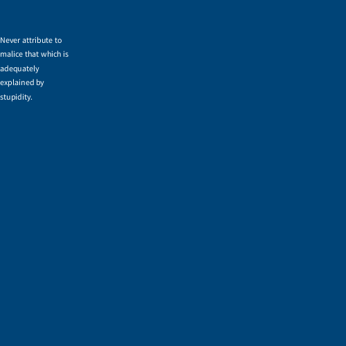
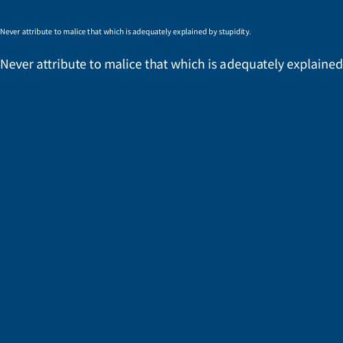
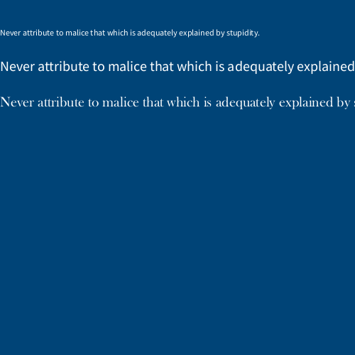
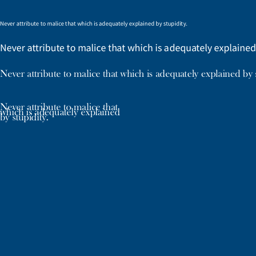
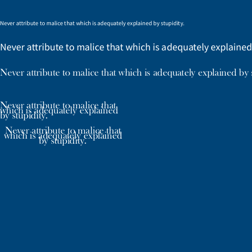
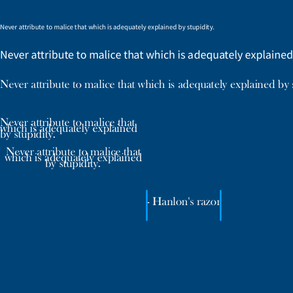

---
jupytext:
  formats: ipynb,md:myst
  text_representation:
    extension: .md
    format_name: myst
    format_version: 0.13
    jupytext_version: 1.14.0
kernelspec:
  display_name: py5bot
  language: python
  name: py5bot
---

# strings and text in py5

We'll be looking at how to render text in py5 in this section. Before we get into it, we'll have to briefly discuss *strings* and functions revolving around them. 

To put it simply, a string is just something we call text in programming terms. Really, we deal with one *character* of text at a time, and a string is a series (or string... get it?) of those characters. These data types are always wrapped in quotation marks when we use them. You can use single or double quote marks, but only one at a time - something unorthodox `"like this'` won't work correctly. 

Let's mess around with strings in the form of variables to understand how they work.

```{code-cell} ipython3
size(500, 500)
background('#004477')

hello = 'hello world'
print(hello)
```

We created a variable, *hello*, and stored a string, "hello world", inside of it. Running this code will print that string back to you.

What if you need to store data with quotation marks inside of it? This code...

```
whatsup = 'what's up!'
```

...would cause an error - the string has ended at that apostrophe/single quotation mark, and everything left on the line is unreadable. This, however, would work:

```
whatsup = "what's up!"
```

Or, you can put a backslash directly before that apostrophe. This is called *escaping* the character, and will force it to be read as regular text. Either works, but you might find escaping preferable if you're dealing with large strings that could contain both kinds of quotation marks.

```{code-cell} ipython3
size(500, 500)
background('#004477')

hello = 'hello world'
print(hello)

whatsup = "what\'s up!"
question = 'is your name really "world"?'
print(whatsup)
print(question)
```

## concatenation and formatting of strings

When we're dealing with numbers (whether whole - *integers* - or decimal - *floats*), you can just perform addition on them using the + operator. However, when you're dealing with strings, the + operate instead will *concatenate* the strings, or connect them together.

```{code-cell} ipython3
size(500, 500)
background('#004477')

hello = 'hello world'
print(hello)

whatsup = "what\'s up!"
question = 'is your name really "world"?'
print(whatsup)
print(question)

all = hello + whatsup + question
print(all)
```

You'll notice this code prints a bit of a mess:

`hello worldwhat's up!is your name really "world"?`

Concatenating just joins your strings together exactly as-is, with nothing separating them. When you're concatenating strings, you'll often want to add in spaces, punctuation or other separators yourself.

```{code-cell} ipython3
size(500, 500)
background('#004477')

hello = 'hello world'
print(hello)

whatsup = "what\'s up!"
question = 'is your name really "world"?'
print(whatsup)
print(question)

all = hello + '. ' + whatsup + ' ' + question
print(all)
```

This displays a much nicer looking string of text.

`hello world. what's up! is your name really "world"?`

There's an alternative in Python (and thus py5) called *string formatting*. Using the % sign as a placeholder, you can format some text any way you like and then tell py5 which strings to use for those placeholders. For the same result as our concatenation above:

```
all = ('%s. %s %s') % (hello, whatsup, question)
```

This has its advantages, but it's a bit harder to read and understand as a beginner, so we'll be using concatenation for now. Before we move on, we'll go over a few different ways to work with text that may come in useful. 

### length

"Length" (*len* for short) will just give you the total number of characters in any string.

```
print( len(all) )  # displays total number of characters (52)
```

### slice notation

Slice notation (using square brackets) in Python lets you fetch the 1st, or 5th, or 37th (etc, etc) character from any string. We refer to the number of the character you're trying to get as the *index*, and we start counting at 0 instead of at 1. 

```
print( all[0] )    # displays the first character (h)
print( all[1] )    # displays character at index 1 (e)
print( all[4] )    # displays character at index 4 (o)
```

You can also use a colon (`:`) in your slice notation to get sections, or ranges, of characters in a string. To get everything up to, but not including, the character at this index:

```
print( all[:4] )   # displays: hell
```

A number on each side of the colon can get only the characters between those two index numbers:

```
print( all[1:4] )  # displays: ell
```

You can also get everything from a given index to the end of the string:

```
print( all[4:] )   # displays: o world... (and so on)
```

And you can even use negative numbers for an interesting wrapping-around behavior! 

```
# [:-x] returns everything from index 0 up to 
# but not including the fourth last character
print( all[:-4] )  # ...our name really "wor

# [-x:] returns everything from the fourth last character
# to the end of the string

print( all[-4:] )  # ld"?

# [x:-y] returns everything from index 4
# up to but not including the fourth last character
print( all[4:-4] ) # o world. ...eally "wor
````

## string methods 

In addition to functions, which take our variables as an argument, Python and py5 have *methods*, which are appended to the end of our variables. For now, it's enough to know the difference between them and how you write them. Using our length function has the format of `len(all)`, while a method might look more like `all.upper()` (which we'll explain in a moment). Trying to use a function as a method (`all.len()`) or a method as a function (`upper(len)`) will give you an error, so it's important not to mix them up. Let's go over a few methods that you can add to your code. 

`.upper()` will give you a version of the string with all lowercase characters converted to uppercase.

```
print( all.upper() )         # HELLO WORLD... (and so on)
```

`.title()` will give you a version of the string in title case, where the first letter of each word is capitalized.

```
print( all.title() )         # Hello World...
```

`.count()` will give you the number of times the character (or sequence of characters) appears in a string.

```
print( all.count('o') )      # 4
print( all.count('or') )     # 2
```

`.find()` will return the index at which you can first find a given string. If it can't find this substring (string within a string) at all, it will instead return -1. 

```
print( all.find('world') )   # 6
print( all.find('lemon') )   # -1
```

If something appears multiple times, it might be helpful to start `.find()` at a certain point - you can add a second optional argument that is the index to begin finding from, and even a third argument, the index where `.find()` should stop.

```
print( all.find('world',7) ) # 45
```

## String task

Using just the *all* variable we've created, how can you print the following to the console?

**Hello. What is your name?**

To start you off, here's how you might print **Hello** - 

```
print( all[0:5].title() )
```

You'll have to combine a few different methods and concatenate them to get the output you're looking for. 

## typography 

We've just learned how to wrangle text within py5. The next step is actually displaying it in our sketches. 

Typography is just arranging and styling text (or type) to make it legible, readable, and ideally even enjoyable to look at. You're probably exposed to a lot of bad typography, with letters that are spaced strangely, hard-to-read or ugly fonts, and huge paragraphs that your eye gets lost in. Good typography is often invisible, but it's worth understanding. 

## fonts 

Fonts on computers used to be made of pixels, so for every size of font there was a different set of letter glyphs. Now we use vector graphics for digital fonts, which can be scaled to any size. py5 actually comes with a default sans-serif font, which is used if you don't load any external fonts into your sketch. If you don't know, a *serif* font will have small decorative lines on the tips of characters; a *sans-serif* font has none. 

You'll also run into fonts that are described as monospace or monospaced. These can be serif or sans-serif, but each letter will take up exactly the same amount of space horizontally. This can be much more legible in code, where a line of 25 characters will always have the same visual spacing and length as a line of 25 different characters. This is especially useful if you're trying to line text up into columns. 

Let's create a variable storing a string in a new sketch, using Hanlon's Razor.

```{code-cell} ipython3
size(500, 500)
background('#004477')
fill('#FFFFFF')
stroke('#0099FF')
stroke_weight(3)

razor = 'Never attribute to malice that which is adequately explained by stupidity.'
```

You can't see it yet, but py5 knows about it now. Let's go over some functions that you can use to actually display this text visually. 

## text(string, x, y)

`text()` draws text in the sketch window, coloring it with your current `fill()` color. The second and third arguments position it.

```{code-cell} ipython3
size(500, 500)
background('#004477')
fill('#FFFFFF')
stroke('#0099FF')
stroke_weight(3)

razor = 'Never attribute to malice that which is adequately explained by stupidity.'
text(razor, 0,50)
```


You can also add a fourth and fifth argument to define its width and height.

```{code-cell} ipython3
size(500, 500)
background('#004477')
fill('#FFFFFF')
stroke('#0099FF')
stroke_weight(3)

razor = 'Never attribute to malice that which is adequately explained by stupidity.'
text(razor, 0,50, 100, 1000)
```

```
text(razor, 0,50, 100, 1000)
```



## text_size(size)

`text_size()` sets a size, in pixels, for all subsequent text.

```{code-cell} ipython3
size(500, 500)
background('#004477')
fill('#FFFFFF')
stroke('#0099FF')
stroke_weight(3)

razor = 'Never attribute to malice that which is adequately explained by stupidity.'
text(razor, 0,50)
text_size(20)
text(razor, 0,100)
```

```
text_size(20)
text(razor, 0,100)
```



## create_font(font name, size)

`create_font()` can be used to load a font on your computer into a format usable by py5. To get a list of fonts you could use, you can use `Py5Font.list()`. Remember that a font on *your* computer may not exist on someone else's computer, so it's best to include the font file with your sketch. Notice that we save this created font to a variable, exactly as we would load an image into py5.  

```
print ( Py5Font.list() ) # show a list of available fonts
baskerville = create_font('Baskerville Old Face', 20)
```

## text_font(font)

Now that we have a font loaded in, we can use `text_font()` to use it for all subsequent text. Combining everything together...

```{code-cell} ipython3
size(500, 500)
background('#004477')
fill('#FFFFFF')
stroke('#0099FF')
stroke_weight(3)

razor = 'Never attribute to malice that which is adequately explained by stupidity.'
text(razor, 0,50)
text_size(20)
text(razor, 0,100)
baskerville = create_font('Baskerville Old Face', 20)
text_font(baskerville)
text(razor, 0,150)
```



## text_leading(spacing)

`text_leading` sets the spacing (in pixels) between lines of subsequent `text()` function.

```{code-cell} ipython3
size(500, 500)
background('#004477')
fill('#FFFFFF')
stroke('#0099FF')
stroke_weight(3)

razor = 'Never attribute to malice that which is adequately explained by stupidity.'
text(razor, 0,50)
text_size(20)
text(razor, 0,100)
baskerville = create_font('Baskerville Old Face', 20)
text_font(baskerville)
text(razor, 0,150)
text_leading(10)
text(razor, 0,200, 250,100)
```



## text_align(alignment)

`text_align()` sets the text alignment for an subsequent text - you can use LEFT, CENTER or RIGHT.

```{code-cell} ipython3
size(500, 500)
background('#004477')
fill('#FFFFFF')
stroke('#0099FF')
stroke_weight(3)

razor = 'Never attribute to malice that which is adequately explained by stupidity.'
text(razor, 0,50)
text_size(20)
text(razor, 0,100)
baskerville = create_font('Baskerville Old Face', 20)
text_font(baskerville)
text(razor, 0,150)
text_leading(10)
text(razor, 0,200, 250,100)
text_align(CENTER)
text(razor, 0,250, 250,100)
```

```
text_align(CENTER)
text(razor, 0,250, 250,100)
```



### text_width(string)

Finally, `text_width()` calculates and gives you the width of any string of text. You can use this to easily draw something that fits with any length of text!

```{code-cell} ipython3
size(500, 500)
background('#004477')
fill('#FFFFFF')
stroke('#0099FF')
stroke_weight(3)

razor = 'Never attribute to malice that which is adequately explained by stupidity.'
text(razor, 0,50)
text_size(20)
text(razor, 0,100)
baskerville = create_font('Baskerville Old Face', 20)
text_font(baskerville)
text(razor, 0,150)
text_leading(10)
text(razor, 0,200, 250,100)
text_align(CENTER)
text(razor, 0,250, 250,100)

text_align(LEFT)
hanlons = "- Hanlon's razor"
text(hanlons, 250, 350)

# A line on either side of our text!
line( 250, 325, 250, 375)
line( 250 + text_width(hanlons), 325, 250 + text_width(hanlons), 375)
```


