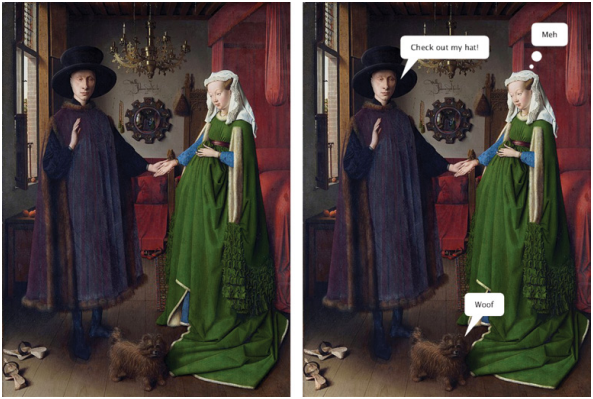
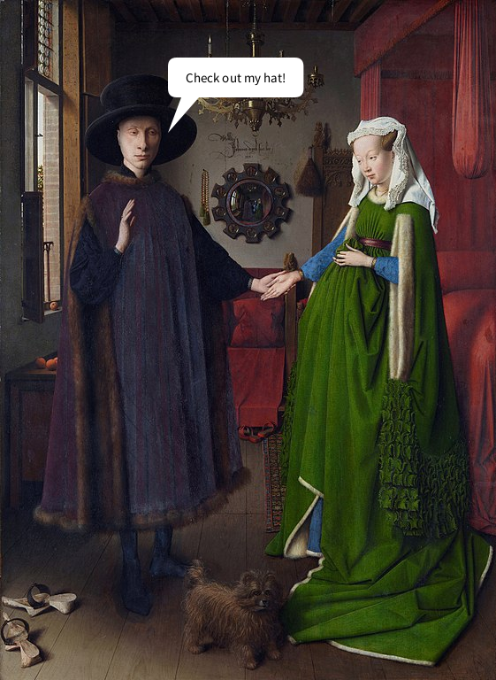
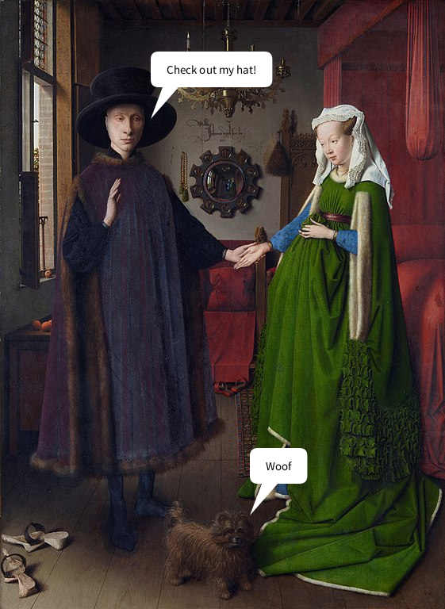
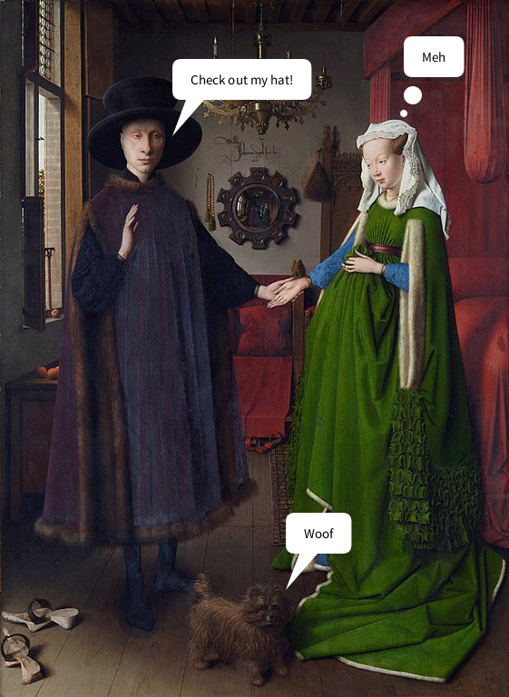

---
jupytext:
  formats: ipynb,md:myst
  text_representation:
    extension: .md
    format_name: myst
    format_version: 0.13
    jupytext_version: 1.14.0
kernelspec:
  display_name: py5
  language: python
  name: py5
---

# functions in py5

When you're writing large programs, you'll often find that chunks of code start running together, even with the help of comments. If you need to use the same code (or very similar code) over and over, the structure of your program can also become very inefficient. With functions, you can pare things down and keep them organized, leading to more readable and elegant code.

What exactly is a *function*? We've been using them very frequently throughout the tutorials here, and the way that functions work is not exclusive to py5 or even to Python, but shared across most (if not all) different programming languages. Some examples that you've probably used very frequently are `size()`, `background()` and `rect()`.  

In this tutorial, we'll first be examining the anatomy of a function (including the ones that come with py5) and then learning how to create our own user-defined functions.   

## function names and arguments

As a quick refresher, let's take a look at the structure of one basic function, `rect()`. As you likely already know, this draws a rectangle on the screen at the positions you specify. 

If you take a look at [the documentation for the `rect()` function](http://py5coding.org/reference/sketch_rect.html), you'll see we make references to *parameters*, some of which are required (like where to actually place the  rectangle, and how wide and tall it should be) and some of which are optional (like the radius for rounded corners). These parameters also have an expected data type... in this case, floats, which are numbers that may include decimal points. Trying to use some other data type, like strings of text (`rect('hello')`), would cause an error.

Essentially, functions are created with parameters that define the ways they work and the values they expect to receive. When we then use the function, or *call* it in our code, we refer to the values we give it as *arguments*, though you'll often see the terms used interchangeably. 

When you see a line of code like `rect(24, 24, 100, 100)`, even if you don't immediately know what those values do, you can tell that it's a function named *rect* that has taken four *arguments* to do something. As you might expect, when you create your own function, this is all information decided by you. 

## creating user-defined functions

Let's start simple with our very first function. We'll be creating a function to generate speech bubbles, like you might see in a comic strip. The first version will have no arguments at all, and we can quickly begin building upon it to create more dynamic code to be used in different situations.  

Even if you've never created a function in py5 before, you may be more familiar with the process than you realize, if you've read up on other tutorials here. When we create sketches with animation or user interaction, you might recall that we make use of the `setup()` and `draw()` functions. For example, this snippet of code from another tutorial will draw an ellipse on screen wherever the mouse is clicked.

```{code-cell} ipython3
def setup():
    size(600,600)
    background('#004477')
    fill('#FFFFFF')

def draw():
    if is_mouse_pressed:
        ellipse(mouse_x,mouse_y, 20,20)
    
run_sketch()
```

In the above code, we defined two functions using the `def` keyword, `setup()` and `draw()`, and then told both of these functions exactly what they should do. The part that py5 handles for us is when these functions are called: by default, `setup()` is called once, and `draw()` is called once per frame. 

First, we'll be writing out some code to represent our very first speech bubble. Inside of `setup()` we'll ask a question, and then we'll print the answer inside of `draw()`. By reducing our frame rate to only one frame per second, and only printing our answer on the fifth frame, we'll effectively add a wait time before the answer appears.

```{code-cell} ipython3
def setup():
    size(600,600)
    background('#004477')
    frame_rate(1)
    print('1. What do you get if you multiply six by seven?')

def draw():
    if frame_count == 5:
        print(' ------------------- ')
        print('| The answer is 42! |')
        print('| ------------------ ')
        print('|/')
    
run_sketch()
```

When you run this code, you'll see the question appear immediately in the console, followed by the answer five seconds later.

```
1. What do you get if you multiply six by seven?
 ------------------- 
| The answer is 42! |
| ------------------ 
|/
```

Let's modify our code so that this answer is wrapped inside of its own *function* that we can use whenever we like. As you'll see, the syntax for defining a new function is just like inserting code into `setup()` and `draw()`!

```{code-cell} ipython3
def setup():
    size(600,600)
    background('#004477')
    frame_rate(1)
    print('1. What do you get if you multiply six by seven?')
    
# Here's our new custom function!
def print_answer():
    print(' ------------------- ')
    print('| The answer is 42! |')
    print('| ------------------ ')
    print('|/')

def draw():
    if frame_count == 5:
        print_answer()
        
run_sketch()
```

This code behaves exactly the same as the previous one, but we've created our own function to handle it. Just like the other two blocks here, we have a `def` keyword, the name of our function, and then *body* of the code, where the lines themselves are placed.

As with variable names, function names are up to you, but there are certain conventions (separating words with an underscore or by capitalizing subsequent words in the function name is common) and requirements (functions must begin with a letter or underscore, and should only contain letters, underscore and numbers). 

Functions should be defined *before* they're called in the code, and many programs (and indeed entire programming languages) will struggle to execute them if you do it the other way around. 

Is this function particularly useful? Not really. You can always add a second question, and a second answer, but it's only meaningful if the answer is also 42.

```{code-cell} ipython3
def setup():
    size(600,600)
    background('#004477')
    frame_rate(1)
    print('1. What do you get if you multiply six by seven?')
    
# Here's our new custom function!
def print_answer():
    print(' ------------------- ')
    print('| The answer is 42! |')
    print('| ------------------ ')
    print('|/')

def draw():
    if frame_count == 5:
        print_answer()
    # Second question...
    if frame_count == 6:
        print('2. How many US gallons are there in a barrel of oil?')
    # ...and second answer
    if frame_count == 10:
        print_answer()
        
run_sketch()
```

By adding arguments, we can make it all a little more modular. What sort of arguments or parameters might a speech bubble function need? 

Of course, one is the actual text to go inside of the bubble, but it would also be useful to start representing our speech bubbles visually. The 'tail' of the speech bubble should be pointing towards the person speaking, so its position could be something we can control with arguments. 

Let's use a free image in the public domain as a base, and lay a speech bubble on top of it. We'll be using Jan van Eyck’s *Arnolfini Portrait* for this example, but any image with a few different participants will be good enough to show off our new function in a few different ways. 



[Download this image from Wikipedia if you're using it](https://en.wikipedia.org/wiki/File:Van_Eyck_-_Arnolfini_Portrait.jpg). (The 561x768 pixel version is definitely big enough!) You'll want to make sure that it's placed somewhere where py5 can recognize it, either in the same folder as your sketch or a folder that you point to in your code. 

Let's modify our code a bit. First, we'll change `setup()` to match the dimensions of the image. Next, we'll make a new function to draw in our speech bubble, and modify `draw()` to use it. You can leave your `print_answer()` function intact if you like, but this new version will be far superior.

```{code-cell} ipython3
def setup():
    size(561,768)
    background('#004477')
    frame_rate(1)
    art = load_image('images/custom_functions/Arnolfini_Portrait.jpg')
    image(art,0,0,width,height)
    
# Here's our speech bubble function...
def speech_bubble():
    x = 190
    y = 150
    txt = 'Check out my hat!'
    
    no_stroke()
    push_matrix()
    translate(x, y)
    
    # tail
    fill('#FFFFFF')
    begin_shape()
    vertex(0, 0) # tip
    vertex(15, -40)
    vertex(35, -40)
    end_shape(CLOSE)
    
    # bubble
    text_size(15)
    by = -85
    bw = text_width(txt)
    pad = 20
    rect(0, by, bw+pad*2, 45, 10)
    fill('#000000')
    text_align(LEFT, CENTER)
    text(txt, pad, by+pad)
    pop_matrix()

def draw():
    if frame_count == 2:
        speech_bubble()
        
run_sketch()
```



We've done a lot in this function, so let's dissect what it is it actually does, aside from display a speech bubble after a few seconds. 

First, we've set some initial variables in this function, `x`, `y` and `txt`. `x` and `y` will position our speech bubble, and `txt` is the text to display inside of it.

We're using a `translate()` function here to position the entire bubble (since it's made of two different shapes) and wrapping the entire thing in its own isolated matrix using `push_matrix()` and `pop_matrix()`. This will let us position each bubble separately, without nudging anything else around. 

For the tail, we draw it with a shape function and a few different vertices. The bubble itself is positioned based on the width of the text inside of it, using that handy `text_width()` function. We also give it a `pad` variable, for the padding of the text. 

This function is clearly much more complex than our last one, but right now it will still only do one thing. By changing those initial three variables to parameters, we can provide arguments each time we use `speech_bubble()` to get different results.

## adding parameters

Right now, we define `x`, `y` and `txt` at the top of our function. To transform those variables into parameters, we'll include them in the definition of the function. That way, it will always expect some values associated with those parameters. You can comment out or remove the three lines at the top of `speech_bubble()` where those values are set -- instead, include those values in the function call itself, inside of `draw()`, in order to pass them as arguments.

```{code-cell} ipython3
def setup():
    size(561,768)
    background('#004477')
    frame_rate(1)
    art = load_image('images/custom_functions/Arnolfini_Portrait.jpg')
    image(art,0,0,width,height)
    
# Here's our speech bubble function...
# Now we've added our parameters into the parenthesis! 
def speech_bubble(x, y, txt):
    #x = 190
    #y = 150
    #txt = 'Check out my hat!'
    
    no_stroke()
    push_matrix()
    translate(x, y)
    
    # tail
    fill('#FFFFFF')
    begin_shape()
    vertex(0, 0) # tip
    vertex(15, -40)
    vertex(35, -40)
    end_shape(CLOSE)
    
    # bubble
    text_size(15)
    by = -85
    bw = text_width(txt)
    pad = 20
    rect(0, by, bw+pad*2, 45, 10)
    fill('#000000')
    text_align(LEFT, CENTER)
    text(txt, pad, by+pad)
    pop_matrix()

def draw():
    if frame_count == 2:
        # Because we're expecting some arguments here, 
        # we have to add them into the function call.
        speech_bubble(190, 150, 'Check out my hat!')
        
run_sketch()
```

You'll notice that we've given these parameters a specific order (x, y, txt) when defining our function, and we've respected that order (190, 150, 'Check out my hat!') when passing in our arguments. These arguments which depend on their order to correspond to the correct parameters are called *positional arguments*. You can also use *keyword arguments*, which explicitly link each argument to their parameter, but can be placed in any order. 

Let's add a second speech bubble using keyword arguments instead. This example will set `txt` to 'Woof' and the `x` and `y` positions to 315, 650.

```{code-cell} ipython3
def setup():
    size(561,768)
    background('#004477')
    frame_rate(1)
    art = load_image('images/custom_functions/Arnolfini_Portrait.jpg')
    image(art,0,0,width,height)
    
# Here's our speech bubble function...
# Now we've added our parameters into the parenthesis! 
def speech_bubble(x, y, txt):
    #x = 190
    #y = 150
    #txt = 'Check out my hat!'
    
    no_stroke()
    push_matrix()
    translate(x, y)
    
    # tail
    fill('#FFFFFF')
    begin_shape()
    vertex(0, 0) # tip
    vertex(15, -40)
    vertex(35, -40)
    end_shape(CLOSE)
    
    # bubble
    text_size(15)
    by = -85
    bw = text_width(txt)
    pad = 20
    rect(0, by, bw+pad*2, 45, 10)
    fill('#000000')
    text_align(LEFT, CENTER)
    text(txt, pad, by+pad)
    pop_matrix()

def draw():
    if frame_count == 2:
        speech_bubble(190, 150, 'Check out my hat!')
    if frame_count == 3:
        # Keyword arguments instead of positional
        speech_bubble(txt='Woof', x=315, y=650)
        
run_sketch()
```



Either of these approaches will work just fine. If you use positional arguments, you must be careful to retain the same order. If you use keyword arguments, you must be careful to correctly label each argument.

Of course, either of these approaches still requires some sort of arguments. For many functions you make yourself, you might not always want to provide arguments for every single parameter. In this case, it would be useful to define some kind of default to take over if there's no argument given.

## setting default values

You can think of default values as a backup plan. If there isn't an argument given corresponding to some expected parameter, Python will look for a default to use. We'll add a default parameter for `txt` to our `speech_bubble()` function, so that supplying this argument is optional. Let's also go ahead and give a speech bubble to the last person in our painting.

```{code-cell} ipython3
def setup():
    size(561,768)
    background('#004477')
    frame_rate(1)
    art = load_image('images/custom_functions/Arnolfini_Portrait.jpg')
    image(art,0,0,width,height)
    
# Here's our speech bubble function...
# We've added a default value for txt.
def speech_bubble(x, y, txt='Hello'):
    #x = 190
    #y = 150
    #txt = 'Check out my hat!'
    
    no_stroke()
    push_matrix()
    translate(x, y)
    
    # tail
    fill('#FFFFFF')
    begin_shape()
    vertex(0, 0) # tip
    vertex(15, -40)
    vertex(35, -40)
    end_shape(CLOSE)
    
    # bubble
    text_size(15)
    by = -85
    bw = text_width(txt)
    pad = 20
    rect(0, by, bw+pad*2, 45, 10)
    fill('#000000')
    text_align(LEFT, CENTER)
    text(txt, pad, by+pad)
    pop_matrix()

def draw():
    if frame_count == 2:
        speech_bubble(190, 150, 'Check out my hat!')
    if frame_count == 3:
        # Keyword arguments instead of positional
        speech_bubble(txt='Woof', x=315, y=650)
    if frame_count == 4:
        # We're not supplying the text argument here... it'll default to something
        speech_bubble(445, 125)
        
run_sketch()
```


We've given this third `speech_bubble()` function just two arguments, for its position, so it's substituted the text inside for its default value. Next we'll give the woman in this painting something real to say... or to think. 

Drawing a *thought bubble* instead of a speech bubble should be pretty simple -- we're already drawing the tail of our speech bubble separately, so we can replace it with three circles instead. However, by default, we'll want to stick with the same type of speech bubble. 

Let's add a new parameter, `type`, and give it a default that still draws the original tail. This way we won't have to go back and change our previous two function calls, either.

Finally, we can give the correct arguments to give this woman a "Meh" thought bubble.

```{code-cell} ipython3
def setup():
    size(561,768)
    background('#004477')
    frame_rate(1)
    art = load_image('images/custom_functions/Arnolfini_Portrait.jpg')
    image(art,0,0,width,height)
    
# Here's our speech bubble function...
# We've added a new parameter, type!
def speech_bubble(x, y, txt='Hello', type='speech'):
    #x = 190
    #y = 150
    #txt = 'Check out my hat!'
    
    no_stroke()
    push_matrix()
    translate(x, y)
    
    # tail
    if type == 'speech':
        fill('#FFFFFF')
        begin_shape()
        vertex(0, 0) # tip
        vertex(15, -40)
        vertex(35, -40)
        end_shape(CLOSE)
    
    elif type == 'thought':
        fill('#FFFFFF')
        circle(0, 0, 8)
        circle(10, -20, 20)
    
    # bubble
    text_size(15)
    by = -85
    bw = text_width(txt)
    pad = 20
    rect(0, by, bw+pad*2, 45, 10)
    fill('#000000')
    text_align(LEFT, CENTER)
    text(txt, pad, by+pad)
    pop_matrix()

def draw():
    if frame_count == 2:
        speech_bubble(190, 150, 'Check out my hat!')
    if frame_count == 3:
        # Keyword arguments instead of positional
        speech_bubble(txt='Woof', x=315, y=650)
    if frame_count == 4:
        # This will be a thought bubble.
        speech_bubble(445, 125, 'Meh', 'thought')
        
run_sketch()
```



Notice that we've placed these optional parameters at the end of our function definition. That way, whether we use positional arguments or keyword arguments, leaving out the optional parameters will always work. 

Sometimes taking a mixed approach to positional arguments and keyword arguments is much more efficient than using only one. For example, if you wanted to give a character a thought bubble saying 'Hello', using purely positional arguments you would have to define all four arguments (even though 'Hello' is the default!) 

```
speech_bubble(315, 650, 'Hello', 'thought')
```

In this case, it might be better suited to your purposes to just explicitly declare that 'thought' is the type of bubble, using a keyword argument.

```
speech_bubble(315, 650, type='thought')
```

## returning values

The functions we've defined here all execute some pre-defined code, and then go back to running the next lines of code (in this case, looping `draw()` each frame). Instead, you can also write a function that does some sort of operation on a value and *returns* whatever comes out. For example, if we use `random()` to select a number between 0 and 100, we might store that in a value, like this:

```
x = random(100)
```

In this case, the number *returned* by `random()` is what ends up inside of our `x` variable. You can also define your own functions that return some value, using the `return` keyword. We'll be making a new function here called `shout()` that modifies and returns any text given to it.

Once you define a function like this, you can use it on any text you like, even before you send that text off to further functions. As an example, we can then use it to turn our first speech bubble into a shouting version!

```{code-cell} ipython3
def setup():
    size(561,768)
    background('#004477')
    frame_rate(1)
    art = load_image('images/custom_functions/Arnolfini_Portrait.jpg')
    image(art,0,0,width,height)
    
# Here's a shout function, with a return value.
def shout(txt):
    return txt.upper() + '!!!'
    
# Here's our speech bubble function...
def speech_bubble(x, y, txt='Hello', type='speech'):
    #x = 190
    #y = 150
    #txt = 'Check out my hat!'
    
    no_stroke()
    push_matrix()
    translate(x, y)
    
    # tail
    if type == 'speech':
        fill('#FFFFFF')
        begin_shape()
        vertex(0, 0) # tip
        vertex(15, -40)
        vertex(35, -40)
        end_shape(CLOSE)
    
    elif type == 'thought':
        fill('#FFFFFF')
        circle(0, 0, 8)
        circle(10, -20, 20)
    
    # bubble
    text_size(15)
    by = -85
    bw = text_width(txt)
    pad = 20
    rect(0, by, bw+pad*2, 45, 10)
    fill('#000000')
    text_align(LEFT, CENTER)
    text(txt, pad, by+pad)
    pop_matrix()

def draw():
    if frame_count == 2:
        # speech_bubble(190, 150, 'Check out my hat!')
        # Shouting version...
        speech_bubble(190, 150, shout('Check out my hat!'))
    if frame_count == 3:
        # Keyword arguments instead of positional
        speech_bubble(txt='Woof', x=315, y=650)
    if frame_count == 4:
        # This will be a thought bubble.
        speech_bubble(445, 125, 'Meh', 'thought')
        
run_sketch()
```
