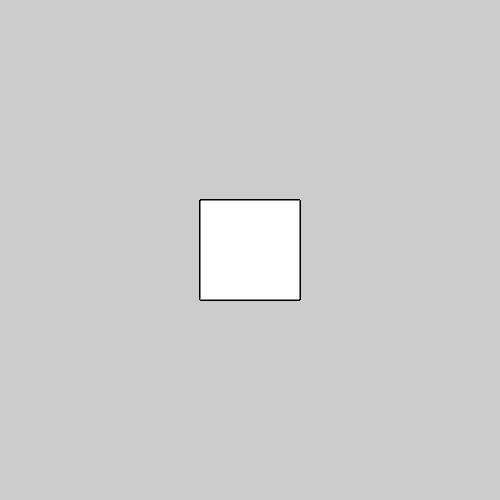
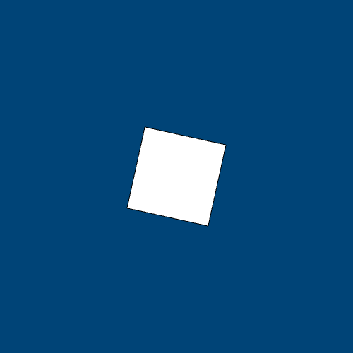
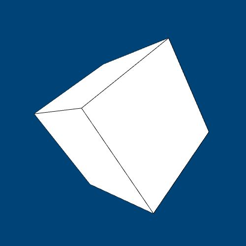
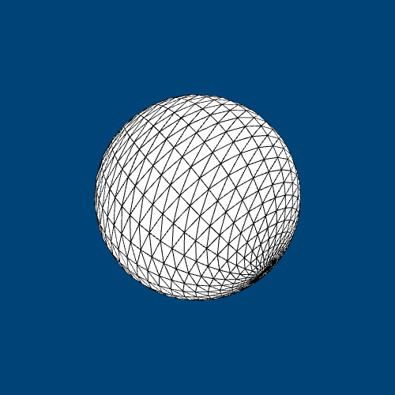
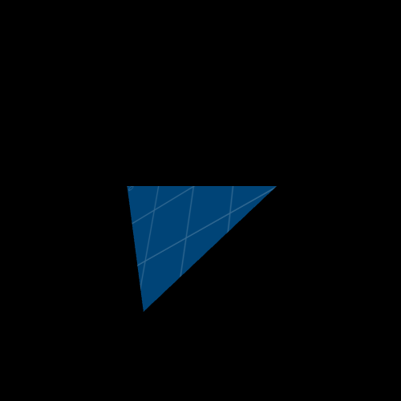
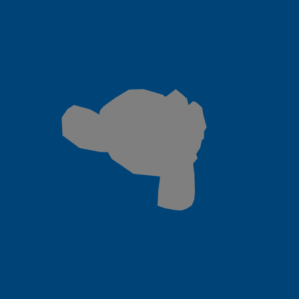
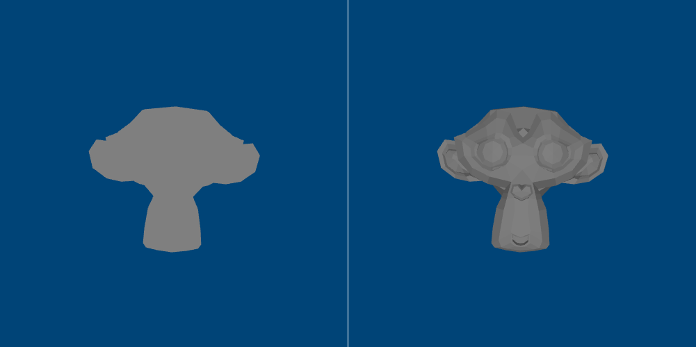
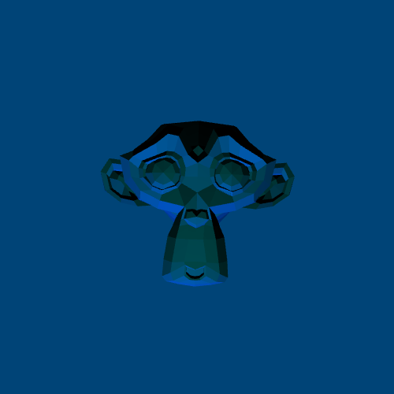

---
jupytext:
  formats: ipynb,md:myst
  text_representation:
    extension: .md
    format_name: myst
    format_version: 0.13
    jupytext_version: 1.14.0
kernelspec:
  display_name: py5
  language: python
  name: py5
---

These tutorials have revolved around the use of two-dimensional graphics in a two-dimensional space. By now, you'll likely be familiar with the way that coordinates work in py5: `0,0` is the top-left corner of the sketch window, and increasing those numbers can move something along the X axis (left to right) or the Y axis (top to bottom). 

The two-dimensional graphics you might draw in this space (like rectangles, circles and complex polyhedrons) are rendered using the built-in py5 renderer. However, this is not the only type of renderer available. 

You can actually define the renderer py5 will use in an optional argument when you size your sketch with `size()`. Although there are quite a few interesting options to choose from (P2D, P3D, FX2D, PDF and SVG), in this tutorial, we'll be looking at the P3D renderer, which can be used to draw in a three-dimensional space. 

## three-dimensional graphics in py5

The P3D renderer (Processing 3D) is a three-dimensional graphics renderer that makes use of OpenGL-compatible graphics hardware. This means that its ability to render quickly and efficiently will depend on your computer's graphics card, but it's a worthy trade-off to have access to three-dimensional shapes (and for most devices, it will still be quite speedy). 

Before we draw anything, or even change the renderer to P3D, we need to talk about how we position objects in 3D space. First, we'll have to look beyond the `x, y` positioning system, since it only accounts for two dimensions. In a 3D space, we'll be using `x, y, z` positioning to place objects. The Z axis is our missing third dimension. A negative Z value will move a 3D object "farther away" from the viewer, and a positive Z value will move it "closer" to the viewer. 

However, we also need to address the expectations you may have on *how* you can position these objects in 3D space. When drawing a 2D object, like a `rect()`, you typically pass it arguments to position it, as well as to size it.

```
rect(x,y,w,h) # X and Y position, then width and height
```

When we're drawing a 3D shape, like a `box()`, you might expect we should give it X, Y and Z positions. However, rendering the positions of objects works a little differently in 3D. The positions of any shape in this 3D space will be adjusted a bit to provide the 3D illusion -- so we can't anticipate that the corners of a `box()`, for example, will be *exactly* where we would like it to be. However, the P3D renderer will do its best to position any shape we give it according to any `translate()` functions we've used. 

Before we start drawing 3D shapes, we can draw 2D shapes in a 3D space to get used to the concept. The code below shows how a three-dimensional `translate()` function works. This is how we'll be positioning our three-dimensional objects, too. 

```{code-cell} ipython3
# Creating some global variables for positioning
x = 250
y = 250
z = 0

def setup():
    size(500,500, P3D) # Using the P3D renderer! 
    
def draw():
    global x, y, z # Let's make sure we can adjust those positioning variables
    translate(x,y,z) # We can translate using the Z value, too!
    rect_mode(CENTER) # Drawing our rectangle with the center point aligned to the screen center
    rect(0,0,100,100) 
    
    z += 1 # As Z increases, the rectangle moves closer!
    
run_sketch()
```



If you've read the other tutorials, you may recall some other *transformation* functions, aside from `translate()`, that you can use in a two-dimensional space. `rotate()`, for example, can spin a shape. In fact, you can use these transformations in a three-dimensional space, too. To get the old `rotate()` behavior that you're used to, you'll want to use `rotate_z()` with a single value.

```{code-cell} ipython3
x = 250
y = 250
z = 0

def setup():
    size(500,500, P3D) 
    
def draw():
    global x, y, z 
    
    background('#004477') # Adding a background to clear the previous frame
    
    translate(x,y,z)
    rect_mode(CENTER) 
    
    rotate_z( z / 10 ) # Rotating the shape by a fraction of Z
    
    rect(0,0,100,100) 
    
    z += 1 # As Z increases, the rectangle spins and moves closer!
    
run_sketch()
```



In addition to `rotate_z()`, we have access to `rotate_x()` and `rotate_y()` in this three-dimensional space, too. Experiment with the following snippets to see how they work on 2D shapes.

```{code-cell} ipython3
x = 250
y = 250
z = 0

def setup():
    size(500,500, P3D) 
    
def draw():
    global x, y, z 
    
    background('#004477') # Adding a background to clear the previous frame
    
    translate(x,y,z)
    rect_mode(CENTER) 
    
    rotate_x( z / 10 ) # Rotating the shape by a fraction of Z
    
    rect(0,0,100,100) 
    
    z += 1 # As Z increases, the rectangle spins and moves closer!
    
run_sketch()
```

```{code-cell} ipython3
x = 250
y = 250
z = 0

def setup():
    size(500,500, P3D) 
    
def draw():
    global x, y, z 
    
    background('#004477') # Adding a background to clear the previous frame
    
    translate(x,y,z)
    rect_mode(CENTER) 
    
    rotate_y( z / 10 ) # Rotating the shape by a fraction of Z
    
    rect(0,0,100,100) 
    
    z += 1 # As Z increases, the rectangle spins and moves closer!
    
run_sketch()
```

## 3d primitives in py5

Let's swap out our `rect()` for a three-dimensional primitive shape, `box()`. 

The `box()` function can take a few different arguments. If you only give it a single argument, like `box(100)`, it will be a perfect cube, with an equal height, weight and depth of (in this case) 100 pixels. If you'd like to create an uneven, rectangular box, you can pass it three different arguments for height, weight and depth, like `box(100, 70, 50)`. Remember, we use the `translate()` function to position three-dimensional objects, so `box()` doesn't take any sort of coordinates. 

```{code-cell} ipython3
x = 250
y = 250
z = 0

def setup():
    size(500,500, P3D) 
    
def draw():
    global x, y, z 
    
    background('#004477') # Adding a background to clear the previous frame
    
    translate(x,y,z)
    
    # You can do multiple rotations at once!
    rotate_y( z / 100 ) 
    rotate_x( z / 100 ) 
    
    box(100) # A box with 100 pixel length on all sides
    
    z += 1 # As Z increases, the box spins and moves closer!
    
run_sketch()
```



The `sphere()` function is almost exactly the same -- but spheres are always equilateral, so it only takes one argument.

```{code-cell} ipython3
x = 250
y = 250
z = 0

def setup():
    size(500,500, P3D) 
    
def draw():
    global x, y, z 
    
    background('#004477') # Adding a background to clear the previous frame
    
    translate(x,y,z)
    
    rotate_y( z / 100 ) 
    rotate_x( z / 100 ) 
    
    sphere(100) # A sphere with 100 pixel length on all sides
    
    z += 1 # As Z increases, the sphere spins and moves closer!
    
run_sketch()
```



## custom shapes in 3d

You might recall that in two dimensions, you can use the `begin_shape()` and `end_shape()` functions to draw complex polygons, vertex-by-vertex. This works in 3D, too. You'll be giving each vertex an X, Y and Z position, so things can get complex quite quickly. Here's an example of a triangular prism drawn with vertices. 

```{code-cell} ipython3
x = 250
y = 250
z = 0

def setup():
    size(500,500, P3D) 
    
def draw():
    global x, y, z 
    
    background('#004477') # Adding a background to clear the previous frame
    
    translate(x,y,z)
    
    # a slow rotation based on our frame count
    rotate_x( frame_count / 200 ) 
    rotate_y( frame_count / 300 )
    
    begin_shape()
    vertex(-100, -100, -100)
    vertex( 100, -100, -100)
    vertex(   0,    0,  100)

    vertex( 100, -100, -100)
    vertex( 100,  100, -100)
    vertex(   0,    0,  100)

    vertex( 100, 100, -100)
    vertex(-100, 100, -100)
    vertex(   0,   0,  100)

    vertex(-100,  100, -100)
    vertex(-100, -100, -100)
    vertex(   0,    0,  100)
    end_shape()
    
    
run_sketch()
```


When working in a 3D space like this, it's much easier to work with some kind of standard unit (in this case, all vertex positions are 0, 100 or -100) and then rotate or reposition the resulting shape using translations and rotations. If you wanted to draw this same prism a little to the left, you wouldn't want to do all that math yourself!

## storing 3d positions

Since you're using `translate()` to position your boxes, spheres and other shapes, accessing their position can sometimes feel a bit tricky. If I wanted to move two shapes, but at very different points in my code, I would likely be using `push_matrix()` and `pop_matrix()` to reset or clear out my `translate()` function. This means that if I moved a box *somewhere*, moving a rectangle to that same *somewhere* might require carefully tracking those positioning changes. After all, when a series of rotations and translations has been done, straightforward coordinates like `0,0,0` or `34, 50, 100` are no longer inherently meaningful.

Luckily, a trio of functions makes this a little easier. Using `model_x()`, `model_y()` and `model_z()` can allow us to find the current *translated* location of any coordinates. In the below code, X, Y and Z are changing each frame, and then being used for our translation function, all wrapped inside of a matrix so that they wouldn't change the location of any subsequent shapes. However, we can easily find out where `0,0,0` (or any other location) would be in this matrix using `model_x()`, `model_y()` and `model_z()`. 

```{code-cell} ipython3
x = 250
y = 250
z = 0

def setup():
    size(500,500, P3D) 
    
def draw():
    global x, y, z 
    
    background('#004477')
    
    # randomize translation values
    x = random(width)
    y = random(height)
    z = random(-500,0)
    
    # beginning our matrix
    push_matrix()
    translate(x,y,z)
    
    sphere(100) # A sphere with 100 pixel length on all sides
    
    # Using model_x, model_y and model_z to see where translate has put our 0 positions
    print("Current X,Y,Z: " 
          + str( model_x(0,0,0) ) + ", " 
          + str( model_y(0,0,0) ) + ", " 
          + str( model_z(0,0,0) ) 
         )
    
    
    # ending our matrix
    pop_matrix()
    
    
run_sketch()
```

## texturing 3D objects

Using the `texture()` function inside of a custom shape, before you start drawing vertices, you can apply an image to the surface of a shape. In addition to loading the image (with `load_image()`) and applying it (with `texture()`), you'll have to pass some extra arguments to each vertex. By default, these extra arguments relate to the full dimensions of the image in pixels. You can use `texture_mode(NORMAL)` to switch to a mode where these arguments are "normalized" to a range from 0 to 1, or `texture_mode(DEFAULT)` to switch back.

Wrapping an image around 3D shapes is no trivial task. The example below uses a simple 2D triangle, though in a 3D space. I've elected to use the [grid.png]("images/3d/grid.png") image from previous tutorials here, but you could use any image of a sufficient size. 

```{code-cell} ipython3
x = 250
y = 250
z = 0

img = None

def setup():
    size(500,500, P3D) 
    global img
    img = load_image("images/3d/grid.png")
    
def draw():
    global x, y, z 
    
    background('#000000')
    
    translate(x,y,z)
    
    # a slow rotation based on our frame count
    rotate_x( frame_count / 200 ) 
    rotate_y( frame_count / 300 )
    
    begin_shape()
    texture(img)
    vertex(-100, -100, -100, 0, 0)
    vertex(100, -100, -100, 300, 120)
    vertex(0, 0, 100, 200, 400)
    end_shape()
    
    
run_sketch()
```



## importing 3d models into py5

In addition to the (admittedly tedious) method of building 3D shapes using vertices, you can actually load 3D models into py5 with the `load_shape()` function! This function can take file formats of .svg or .obj, with the latter being used for 3D models. For the purposes of this demo, we're using Suzanne, the unofficial mascot of the 3D modeling program Blender. You can download [suzanne.obj]("images/3d/suzanne.obj") yourself and put her in the same folder as your sketch, or use any other 3D model in the right format. 

First, we load our .obj in the `setup()` block. You can use `load_shape()` (or `load_image()`, for that matter) inside of `draw()`, but it's slow and expensive in terms of processing power, so it's much better to load things into a variable ahead of time and just use them when needed. 

Inside of `draw()`, we use `shape()` with our new variable (and a position of 0,0) to actually display Suzanne. In addition to applying a `translate()` and a few rotations, we're using `scale()` to scale the model up -- the default scale provided by Blender is really small! 

```{code-cell} ipython3
x = 250
y = 250
z = 0

suzanne = None

def setup():
    size(500,500, P3D) 
    global suzanne
    suzanne = load_shape("images/3d/suzanne.obj")
    
def draw():
    global x, y, z 
    
    background('#004477')
    
    translate(x,y,z)
    
    # a slow rotation based on our frame count
    rotate_x( frame_count / 200 ) 
    rotate_y( frame_count / 300 )
    
    scale(100)
    shape(suzanne,0,0)
    
    
run_sketch()
```



Compared to other ways you may have viewed 3D models before, Suzanne is looking pretty flat without any textures or materials. The details are difficult to make out because there's currently no lighting in our sketch -- but we can fix that.

## 3d lighting simulation in py5

When using the P3D or P2D renderers, py5 gives you access to a few different types of lighting. The simplest way to use this is with the `lights()` function, which sets up some default lighting for subsequently loaded objects. In the example below, holding the mouse button down will run `lights()` and add some real definition to Suzanne's face. 

```{code-cell} ipython3
x = 250
y = 250
z = 0

suzanne = None

def setup():
    size(500,500, P3D) 
    global suzanne
    suzanne = load_shape("images/3d/suzanne.obj")
    
def draw():
    global x, y, z 
    
    background('#004477')
    
    translate(x,y,z)
    rotate_z(9.45) # Putting Suzanne's head upright
    
    scale(100)
    
    if (is_mouse_pressed):
        lights()
    
    shape(suzanne,0,0)
    
    
run_sketch()
```



Using `lights()` is a quick way of using a few different lighting functions made available in py5: `ambient_light()`, `directional_light()`, `light_falloff()` and `light_specular()`. You can adjust these qualities manually and also create another type of lighting, `point_light()`.

The functions `ambient_light()`, `directional_light()` and `point_light()` all create new lighting sources, but with slightly different properties. 

`ambient_light()` has no particular direction, and spreads throughout the space. It takes three arguments for the color of the light (R, G and B values) and two or three arguments for its position in the sketch (X, Y and Z coordinates). 

`directional_light()` is aimed in a direction, and will be stronger on some surfaces depending on the angle at which it hits them.  It takes three arguments for the color of the light (R, G and B values) and two or three arguments for its direction (along the X, Y and Z axis). 

`point_light()` is a positioned light that does not light the space equally -- a happy medium between an ambient and a directional light, good for lighting specific areas. It takes three arguments for the color of the light (R, G and B values) and two or three arguments for its position in the sketch (X, Y and Z coordinates). 

Meanwhile, `light_falloff()` and `light_specular()` adjust the properties of any subsequent lighting in the sketch to give you more fine-tuned control. 

It can be difficult to understand `light_falloff()` without further studying digital lighting, but experimenting with the three arguments it takes (*constant*, *linear* and *quadratic* values) can yield interesting results. 

The `light_specular()` function adjusts the *specular* color of the lights, which refers to the color of the highlight or "shine" on lit objects. It takes three arguments for R, G and B values. 

The below sketch sets the specular values to a teal color, and when the mouse is pressed, produces a dark blue point light at the current mouse position. Try holding the mouse down and dragging it around your sketch to watch how the location of the point light changes the shadows and highlights. 

```{code-cell} ipython3
x = 250
y = 250
z = 0

suzanne = None

def setup():
    size(500,500, P3D) 
    global suzanne
    suzanne = load_shape("images/3d/suzanne.obj")
    
def draw():
    global x, y, z 
    
    background('#004477')
    
    translate(x,y,z)
    rotate_z(9.45) # Putting Suzanne's head upright
    
    scale(100)
    
    if (is_mouse_pressed):
        light_specular(0,180,180) # Teal highlights/shine
        point_light(0,0,255,mouse_x,mouse_y,0) # A dark blue point light
        
    
    shape(suzanne,0,0)
    
    
run_sketch()
```



In addition to adjusting the properties of the lights, you can adjust the properties of the objects in the scene and how they react to light. `specular()` works similarly to `light_specular()`, but for the models themselves instead of the lights. `shininess()` takes a single value from 0 to 255 to determine the glossiness or shininess of objects. You can also adjust ambient reflective color values with `ambient()` and emissive color values with `emissive()`. 

There's a lot more experimentation you could do with lighting in py5, but that's enough for a quick taste. Let's move on to adjusting our view of the 3D environment. 

## camera adjustment in py5

Using `camera()`, you can set a few different values. The first three (which refer to an X, Y and Z position, of course) are the position of the camera itself. The next three coordinates refer to the center of the screen, towards which the camera is pointing. Finally, you can define custom "up" directions for the X, Y and Z axis in your scene. Below, we use `camera()` with the mouse position to pan around Suzanne's front and sides, while always pointing directly at her. 

```{code-cell} ipython3
x = 250
y = 250
z = 0

suzanne = None

def setup():
    size(500,500, P3D) 
    global suzanne
    suzanne = load_shape("images/3d/suzanne.obj")

    
def draw():
    global x, y, z 
    
    background('#004477')
    
    
    camera(mouse_x, mouse_y, width/2.0, # Adjusting the camera based on mouse position
           x, y, z, # ... but always pointing towards Suzanne
           0, 1, 0)
    
    translate(x,y,z)
    rotate_z(9.45) # Putting Suzanne's head upright
    
    scale(100)
    
    if (is_mouse_pressed):
        light_specular(0,180,180) # Teal highlights/shine
        point_light(0,0,255,mouse_x,mouse_y,0) # A dark blue point light
        
    
    shape(suzanne,0,0)
    
    
run_sketch()
```

Of course, this is a simple way of experimenting with camera positioning. If you wanted to create a scene where the camera could be moved with the arrow keys, it might be a little more complex, but you'd also have much greater control over these values. 

## where next? 

One potential area worth exploring is the world of shaders. If you happen to have any lying around, you can load shader files (probably in a .GLSL format) into py5 using the `shader()` function with a filename. Shaders are complex and fascinating, and completely beyond the scope of this tutorial. 

However, it's worth checking out [The Book of Shaders](https://thebookofshaders.com/) for an introduction to this world, and parts of the book which apply to Processing are broadly applicable to what we've done here in py5. 

Have fun!
