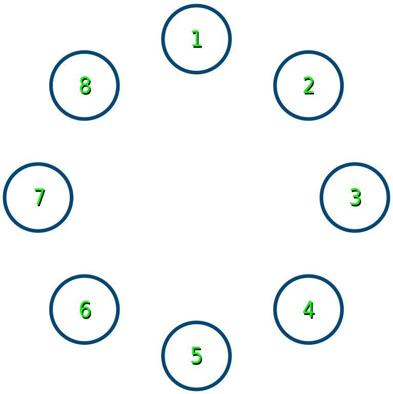
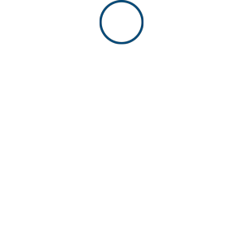
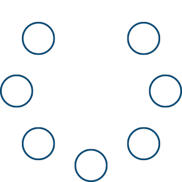
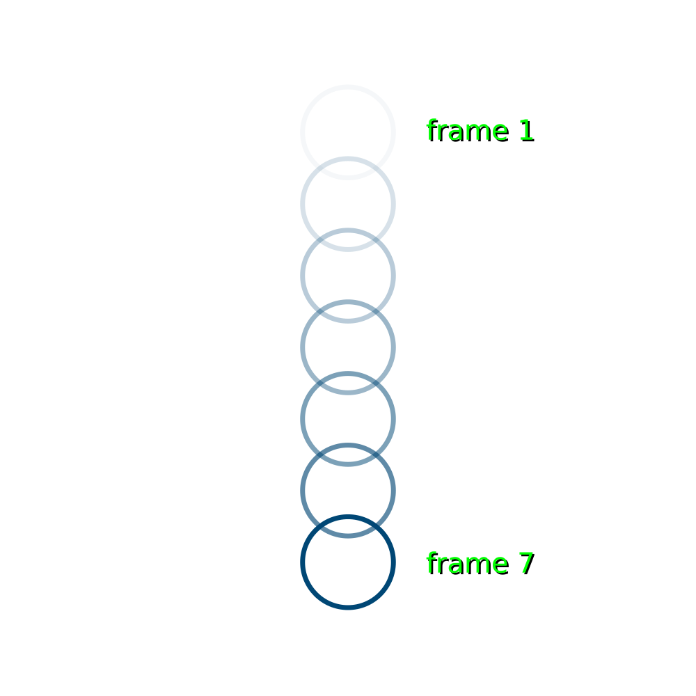

---
jupytext:
  formats: ipynb,md:myst
  text_representation:
    extension: .md
    format_name: myst
    format_version: 0.13
    jupytext_version: 1.14.0
kernelspec:
  display_name: py5
  language: python
  name: py5
---

While py5 is perfectly well-suited for creating still images as its visual output, where programming art begins to far outpace manually produced art is in the realms of animation and movement. Even if you "only" had to draw one image and slowly slide it across a background surface, photographing each different position one at a time, animating something by hand is a tedious task. In comparison, animating images in py5 is easy - once you understand the principles behind movement and animation in general.

# animation

The way the brain perceives motion in general is fairly straightforward, though there are a lot of different factors that can enhance the accuracy of that perception (or the illusion, in the case of animation). Your retina passes an image to your brain around ten times per second. Whether you perceive something as moving or still, then, is reliant on whether its position is changing compared to that rate. One of the founders of Gestalt school of psychology, Max Wertheimer, found in 1912 that perception of smooth movement between two images of shapes in different locations was highly dependent on the rate at which these images were shown. Another psychologist, Friedrich Kenkel, called this particular illusion - two separate figures, interpreted as one figure moving from one place to the next - *Beta movement*. Screens that update information relatively slowly, like news tickers and LED displays, rely heavily on Beta movement for animation. Generally, for the illusion to work, images are displayed at around ten to twelve frames per second. However, you can start observing the effects at much lower frame rates. 



In the image above, you can see the circles are numbered. If you displayed just circle 1 for four seconds, and then just circle 5 for four seconds, most people would see this as unrelated images. This is a very low frame rate, 0.25 FPS. 


Let's speed this up a bit. If each frame appears for 0.4 seconds instead of 4 seconds, we're operating at 2.5 FPS instead of 0.25. You can likely see that the circle appears to bounce back and forth between the two points.



By further increasing the FPS to 12 frames per second, you begin to reach the bounds of the Beta movement illusion - the circle is either moving quite quickly between these two points, or there are two circles flickering together.


We can observe a few more illusions related to this using the entire ring of circles. This animation runs at one frame per second. 



If you watch the above animation, you may see one circle as "jumping" into the gap on each frame!

Meanwhile, in this much faster animation (25 FPS), it looks as if that gap is actually its own object, moving around and obscuring each circle:


This illusion is known as the *phi phenomenon*. With a slightly better understanding of how adjusting framerate can change the perception of animation, let's move on to how this all works in py5.

## animation functions

To use animation in py5 (as well as a handful of other nifty features), you have to take advantage of two built-in functions that define the behavior of whole blocks of code: `setup()` and `draw()`. Other tutorials do not always use these functions - coding in py5 without using these is referred to as *static* mode, since the sketches it creates will have still (static) visuals. Py5bot is set up to run these sorts of sketches by default. A static sketch might begin with some code like this, to set up the various unchanging qualities of the sketch:

+++

```python
size(500,500)
background('#004477')
no_fill()
stroke('#FFFFFF')
stroke_weight(3)
```

It's no surprise, then, that this is the sort of code you execute in a `setup()` function. Like many other types of code blocks (such as those you would use for *if* statements), indenting is used to keep all this `setup()` code running together. In some development environments (like on this documentation website), you may also need to include a `run_sketch()` line at the bottom of your sketch. This line will be included in all code snippets here, so that they can be run using live code.

```{code-cell} ipython3
def setup():
    size(500,500)
    background('#004477')
    no_fill()
    stroke('#FFFFFF')
    stroke_weight(3)

run_sketch()
```

Any code in that block following `def setup():` is run once, when the sketch begins. 

This `setup()` function becomes very powerful when you use it with `draw()`. Unlike `setup()`, which is run once, `draw()` is run every frame! By default, sketches run at 60 frames per second, but this number may reduce if a lot of heavy-duty animation is running on screen. You can use a built-in variable, `frame_rate`, to see how many frames have advanced since the start of the sketch. Let's use this inside of another block, for `draw()`, to see how it works.

```{code-cell} ipython3
def setup():
    size(500,500)
    background('#004477')
    no_fill()
    stroke('#FFFFFF')
    stroke_weight(3)
    
def draw():
    print(frame_count)

run_sketch()
```

As long as the above sketch is running, a higher number will be printed to the console for each new frame. You can use `frame_rate()` (with one argument, a number) inside of your setup code to change the FPS at which your sketch runs. 

Using an extra *if* statement and the *modulo* operator (which you may recall gives us the remainder of a division operation), you can easily create a sketch where something only happens every two frames:

```{code-cell} ipython3
def setup():
    size(500,500)
    background('#004477')
    no_fill()
    stroke('#FFFFFF')
    stroke_weight(3)
    frame_rate(2.5) # Slowing our frame rate to make this more visible...
    
def draw():
    if frame_count % 2 == 0:
        print(frame_count)

run_sketch()
```

Let's replace this `print()` function with an ellipse, to draw a circle on even-numbered frames. Actually, the code below may not run as you initially expect.

```{code-cell} ipython3
def setup():
    size(500,500)
    background('#004477')
    no_fill()
    stroke('#FFFFFF')
    stroke_weight(3)
    frame_rate(2.5) # Slowing our frame rate to make this more visible...
    
def draw():
    if frame_count % 2 == 0:
        # print(frame_count)
        ellipse(250,140, 47,47)
        
run_sketch()
```


The circle appears, alright, but it doesn't blink on and off. Why? 

Well, py5 draws everything you tell it to, and nothing more. This means that although it's drawing a circle on even-numbered frames, it's not doing anything to remove that circle on odd-numbered frames. To easily solve this problem, you can actually utilize the `background()` function already in your sketch. Simply move it from the `setup()` block to the start of the `draw()` block, and it will be drawn every frame, "covering up" whatever happened on the previous frame!

```{code-cell} ipython3
def setup():
    size(500,500)
    no_fill()
    stroke('#FFFFFF')
    stroke_weight(3)
    frame_rate(2.5) # Slowing our frame rate to make this more visible...
    
def draw():
    background('#004477')
    if frame_count % 2 == 0:
        # print(frame_count)
        ellipse(250,140, 47,47)
        
run_sketch()
```

Now your ellipse will blink on and off every frame. 

We can of course add an *else* statement to draw another ellipse, in a different position, on odd-numbered frames.

```{code-cell} ipython3
def setup():
    size(500,500)
    no_fill()
    stroke('#FFFFFF')
    stroke_weight(3)
    frame_rate(2.5) # Slowing our frame rate to make this more visible...
    
def draw():
    background('#004477')
    if frame_count % 2 == 0:
        # print(frame_count)
        ellipse(250,140, 47,47)
    else:
        ellipse(250,height-140, 47,47)
        
run_sketch()
```

Just like with the animated examples at the top of the page, you can adjust the `frame_rate()` function here to experiment with the results!

Of course, there are no frames of movement between these two ellipses, making the illusion incomplete. 



You could always draw extra ellipses, but this is unnecessarily time-consuming, and we have access to smoother methods of animation. Toggling on and off these two different ellipses is not the best way to accomplish smooth movement - it would be better if we could simply adjust the position of a single ellipse over each frame. In fact, using variables for the position of the ellipse, we can do just that, by adding to and subtracting from those variables. 

## global variables

When using static sketches, variables can be defined anywhere, and used on any subsequent lines of code. However, our `setup()` and `draw()` blocks have different *scopes*, which means that variables cannot be shared between them. You can see an example of this by trying to run the following code, which defines a variable named *y* inside of `setup()`, then tries to access it in `draw()`.

```{code-cell} ipython3
:tags: [raises-exception, output_scroll]

def setup():
    size(500,500)
    no_fill()
    stroke('#FFFFFF')
    stroke_weight(3)
    y = 1

def draw():
    background('#004477')
    print(y)
    
run_sketch()
```

This will give some sort of error, for example:

```
py5 encountered an error in your code:File "C:\Users\PC\AppData\Local\Temp\ipykernel_6124\2077076397.py", line 10, in draw
    8    def draw():
    9        background('#004477')
--> 10       print(y)

NameError: name 'y' is not defined
```

When a variable only exists in some limited scope, we call it a *local* variable. To use the same variable throughout your sketch, you will have to define it as a *global* variable instead. The easiest way to do this is simply to move the initial variable declaration - that line like `y = 1` - outside of either the `setup()` or `draw()` blocks. As the following code shows, both blocks can access this global variable.

```{code-cell} ipython3
y = 1 # Global variable

def setup():
    size(500,500)
    no_fill()
    stroke('#FFFFFF')
    stroke_weight(3)
    frame_rate(2.5)
    print( "Setup code: " + str(y) ) # prints "Setup code: 1" once

def draw():
    background('#004477')
    print( "Draw code: " + str(y) ) # prints "Draw code: 1" once per frame
    
run_sketch()
```

However, trying to reassign this variable in either block will do something funny. You won't actually be editing *y* itself - you'll be overriding it with a *local* version of y.

```{code-cell} ipython3
y = 1 # Global variable

def setup():
    size(500,500)
    no_fill()
    stroke('#FFFFFF')
    stroke_weight(3)
    frame_rate(2.5)
    print( "Setup code: " + str(y) ) # prints "Setup code: 1" once

def draw():
    background('#004477')
    y = 0 # Local variable, which overrides y
    print( "Draw code: " + str(y) ) # prints "Draw code: 0" once per frame
    
run_sketch()
```

Even worse, trying to edit *y* inside of `draw()` still gives an error, since it's overriding the variable with its own special one.

```{code-cell} ipython3
y = 1 # Global variable

def setup():
    size(500,500)
    no_fill()
    stroke('#FFFFFF')
    stroke_weight(3)
    frame_rate(2.5)
    print( "Setup code: " + str(y) ) # prints "Setup code: 1" once

def draw():
    background('#004477')
    y += 1 # Local variable, trying to override y... giving an error
    print( "Draw code: " + str(y) ) # prints "Draw code: 0" once per frame
    
run_sketch()
```

That one gives a new error:

```
UnboundLocalError: local variable 'y' referenced before assignment
```

So, what's the actual solution? To get things working again, keep that global variable at the top of the code. However, you'll have to add a new line, using the keyword *global*, to tell your `draw()` function to link this *local* reference with the *global* variable.

While we're here, let's do something useful for animating... and add our `ellipse()` back in, but use *y* to increment its position on the y axis!

```{code-cell} ipython3
y = 1 # Global variable

def setup():
    size(500,500)
    no_fill()
    stroke('#FFFFFF')
    stroke_weight(3)
    frame_rate(30) # Trust me, leaving this at 2.5 will be too slow
    print( "Setup code: " + str(y) ) # prints "Setup code: 1" once

def draw():
    global y # Bringing the global variable, y, into this scope
    background('#004477')
    y += 1 # Adding to y each frame
    print( "Draw code: " + str(y) ) # prints "Draw code: " and current y value once per frame
    ellipse(height/2,y, 47,47) # Draws our ellipse at y each frame!
    
run_sketch()
```

Run this code. You'll be able to watch the ellipse slide down the screen. 

## saving frames as images

py5 has a few different ways to produce image files from your sketch, like `save()` and `save_frame()`. We'll be looking at `save_frame()` here, since we've just started working with animation.

By adding these two lines to your code, you can "take a picture" every 100 frames. (You wouldn't want to use this with a very slow frame rate, as you'd be waiting a long time!) The argument that I've given it is the filename, including the file extension, that will determine how the file is saved.

```
if frame_count % 100 == 0:
        save_frame('file.png')
```

```{code-cell} ipython3
y = 1 # Global variable

def setup():
    size(500,500)
    no_fill()
    stroke('#FFFFFF')
    stroke_weight(3)
    frame_rate(30) # Trust me, leaving this at 2.5 will be too slow
    print( "Setup code: " + str(y) ) # prints "Setup code: 1" once

def draw():
    global y # Bringing the global variable, y, into this scope
    background('#004477')
    y += 1 # Adding to y each frame
    print( "Draw code: " + str(y) ) # prints "Draw code: " and current y value once per frame
    ellipse(height/2,y, 47,47) # Draws our ellipse at y each frame!
    
    if frame_count % 100 == 0:
        save_frame('file.png')
    
run_sketch()
```

If you're running this code online, the resulting file may be quite hard to find. However, in any development environment hosted on your computer, `file.png` will be placed in the same folder as the sketch, and updated every 100 frames. 

## DVD screensaver task

It's time for a challenge, putting your new knowledge about frames and animation to use.

What exactly is a DVD screensaver? Well, DVD players (if you remember those) often have a screensaver where their logo slides around on the screen, bouncing back when it hits a wall or corner. (Have you ever found yourself waiting around for that logo to perfectly hit the corner? You're not alone... and there's an excellent post on [The Lost Math Lessons](http://lostmathlessons.blogspot.com/2016/03/bouncing-dvd-logo.html) calculating how long this might take.) 

Instead of making you draw your own, we'll be using a generic DVD logo here. You can save it into the same folder as your sketch on your computer, or directly reference it by its complete URL.


Here's some code to get you started. Most of it will be at least a little familiar.

```{code-cell} ipython3
x = 0
xspeed = 2
logo = None

def setup():
    global logo
    size(800,600)
    logo = load_image('images/animation_and_motion/dvd-logo.png')

def draw():
    global x, xspeed, logo
    background('#000000')
    x += xspeed
    image(logo, x,100)

run_sketch()
```

You can see we're following the same general format as before: global variables are declared at the top of the sketch, and the *global* keyword is used whenever they must be changed. Notice that loading an image with `load_image()` is done inside of our `setup()` block, overwriting the placeholder "None". Since `load_image()` is a function, we run it just once on startup by doing this. 

In addition to x, we also use a variable, *xspeed*, so that we can easily adjust the speed at which our logo moves. Right now, the logo will slide all the way to the right and off the right side of the screen.

So how do we make sure it *bounces back*? You might remember that the maximum width of the window is stored in a built-in variable named *width*. We can use this to check if *x* (and thus the position of the logo) has moved to the edge of the screen. This will fill the console with `Bye!` once the DVD logo disappears:

```{code-cell} ipython3
x = 0
xspeed = 2
logo = None

def setup():
    global logo
    size(800,600)
    logo = load_image('images/animation_and_motion/dvd-logo.png')

def draw():
    global x, xspeed, logo
    background('#000000')
    x += xspeed
    image(logo, x,100)
    if (x >= width):
        print('Bye!')

run_sketch()
```

Since the movement of the logo is controlled by xspeed, we can reverse its motion by changing xspeed into a negative number. Try this to bounce the logo off the right side of the screen:

```{code-cell} ipython3
x = 0
xspeed = 2
logo = None

def setup():
    global logo
    size(800,600)
    logo = load_image('images/animation_and_motion/dvd-logo.png')

def draw():
    global x, xspeed, logo
    background('#000000')
    x += xspeed
    image(logo, x,100)
    if (x >= width):
        # print('Bye!')
        xspeed *= -1 # Multiplying xspeed by negative 1

run_sketch()
```

This bounce isn't perfect... the logo almost completely disappears before it bounces back, because its anchor point is at the top-left corner of the image. We can compensate for this by subtracting the width of the image from our calculations. (As a hint, this logo is 100 pixels wide and 45 pixels tall.)

```{code-cell} ipython3
x = 0
xspeed = 2
logo = None

def setup():
    global logo
    size(800,600)
    logo = load_image('images/animation_and_motion/dvd-logo.png')

def draw():
    global x, xspeed, logo
    background('#000000')
    x += xspeed
    image(logo, x,100)
    if (x >= (width - 100)):
        # print('Bye!')
        xspeed *= -1 # Multiplying xspeed by negative 1

run_sketch()
```

What about the left side of the screen? Well, that's as simple as adding another check for an x position of less than zero. We don't even have to do any math with the width of the logo here, since it's anchored on the top-left corner by default. Since the same thing has to happen on either end of the screen (reversing the xspeed variable), you can use the *or* operator to combine this check with the last one.

```{code-cell} ipython3
x = 0
xspeed = 2
logo = None

def setup():
    global logo
    size(800,600)
    logo = load_image('images/animation_and_motion/dvd-logo.png')

def draw():
    global x, xspeed, logo
    background('#000000')
    x += xspeed
    image(logo, x,100)
    if (x >= (width - 100) or x <= 0):
        # print('Bye!')
        xspeed *= -1 # Multiplying xspeed by negative 1

run_sketch()
```


Now the DVD logo will bounce back and forth every time it hits a wall.

The missing component here is the possibility for the logo to bounce up and down, too. You'll need to add variables for *y* and *yspeed*, and make them global where appropriate, as well as work on detecting when the logo hits the top and bottom of the screen.

Blazing through it? Here's another challenge - using the `random()` function, make the value of xspeed and yspeed (and thus the starting angle) randomize every time the sketch is run!
