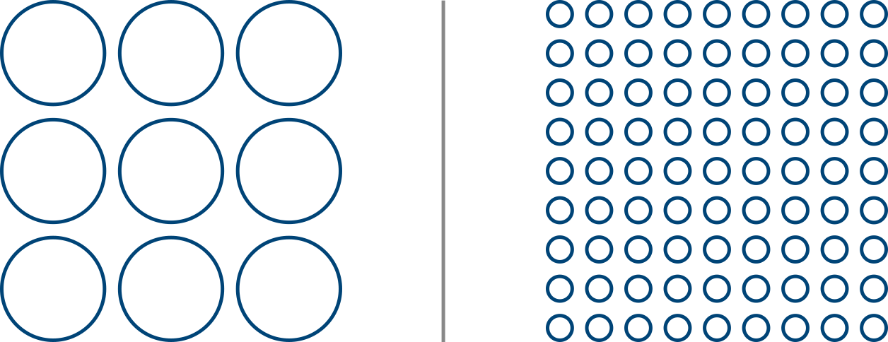
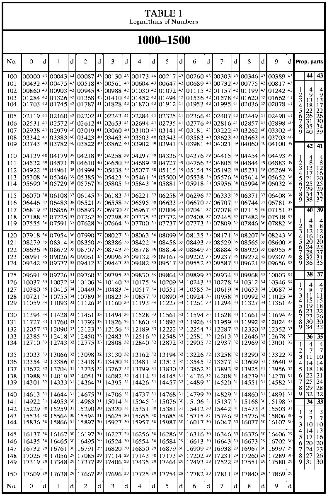
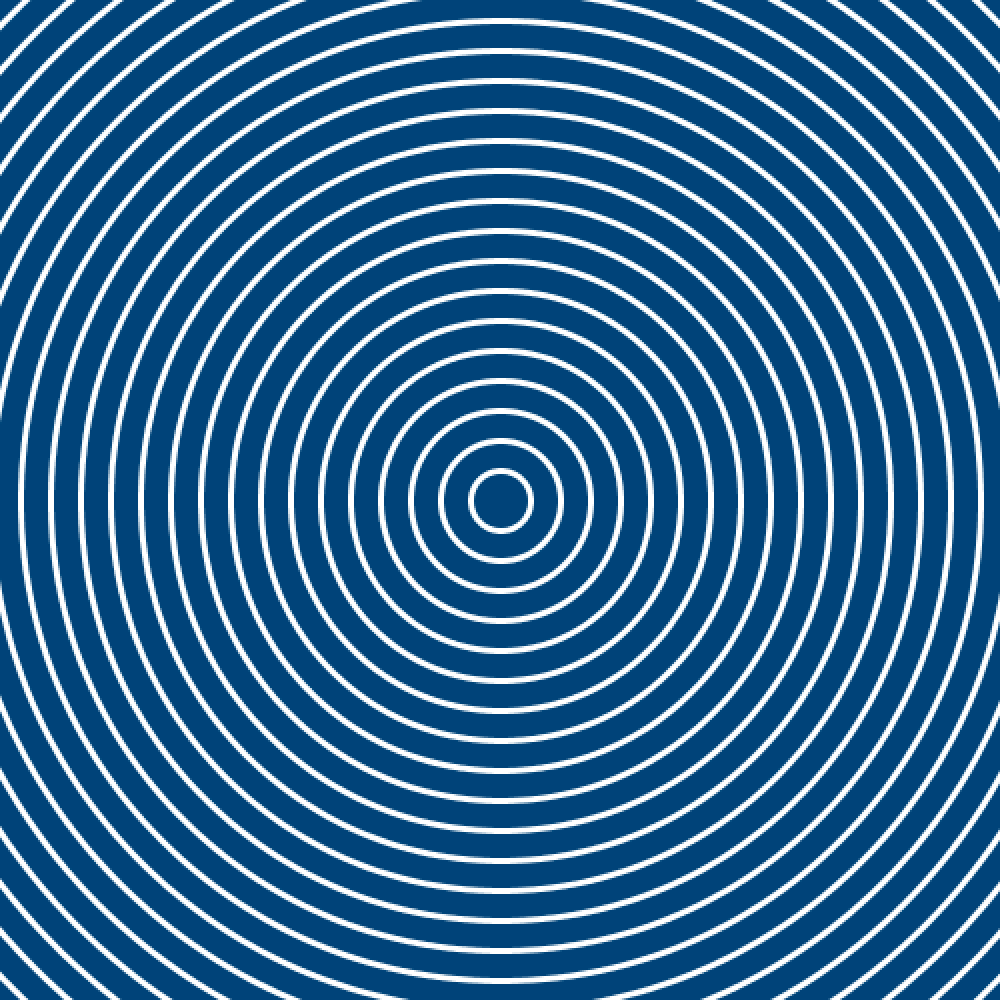
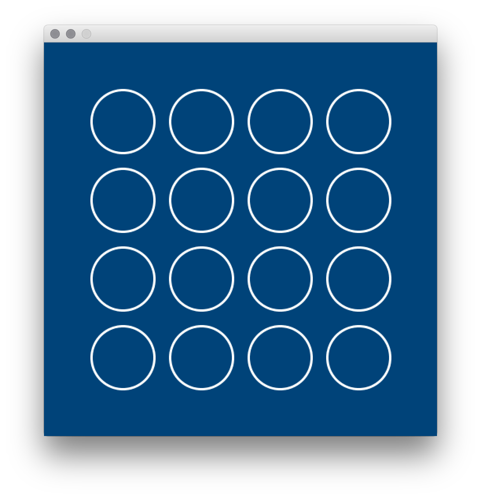

---
jupytext:
  formats: ipynb,md:myst
  text_representation:
    extension: .md
    format_name: myst
    format_version: 0.13
    jupytext_version: 1.14.0
kernelspec:
  display_name: py5bot
  language: python
  name: py5bot
---

Imagine that you wanted to fill the sketch window with circles. 



Of course, to draw nine of these circles, you could simply manually write nine `ellipse()` functions, one after the other, telling the computer exactly where to place each one. However, if you wanted to draw eighty-one circles instead, this task becomes tedious and unproductive to perform manually. Using control flow, iteration, and loops, we can give py5 exactly the instructions and rules that it needs to place each circle for us, with a minimal amount of work on our end. In fact, it's easy enough to create more *dynamic* code that can be adapted to many different use cases - something that we can modify to account for any number of circles, or different sizes of circles, and let py5 do the hard stuff all by itself. 

## iteration

If you were trying to tile a floor, it would make sense to start at one corner, placing a single tile. Then, you could move along the wall towards another corner, placing tiles as you go, until you reach the opposite wall. At that point, you would move along a row and place tiles on your way back. In this scenario, the placing of an individual tile is referred to as one *iteration* of the process. In many iterative processes, the result of a previous iteration defines the starting point of another – in this case, the position of each tile is advanced by the one laid before it.

Many iterative processes like this are a tedious task to the human mind, and boredom or inattention can lead to them being done imperfectly. Of course, these are exactly the sorts of tasks computers excel at.

As a fun aside, the term *computer* didn't refer to a machine when it was first used. Actually, a computer was the human being (usually a woman) who sat down and performed huge amounts of calculations by hand. Here's a photo of the High Speed Flight Station *computer room* (from 1949) at the National Advisory Committee for Aeronautics: 


*Human computers in the NACA High Speed Flight Station "Computer Room", Dryden Flight Research Center Facilities. Public domain, via [Wikimedia Commons](https://commons.wikimedia.org/wiki/File:Human_computers_-_Dryden.jpg)*

These human computers would usually spend their time calculating and putting together mathematical tables called logarithm tables. These are a lot like the multiplication tables many people memorize in school - they were your cheat sheet for looking up common calculations you may have been making frequently in your work. 



*A logarithms table from American Practical Navigator. Nathaniel Bowditch, originally; National Imagery and Mapping Agency, U.S. Government. Public domain, via [Wikimedia Commons](https://commons.wikimedia.org/wiki/File:APN2002_Table_1,_1000-1500.agr.tiff)*

Computing more efficiently (and without necessarily requiring the aid of humans) has been a problem itching to be solved for quite a long time. The very first iteration of the modern computer, the *Difference Machine*, was prototyped in the 1820s by Charles Babbage to automate the work of human computers. We've come a long way since then, and now many iteration tasks can be performed mechanically - including in Python. Let's begin exploring how we can automate tasks in py5.

```{code-cell} ipython3
size(500,500)
background('#004477')
no_fill()
stroke('#FFFFFF')
stroke_weight(3)

# concentric circles
ellipse(width/2,height/2, 30,30)
ellipse(width/2,height/2, 60,60)
ellipse(width/2,height/2, 90,90)
```


As you can imagine, we're thinking of filling the screen with these concentric circles here. Of course, you could simply do this all by hand, drawing an `ellipse()` each time with an expanding width and height. This would be pretty inefficient, so let's go over some ways we can get py5 to do it for us. 

## while loops

The *while* statement looks quite a lot like the *if* statement, a common conditional statement. The if statement executes code once, if the statement given is true. The while statement, on the other hand, executes its code as many times as necessarily *while* the statement is true. Let's write an example (and while we're here, we can comment out our three ellipse functions; we won't be needing to draw them like that!)

```{code-cell} ipython3
size(500,500)
background('#004477')
no_fill()
stroke('#FFFFFF')
stroke_weight(3)

# concentric circles
# ellipse(width/2,height/2, 30,30)
# ellipse(width/2,height/2, 60,60)
# ellipse(width/2,height/2, 90,90)

i = 0

while i < 24:
    print(i)
```

As you might be able to imagine, running this code will fill your console area with printed zeroes... forever. That's because we've told this *while* loop to execute its code until our new integer *i* reaches a certain number - but we haven't done anything to actually increase *i*, so it will run forever. Try this instead:

```{code-cell} ipython3
size(500,500)
background('#004477')
no_fill()
stroke('#FFFFFF')
stroke_weight(3)

# concentric circles
# ellipse(width/2,height/2, 30,30)
# ellipse(width/2,height/2, 60,60)
# ellipse(width/2,height/2, 90,90)

i = 0

while i < 24:
    print(i)
    i = i + 1
```

What's the difference? Well, each time the loop runs, it is telling you what number is assigned to i, and then *increasing i*, the missing step from before. Your console will print numbers one after the other, starting at 0 and reaching 23. At that point, increasing i means it is no longer less than 24, so the loop will not run again. Of course, i can be named anything, but these integers we create only for while loops are often just named i. Sometimes, you'll be using existing variables for your while loops instead, but for simple counters like this, it's sufficient to just create a new one. 

Just like with other types of conditional statements, the indentation before our `print()` and `i = i + 1` lines is important - it tells py5 to treat these lines as a block of code inside of our loop. 

As an aside, that line `i = i + 1` can be written a few different ways and do the same thing. For example, `i += 1` is a common way to do the same thing, and in other coding languages (but not in Python) you might also see even shorter statements like `i++`. Other shorthand operators work similarly:

```
i -= 1 is equivalent to  i = i - 1
i *= 1 is equivalent to  i = i * 1
i /= 1 is equivalent to  i = i / 1
```

So how can we use all this to draw some circles? We can start by incorporating an `ellipse()` function, very similar to our first one, inside of our loop.

```{code-cell} ipython3
size(500,500)
background('#004477')
no_fill()
stroke('#FFFFFF')
stroke_weight(3)

# concentric circles
# ellipse(width/2,height/2, 30,30)
# ellipse(width/2,height/2, 60,60)
# ellipse(width/2,height/2, 90,90)

i = 0

while i < 24:
    print(i)
    ellipse(width/2,height/2, 30,30)
    i = i + 1
```


Your console will still print the numbers 0 to 23, so you can tell the loop is running. However, only a single circle will appear on the screen. Actually, this is 24 circles - but they're being drawn in exactly the same place, and their width and height are identical. To easily increase the size of our circle along with *i*, you can simply multiply the height and width of the circle by *i* each time. To make this a little easier to read and adjust, let's also store the size of our circle in a variable.

```{code-cell} ipython3
size(500,500)
background('#004477')
no_fill()
stroke('#FFFFFF')
stroke_weight(3)

circle_size = 30
i = 0

while i < 24:
    print(i)
    ellipse(width/2,height/2, circle_size * i, circle_size * i)
    i = i + 1
```



Because circle_size is now a variable, changing that 30 to a different number can give you more tightly clumped or spread out concentric circles. Notice that because this size is multiplied by i each time, and i starts at zero, we're actually only printing 23 visible circles - the very first circle is given a height and width of zero, so it's impossible to see. Of course, you could start i at 1 instead of at 0, or do some other trickery like `circle_size * (i + 1)` to get around this, but for the moment it's more than enough to just see it working.

## rows of circles

Let's put our new knowledge of while loops to the test. You'll be recreating this image:



This code will start you off, placing a single `ellipse()` in the top left.

```{code-cell} ipython3
size(500,500)
background('#004477')
no_fill()
stroke('#FFFFFF')
stroke_weight(3)
ellipse(100,100, 80,80)
```

As with our concentric circles, your success will hinge on wrapping your `ellipse()` functions in a while loop. You need to draw 16 circles in total. Let's discuss how you could do this with a while loop.

One way to manage rows and columns would be to have variables for them, maybe named something like `row` and `column` (just to be explicit). 

You could run your while loop sixteen times, drawing sixteen circles, and using `row` and `column` to determine their positions. 

Your `column` variable would increase each time a circle was drawn, and then when you'd drawn four circles, you would reset `column` and increase `row` by one instead. 

A good way to do this is using the modulo operator - this gives you the remainder of a division operation. 

For an *i* number of 4, 8, 12 and 16 (the numbers of the circles on the 'far right', or the final column), `i % 4 == 0` will be `True`. So, if `i % 4 == 0` were `True`, you would know you had reached the end of a column.

This method is good to know, and it's worth trying. In some situations, while loops are perfect. However, there's another, slightly easier way to manage rows and columns simultaneously, using a different kind of loop. 

## for loops

In addition to *while* loops, you have access to something called a *for* loop. These are very similar, but the *for* loop is well suited to being nested (exactly like an if statement) with powerful results!

Above, we used the line `while i < 24:` to start off our while loop. The for loop would instead use `for i in range(24):` for the same results. One difference is that you don't have to declare i before using it - the for loop understands implicitly that it's created a new variable as its counter. And, unlike a while loop, you never have to manually increase i (or any other counter variable) - the for loop does this automatically. 

Combining this, an elegant way to draw your sixteen circles follows.

```{code-cell} ipython3
size(500,500)
background('#004477')
no_fill()
stroke('#FFFFFF')
stroke_weight(3)
ellipse(100,100, 80,80)

# This whole for loop will run once for each column. 
for column in range(4):
    # This NESTED for loop will run once for each row INSIDE each column! 
    # So it will run four times... four times.
    for row in range(4):
        ellipse( (column + 1) * 100, (row + 1) * 100, 80, 80)
        # We don't have to increase column or row at all... it just works.
```

In the same way, our previous code for our concentric circles could be written like this:

```{code-cell} ipython3
size(500,500)
background('#004477')
no_fill()
stroke('#FFFFFF')
stroke_weight(3)

circle_size = 30

for i in range(24):
    print(i)
    ellipse(width/2,height/2, circle_size * i, circle_size *i)
```

We've used `range()` above with just one argument, which is our "stopping point", equivalent to `while i > 24`. There are some optional arguments you can use, too. Providing `range()` with two arguments can define a stopping point and a starting point. For example, running this concentric circle code with `range(8,12)` instead will give this output: 


You can even iterate through a range, but only take action every *x* steps, where *x* is your third argument. `range(0,12,3)` draws a circle at 0, 3, 6, and 9. 

It's important to mention at this point that your nested for loops can be even more efficient. You may notice a lot of the math above, when we draw our rows of circles, is actually just offsetting the position of each row/column by 100 pixels. This could be rewritten (with some amount of effort) using three arguments in `range()` to define a starting point, ending point and how many steps between running our code, something like:

```
for column in range(0, width, 100):
    for row in range(0, height, 100):
```

Using this approach, grid-based and tile-based placements can be scaled to any size and number of "tiles" and any size of sketch!

## for loops task

For this task, you'll be recreating the following image:


It may be a good idea to [save a copy](images/iteration_with_loops/iteration-for-loops-task.png) or keep it open to reference while you work on these tasks.

The pale blue lines at each point of this image are each the first step in a for loop, with their initial coordinates given. Placing the other white lines within a for loop will be your challenge! 

This code can start you off. The initial `line()` in each area of the screen has been commented out, but you can use it to begin your for loops.

```{code-cell} ipython3
size(600,600)
background('#004477')
no_fill()
stroke('#FFFFFF')
stroke_weight(3)

# Top left
# line(75, 138, 228, 88)

# Top right
# line(370, 80, 522, 80)

# Bottom center
# line(225, 370, 300, 370)
```

For the top left pattern, the loop will be straightforward. You'll need to draw twelve lines in all.

For the top right pattern, it's useful to know that the spacing between the lines increases by 1.5 times each iteration.

For the bottom pattern, it may be helpful to remember that the result of `i % 2` can always determine whether i is odd or even.
