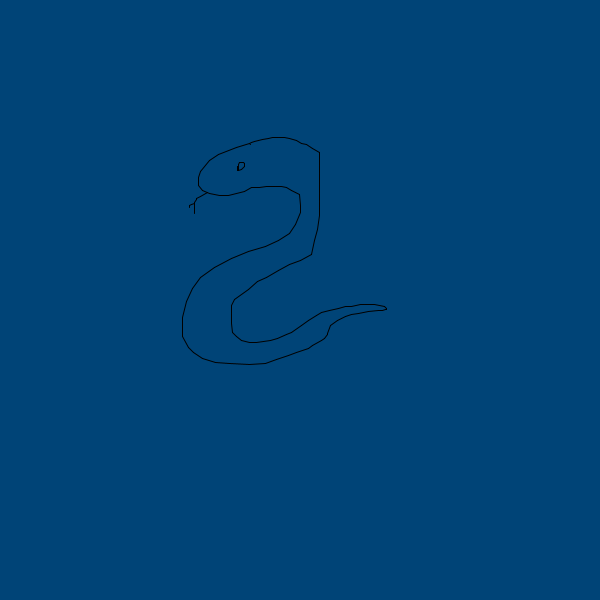
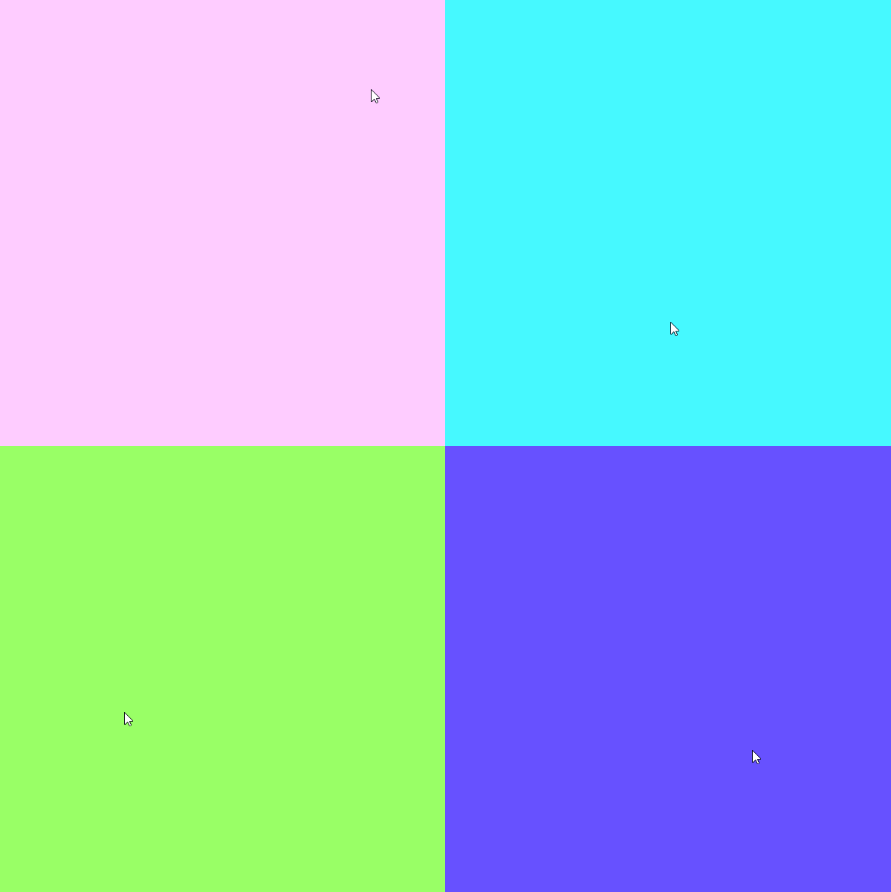
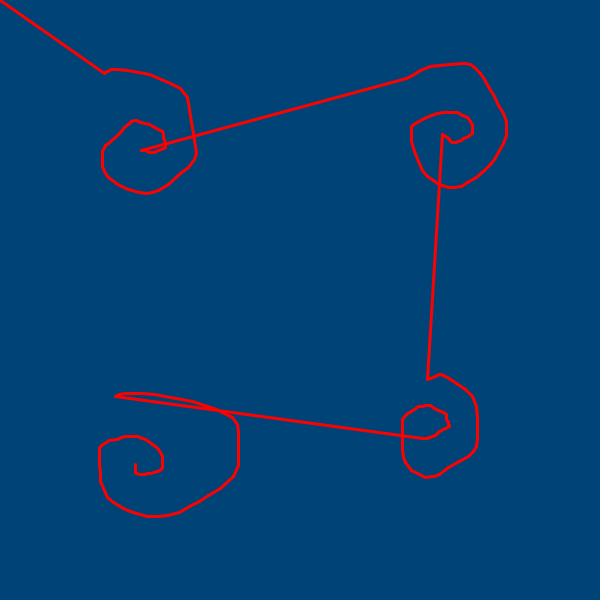
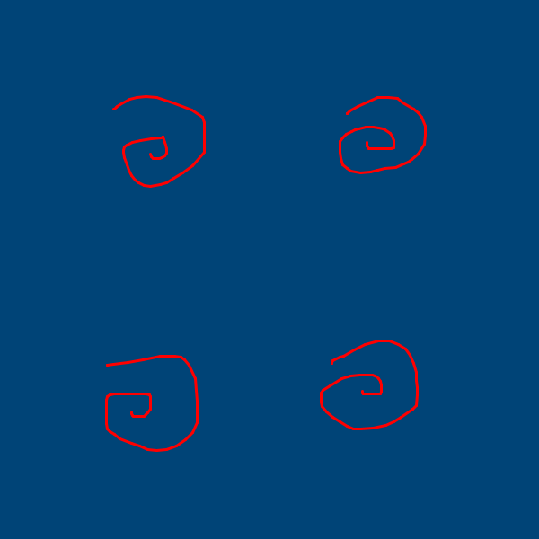
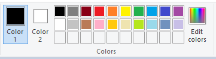
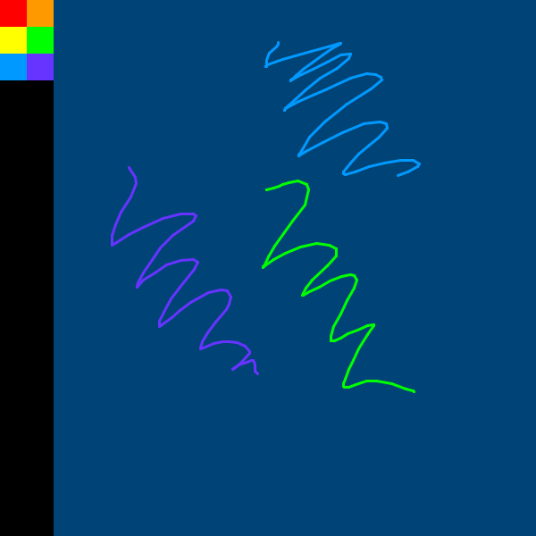
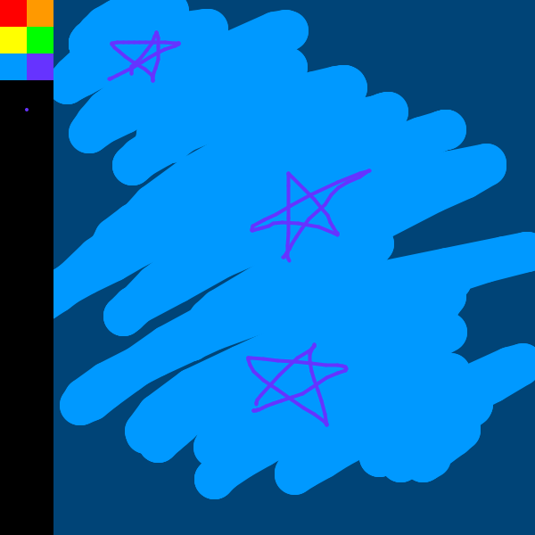
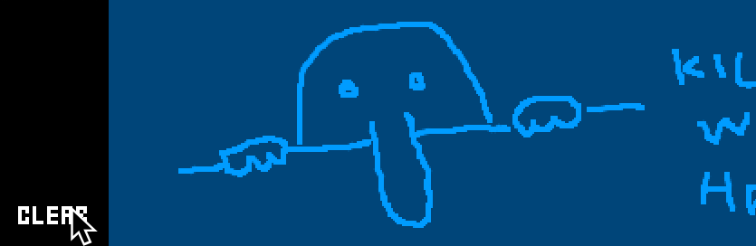

---
jupytext:
  formats: ipynb,md:myst
  text_representation:
    extension: .md
    format_name: myst
    format_version: 0.13
    jupytext_version: 1.14.0
kernelspec:
  display_name: py5
  language: python
  name: py5
---

# mouse and keyboard interaction in py5

Many programs written in py5, such as those we've discussed in previous tutorials, run independently of any outside input. Static sketches that produce a single frame of artwork are one example of this, but even animated sketches are often self-driven; variables can change at random or with some pre-defined pattern to move and alter shapes in real-time. Using a digital medium like py5 is a great way to create types of art, like animation, which are tedious or difficult to produce in other mediums. You can take this a step further with interactive artwork and digital games. 

There are a variety of ways you can hook py5 sketches up to some kind of user input, including game controllers and more novel input methods like webcams and microphones. In this tutorial, we'll be starting simple, with mouse and keyboard interaction. 

Interactivity in py5 requires the use of both `setup()` and `draw()` blocks, so that each new frame being drawn can respond to the user input. If you're unfamiliar with these concepts, which have come up in a few other tutorials where animation comes into play, just know that `setup()` is for code which runs once -- at the beginning of the sketch loading up -- and `draw()` is for code that should run repeatedly. 

## mouse interaction and mouse variables

You can use the mouse to perform simple interactions like pointing and clicking, or more complex ones like dragging-and-dropping different elements or panning around a 3D view. Many standard computer mice have three buttons, for left-clicking, right-clicking, and center-clicking (which often doubles as a scroll wheel). 

py5 includes a handful of useful system variables (meaning you don't have to define them yourself, they're already understood) relating to the state of the mouse. The `mouse_x` and `mouse_y` variables refer to the current position of the pointer inside the sketch. In the example sketch below, we create a 600 by 600 pixel sketch window and use `mouse_x` and `mouse_y` to draw ellipses beneath the mouse pointer.

```{code-cell} ipython3
def setup():
    size(600,600)
    background('#004477')
    frame_rate(20)
    fill('#FFFFFF')

def draw():
    # This line prints the mouse coordinates to the console!
    # print(mouse_x, mouse_y)
    
    # Drawing a 20-pixel ellipse at mouse_x, mouse_y
    ellipse(mouse_x,mouse_y, 20,20)
    
run_sketch()
```


In addition to `mouse_x` and `mouse_y`, you have access to two similar variables, `pmouse_x` and `pmouse_y`. These refer to the *previous* positions of the mouse, in the frame directly before the current frame. (You might be able to think of some ways this could be useful already, like determining the direction of mouse movement by seeing where the cursor was a moment before!) 

The `is_mouse_pressed` variable, as the name may hint, is py5's way of knowing whether a mouse button is currently being pressed. When someone is holding down one of the mouse buttons, `is_mouse_pressed` boolean will change to `True`. You can cleverly check for this value in order to only do something when a user clicks their mouse. By modifying our earlier sketch, we can create a very rudimentary drawing program that only draws an ellipse while the mouse is being clicked or held down.

```{code-cell} ipython3
def setup():
    size(600,600)
    background('#004477')
    frame_rate(20)
    fill('#FFFFFF')

def draw():
    # This line prints whether a mouse button is being pressed to the console!
    # print(is_mouse_pressed)
    
    if is_mouse_pressed:
        # Drawing a 20-pixel ellipse at mouse_x, mouse_y
        ellipse(mouse_x,mouse_y, 20,20)
    
run_sketch()
```

This works, but leaves a lot to be desired. Our framerate is pretty low (20 frames per second) and moving the mouse around quickly will inevitably leave gaps in our ellipses. Using `pmouse_x` and `pmouse_y` to know the previous location of the mouse, we can easily swap this ellipse function out for a line. This makes things look a lot smoother, and it's more like you might expect a digital drawing program to behave.

```{code-cell} ipython3
def setup():
    size(600,600)
    background('#004477')
    frame_rate(20)
    fill('#FFFFFF')

def draw():
    # This line prints whether a mouse button is being pressed to the console!
    # print(is_mouse_pressed)
    
    if is_mouse_pressed:
        # Drawing a line between the previous frame's position and the current frame's position
        line(mouse_x, mouse_y, pmouse_x, pmouse_y)
    
run_sketch()
```



*(It's a python, of course.)*

In addition to `is_mouse_pressed` we have access to one last mouse variable, `mouse_button`, to tell us which button on the mouse is being pressed. This will set the variable to LEFT, RIGHT or CENTER, depending on the button used. You shouldn't rely on `mouse_button` by itself to tell you *if* a button is being pressed, since it might not always reset correctly or behave in ways you'd expect, but you can use it alongside `is_mouse_pressed` to get more specific. If we might want to use the right or center mouse button for other drawing functions, we can check to make sure only the *left* button is being used before we draw our lines.

```{code-cell} ipython3
def setup():
    size(600,600)
    background('#004477')
    frame_rate(20)
    fill('#FFFFFF')

def draw():
    # This line prints whether a mouse button is being pressed to the console!
    # print(is_mouse_pressed)
    # This one will tell you which mouse button is being pressed. 
    # Note it may not always be accurate if no button is being pressed!
    # print(mouse_button)
    
    if is_mouse_pressed and mouse_button == LEFT:
        # Drawing a line between the previous frame's position and the current frame's position
        line(mouse_x, mouse_y, pmouse_x, pmouse_y)
    
run_sketch()
```

Let's take this a step further and give some use to our other mouse buttons. Our lines are looking a little thin. We can increase this with the `stroke_weight()` function, but it would be good to give the user some control over that thickness. By tying `stroke_weight()` to a variable, we can then increase it by clicking the right button, or reset it by clicking the center button.

```{code-cell} ipython3
# A new global variable for our stroke weight!
sw = 3

def setup():
    size(600,600)
    background('#004477')
    frame_rate(20)
    fill('#FFFFFF')

def draw():
    # Bringing in our global variable and using it to set the stroke weight
    global sw
    stroke_weight(sw)
    
    if is_mouse_pressed and mouse_button == LEFT:
        # Drawing a line between the previous frame's position and the current frame's position
        line(mouse_x, mouse_y, pmouse_x, pmouse_y)
        
    if is_mouse_pressed and mouse_button == CENTER:
        # Resetting stroke weight
        sw = 3
        
    if is_mouse_pressed and mouse_button == RIGHT:
        # Increasing stroke weight
        sw += 1
    
run_sketch()
```

Of course, you can use mouse input in ways that are less direct to produce digital art that requires and responds to user interaction. As an example, here's some code that creates a background color reliant on the current position of the mouse. The *x* position will change the hue of the background, and the *y* position will change the saturation. If you want to make the relationship between the user's mouse position and the color of the background a bit more mysterious, you can also use the function `no_cursor()` to hide the cursor entirely.

```{code-cell} ipython3
def setup():
    size(600,600)
    frame_rate(20)
    # If you want to hide the mouse cursor...
    # no_cursor()

def draw():
    # Setting the color mode to hue, saturation, brightness
    color_mode(HSB, 360,100,100)
    
    # Determining hue and saturation based on mouse position
    h = float(mouse_x)/width*360
    s = float(mouse_y)/height*100
    
    # Brightness is always the same, although you could change this!
    b = 100
    background(h,s,b)
    
run_sketch()
```



## paint app, with mouse events 

In addition to the mouse variables we've just gone over -- `mouse_x`, `mouse_y`, `pmouse_x`, `pmouse_y`, `is_mouse_pressed` and `mouse_button` -- in py5 we have access to a variety of mouse *events*. These share some functionality with mouse variables, but are given their own chunks of associated code outside of the `draw()` function. While we won't be using all of them immediately, these events are `mouse_pressed()`, `mouse_released()`, `mouse_wheel()`, `mouse_clicked()`, `mouse_dragged()`, and `mouse_moved()`. These are functions of their own that listen for their corresponding mouse events and then execute some code in response. Just like `setup()` and `draw()`, you can write this code yourself.

We'll be using the first three of those events (for pressing and releasing mouse buttons, and using the mouse wheel) to create an expanded version of our simple drawing app idea. To have better control over when our `draw()` function runs, we'll also be utilizing two functions called `no_loop()` and `loop()`. By default, everything inside of `draw()` runs once every frame. By using `no_loop()`, you can "freeze" the code inside of `draw()` and stop it from running. As an example, the code below will NOT fill the console with numbers, like it might normally... we've frozen the `print()` function and stopped it from running each frame.

```{code-cell} ipython3
def setup():
    size(600,600)
    background('#004477')
    no_loop()

def draw():
    print(frame_count)
    
run_sketch()
```

Why would you want to do this? Well, by using `loop()`, we can now manually control when everything inside of `draw()` runs, which can be a neat way to only use our code when we need it. 

Exactly as the `setup()` and `draw()` functions are written, we'll be adding `mouse_pressed()` to our code with the *def* keyword. Inside this new function, we've checked if the mouse button being pressed is the left mouse button, and if it is, we use `loop()` to run our code as normal. Try it out -- once you press the right mouse button, the `mouse_pressed()` event will trigger our code, and you'll start getting the current frame number in the console!

```{code-cell} ipython3
def setup():
    size(600,600)
    background('#004477')
    no_loop()

def draw():
    print(frame_count)
    
def mouse_pressed():
    if mouse_button == LEFT:
        loop()
        
run_sketch()
```

As we build our digital painting app, you can optionally download the font [*Ernest* (created by Marc André 'mieps' Misman)](https://www.dafont.com/ernest.font) to make the words on your user interface look a little nicer. If you're running this sketch on your computer, make sure to place the .ttf file in an appropriate place, either in the same folder as your sketch or a folder alongside it that you reference in your code. We'll be creating a whole lot of global variables to control various attributes in our app, which must be placed somewhere outside of our `setup()`, `draw()` and mouse-event-related functions. Finally, in order to make sure that our `loop()` only runs while the mouse button is being held down, we'll add a `mouse_released()` function that runs `no_loop()` again.

```{code-cell} ipython3
# Global variables live outside of our various functions.
swatches = ['#FF0000', '#FF9900', '#FFFF00', 
 '#00FF00', '#0099FF', '#6633FF']
brushcolor = swatches[0]
brushshape = ROUND
brushsize = 3
painting = False
paintmode = 'free'
palette = 60

def setup():
    size(600,600)
    background('#004477')
    no_loop()
    
    # Comment out the two lines below if you aren't using the Ernest font by Marc André 'mieps' Misman.
    ernest = create_font('images/mouse_and_keyboard_interaction/Ernest.ttf', 20)
    text_font(ernest)

def draw():
    print(frame_count)
    
def mouse_pressed():
    if mouse_button == LEFT:
        loop()
        
def mouse_released():
    no_loop()
    
run_sketch()
```

Now, pressing and releasing the left mouse button will lead to a short burst of drawn frames, with the current framecount being printed in the console. Let's add those drawing features back in, using our new global variables.

```{code-cell} ipython3
# Global variables live outside of our various functions.
swatches = ['#FF0000', '#FF9900', '#FFFF00', 
 '#00FF00', '#0099FF', '#6633FF']
brushcolor = swatches[0]
brushshape = ROUND
brushsize = 3
painting = False
paintmode = 'free'
palette = 60

def setup():
    size(600,600)
    background('#004477')
    no_loop()
    
    # Comment out the two lines below if you aren't using the Ernest font by Marc André 'mieps' Misman.
    ernest = create_font('images/mouse_and_keyboard_interaction/Ernest.ttf', 20)
    text_font(ernest)

def draw():
    # print(frame_count)
    stroke(brushcolor)
    stroke_cap(brushshape)
    stroke_weight(brushsize)
    line(mouse_x,mouse_y, pmouse_x,pmouse_y)
    
def mouse_pressed():
    if mouse_button == LEFT:
        loop()
        
def mouse_released():
    no_loop()
    
run_sketch()
```



It works... sort of. There are some issues here, because of the way the line will always connect to the previous mouse positions. The first time you draw anything, the *pmouse* variables will be set to the 0, 0 position, so a line connects your drawing to the upper left corner. Plus, if you stop and start drawing, your current line will be connected to the last position of the mouse. Although it's more efficient, by only updating `draw()` when we need to, we're no longer getting that live, updating data of the new mouse position unless you're holding the button down.

However, we can fix this using a couple of neat tricks. You'll notice one of our global variables, *painting*, is set to `False` by default. We can use this to represent whether you're currently trying to draw a line, and it can resolve our issues.

```{code-cell} ipython3
# Global variables live outside of our various functions.
swatches = ['#FF0000', '#FF9900', '#FFFF00', 
 '#00FF00', '#0099FF', '#6633FF']
brushcolor = swatches[0]
brushshape = ROUND
brushsize = 3
painting = False
paintmode = 'free'
palette = 60

def setup():
    size(600,600)
    background('#004477')
    no_loop()
    
    # Comment out the two lines below if you aren't using the Ernest font by Marc André 'mieps' Misman.
    ernest = create_font('images/mouse_and_keyboard_interaction/Ernest.ttf', 20)
    text_font(ernest)

def draw():
    # Bringing in some global variables that can change
    global painting, paintmode
    
    if paintmode == 'free':
        if painting:
            stroke(brushcolor)
            stroke_cap(brushshape)
            stroke_weight(brushsize)
            line(mouse_x,mouse_y, pmouse_x,pmouse_y)
        else:
            painting = True
    
def mouse_pressed():
    # start painting
    if mouse_button == LEFT:
        global painting
        painting = False
        loop()
        
def mouse_released():
    # stop painting!
    no_loop()
    
run_sketch()
```



Now that we're using our *painting* variable as a sort of toggle, the very first frame that you hold down the left mouse button, the only thing that will happen is that *painting* is set to `True`. On the next frame, the actual drawing function will begin, and it will neatly connect to wherever your mouse was on the previous frame (when you started holding down the button). When you release the button, *painting* is toggled back off. We've also wrapped the relevant `draw()` code inside of a check against our *paintmode* variable. Currently, the only mode is "free painting"; later, we'll be able to add others. 

Now we need to create a way to select between different colors. We've stored all of these colors inside of a list named *swatches*, and we're also using a variable called *palette*, which doesn't do anything yet. You may be familar with digital palettes if you've used drawing programs like Microsoft Paint:



We'll be creating our own digital paint palette against the left side of the screen, using the *palette* variable for the width. This will be done using a *for loop* at the bottom of our `draw()` function that iterates through the list of swatches and draws a square for each. Because none of this is hard-coded, by changing the *swatches* list and the width of *palette* you can fully customize your color choices.

```{code-cell} ipython3
# Global variables live outside of our various functions.
swatches = ['#FF0000', '#FF9900', '#FFFF00', 
 '#00FF00', '#0099FF', '#6633FF']
brushcolor = swatches[0]
brushshape = ROUND
brushsize = 3
painting = False
paintmode = 'free'
palette = 60

def setup():
    size(600,600)
    background('#004477')
    no_loop()
    
    # Comment out the two lines below if you aren't using the Ernest font by Marc André 'mieps' Misman.
    ernest = create_font('images/mouse_and_keyboard_interaction/Ernest.ttf', 20)
    text_font(ernest)

def draw():
    # Bringing in some global variables that can change
    global painting, paintmode
    
    if paintmode == 'free':
        if painting:
            stroke(brushcolor)
            stroke_cap(brushshape)
            stroke_weight(brushsize)
            line(mouse_x,mouse_y, pmouse_x,pmouse_y)
        else:
            painting = True
            
    # black side panel
    no_stroke()
    fill('#000000')
    rect(0, 0, palette, height)
    # color swatches
    for i, swatch in enumerate(swatches):
        sx = int(i%2) * palette/2
        sy = int(i/2) * palette/2
        fill(swatch)
        square(sx, sy, palette/2)
    
def mouse_pressed():
    # start painting
    if mouse_button == LEFT:
        global painting
        painting = False
        loop()
        
def mouse_released():
    # stop painting!
    no_loop()
    
run_sketch()
```

Getting the color when someone clicks one of those swatches is actually very easy. We can use the function `get()`, which reads the color of specific pixels. Let's add a section of code inside of `draw()` that checks the mouse position. We'll be able to tell if we're in the right area of the screen just by checking the mouse's X position against that *palette* variable from earlier... and because we'll be adding other buttons to the left-hand panel, it's a good idea to check that we're at a certain Y position as well.

```{code-cell} ipython3
# Global variables live outside of our various functions.
swatches = ['#FF0000', '#FF9900', '#FFFF00', 
 '#00FF00', '#0099FF', '#6633FF']
brushcolor = swatches[0]
brushshape = ROUND
brushsize = 3
painting = False
paintmode = 'free'
palette = 60

def setup():
    size(600,600)
    background('#004477')
    no_loop()
    
    # Comment out the two lines below if you aren't using the Ernest font by Marc André 'mieps' Misman.
    ernest = create_font('images/mouse_and_keyboard_interaction/Ernest.ttf', 20)
    text_font(ernest)

def draw():
    # Bringing in some global variables that can change
    global painting, paintmode
    
    # Selecting swatches
    if mouse_button == LEFT and mouse_x < palette and mouse_y < 90:
        global brushcolor
        brushcolor = get(mouse_x, mouse_y)
    
    if paintmode == 'free':
        if painting:
            stroke(brushcolor)
            stroke_cap(brushshape)
            stroke_weight(brushsize)
            line(mouse_x,mouse_y, pmouse_x,pmouse_y)
        else:
            painting = True
            
    # black side panel
    no_stroke()
    fill('#000000')
    rect(0, 0, palette, height)
    # color swatches
    for i, swatch in enumerate(swatches):
        sx = int(i%2) * palette/2
        sy = int(i/2) * palette/2
        fill(swatch)
        square(sx, sy, palette/2)
    
def mouse_pressed():
    # start painting
    if mouse_button == LEFT:
        global painting
        painting = False
        loop()
        
def mouse_released():
    # stop painting!
    no_loop()
    
run_sketch()
```



Let's add in the ability to change the size of our brush. We could redo our previous code, that increases the size with a right click and resets it with the middle click... but it'd be more elegant to use the mouse wheel to scroll up and down and change the size that way. 

Thankfully, the `mouse_wheel()` event can do the hard part for us, waiting to capture that event. Scrolling the mouse wheel up or down (or, on some laptops, scrolling the touchpad with two fingers) will trigger thie event... but the values produced from it for an *upwards* scroll or a *downwards* scroll vary by device, so we'll do some testing first to determine which way is which. 

Add in a `mouse_wheel()` event that captures the event information (we've called it *e*, but you can name it anything) and prints it to the console. The data returned by just printing *e* is pretty useless -- you might see some kind of a mess like `<py5.mouseevent.Py5MouseEvent object at 0x0000018F3E0B96D0>` -- but we're also using a method called `.get_count()` to turn this mouse event into a human-readable number.

```{code-cell} ipython3
# Global variables live outside of our various functions.
swatches = ['#FF0000', '#FF9900', '#FFFF00', 
 '#00FF00', '#0099FF', '#6633FF']
brushcolor = swatches[0]
brushshape = ROUND
brushsize = 3
painting = False
paintmode = 'free'
palette = 60

def setup():
    size(600,600)
    background('#004477')
    no_loop()
    
    # Comment out the two lines below if you aren't using the Ernest font by Marc André 'mieps' Misman.
    ernest = create_font('images/mouse_and_keyboard_interaction/Ernest.ttf', 20)
    text_font(ernest)

def draw():
    # Bringing in some global variables that can change
    global painting, paintmode
    
    # Selecting swatches
    if mouse_button == LEFT and mouse_x < palette and mouse_y < 90:
        global brushcolor
        brushcolor = get(mouse_x, mouse_y)
    
    if paintmode == 'free':
        if painting:
            stroke(brushcolor)
            stroke_cap(brushshape)
            stroke_weight(brushsize)
            line(mouse_x,mouse_y, pmouse_x,pmouse_y)
        else:
            painting = True
            
    # black side panel
    no_stroke()
    fill('#000000')
    rect(0, 0, palette, height)
    # color swatches
    for i, swatch in enumerate(swatches):
        sx = int(i%2) * palette/2
        sy = int(i/2) * palette/2
        fill(swatch)
        square(sx, sy, palette/2)
    
def mouse_pressed():
    # start painting
    if mouse_button == LEFT:
        global painting
        painting = False
        loop()
        
def mouse_released():
    # stop painting!
    no_loop()
    
def mouse_wheel(e):
    print(e.get_count())
    
run_sketch()
```

Scrolling the mouse wheel at this point will print either a -1 or a 1 in the console. On some devices, -1 will correspond to scrolling upwards... on other devices it could be the opposite. However, you'll quickly be able to figure out which one is the case for you. For simplicity's sake, we'll just be adding this value to our *brushsize* variable. 

We'll also be bringing in a different mode here. While we're adjusting our brush size, our painting mode will be on *select*. When we've adjusted our brush size, the `redraw()` line will run `draw()` again -- just once -- to set the painting mode back to *free*. To prevent blobs of paint appearing around the edges of the palette when you select colors with a large brush size, we've also added in a line to set our painting mode to *select* while we're selecting from our swatches.

Finally, it's a good idea to provide some feedback to the user. The new section for *brush preview* adds an appropriately sized blob to the side panel to show what size the brush is.

```{code-cell} ipython3
# Global variables live outside of our various functions.
swatches = ['#FF0000', '#FF9900', '#FFFF00', 
 '#00FF00', '#0099FF', '#6633FF']
brushcolor = swatches[0]
brushshape = ROUND
brushsize = 3
painting = False
paintmode = 'free'
palette = 60

def setup():
    size(600,600)
    background('#004477')
    no_loop()
    
    # Comment out the two lines below if you aren't using the Ernest font by Marc André 'mieps' Misman.
    ernest = create_font('images/mouse_and_keyboard_interaction/Ernest.ttf', 20)
    text_font(ernest)

def draw():
    # Bringing in some global variables that can change
    global painting, paintmode
    
    # Selecting swatches
    if mouse_button == LEFT and mouse_x < palette and mouse_y < 90:
        paintmode = 'select'
        global brushcolor
        brushcolor = get(mouse_x, mouse_y)
    
    if paintmode == 'free':
        if painting:
            stroke(brushcolor)
            stroke_cap(brushshape)
            stroke_weight(brushsize)
            line(mouse_x,mouse_y, pmouse_x,pmouse_y)
        else:
            painting = True
            
    # Setting our painting mode again
    paintmode = 'free'
            
    # black side panel
    no_stroke()
    fill('#000000')
    rect(0, 0, palette, height)
    # color swatches
    for i, swatch in enumerate(swatches):
        sx = int(i%2) * palette/2
        sy = int(i/2) * palette/2
        fill(swatch)
        square(sx, sy, palette/2)
        
    # brush preview
    fill(brushcolor)
    if brushshape == ROUND:
        circle(palette/2, 123, brushsize)
    
def mouse_pressed():
    # start painting
    if mouse_button == LEFT:
        global painting
        painting = False
        loop()
        
def mouse_released():
    # stop painting!
    no_loop()
    
def mouse_wheel(e):
    global brushsize, paintmode
    
    # Switching the painting mode so we can't draw while adjusting our size
    paintmode = 'select'
    brushsize += e.get_count()
    
    # Setting a maximum and minimum size for our brush
    if brushsize > 45:
        brushsize = 45
    if brushsize < 3:
        brushsize = 3
    # Running draw() again
    redraw()
    
run_sketch()
```



We've done a lot with mouse input here. Let's move on to the keyboard.

## keyboard input

Keyboard interaction in py5 is similar to what we've already experienced, with system variables like `key` and `is_key_pressed` and events like `key_pressed()`, `key_released()` and `key_typed()`. We'll be adding an event to detect keyboard presses, and using it to select from our swatches with the keyboard. Our code is getting pretty long now... don't get lost! First, we'll be adding the `key_pressed()` function itself, and printing the value of `key`. This function will be triggered every time you press a key on your keyboard, and `key` stores the last button on the keyboard that was pressed.

```{code-cell} ipython3
# Global variables live outside of our various functions.
swatches = ['#FF0000', '#FF9900', '#FFFF00', 
 '#00FF00', '#0099FF', '#6633FF']
brushcolor = swatches[0]
brushshape = ROUND
brushsize = 3
painting = False
paintmode = 'free'
palette = 60

def setup():
    size(600,600)
    background('#004477')
    no_loop()
    
    # Comment out the two lines below if you aren't using the Ernest font by Marc André 'mieps' Misman.
    ernest = create_font('images/mouse_and_keyboard_interaction/Ernest.ttf', 20)
    text_font(ernest)

def draw():
    # Bringing in some global variables that can change
    global painting, paintmode
    
    # Selecting swatches
    if mouse_button == LEFT and mouse_x < palette and mouse_y < 90:
        paintmode = 'select'
        global brushcolor
        brushcolor = get(mouse_x, mouse_y)
    
    if paintmode == 'free':
        if painting:
            stroke(brushcolor)
            stroke_cap(brushshape)
            stroke_weight(brushsize)
            line(mouse_x,mouse_y, pmouse_x,pmouse_y)
        else:
            painting = True
            
    # Setting our painting mode again
    paintmode = 'free'
            
    # black side panel
    no_stroke()
    fill('#000000')
    rect(0, 0, palette, height)
    # color swatches
    for i, swatch in enumerate(swatches):
        sx = int(i%2) * palette/2
        sy = int(i/2) * palette/2
        fill(swatch)
        square(sx, sy, palette/2)
        
    # brush preview
    fill(brushcolor)
    if brushshape == ROUND:
        circle(palette/2, 123, brushsize)
    
def mouse_pressed():
    # start painting
    if mouse_button == LEFT:
        global painting
        painting = False
        loop()
        
def mouse_released():
    # stop painting!
    no_loop()
    
def mouse_wheel(e):
    global brushsize, paintmode
    
    # Switching the painting mode so we can't draw while adjusting our size
    paintmode = 'select'
    brushsize += e.get_count()
    
    # Setting a maximum and minimum size for our brush
    if brushsize > 45:
        brushsize = 45
    if brushsize < 3:
        brushsize = 3
    # Running draw() again
    redraw()
    
def key_pressed():
    print(key)
    
run_sketch()
```

Run this code, and start pushing keys. You'll notice that, for the most part, the output is human-readable. Exceptions will be special keys like SHIFT and CTRL, or the arrow keys. (For capturing the inputs of these special keys, you'll want to read up on how to use the [key_code variable](http://py5coding.org/reference/sketch_key_code.html) instead.) 

We can check if the key pressed is a digit using Python's `.isdigit()` method, and then use this to select a color if a corresponding color exists.

```{code-cell} ipython3
# Global variables live outside of our various functions.
swatches = ['#FF0000', '#FF9900', '#FFFF00', 
 '#00FF00', '#0099FF', '#6633FF']
brushcolor = swatches[0]
brushshape = ROUND
brushsize = 3
painting = False
paintmode = 'free'
palette = 60

def setup():
    size(600,600)
    background('#004477')
    no_loop()
    
    # Comment out the two lines below if you aren't using the Ernest font by Marc André 'mieps' Misman.
    ernest = create_font('images/mouse_and_keyboard_interaction/Ernest.ttf', 20)
    text_font(ernest)

def draw():
    # Bringing in some global variables that can change
    global painting, paintmode
    
    # Selecting swatches
    if mouse_button == LEFT and mouse_x < palette and mouse_y < 90:
        paintmode = 'select'
        global brushcolor
        brushcolor = get(mouse_x, mouse_y)
    
    if paintmode == 'free':
        if painting:
            stroke(brushcolor)
            stroke_cap(brushshape)
            stroke_weight(brushsize)
            line(mouse_x,mouse_y, pmouse_x,pmouse_y)
        else:
            painting = True
            
    # Setting our painting mode again
    paintmode = 'free'
            
    # black side panel
    no_stroke()
    fill('#000000')
    rect(0, 0, palette, height)
    # color swatches
    for i, swatch in enumerate(swatches):
        sx = int(i%2) * palette/2
        sy = int(i/2) * palette/2
        fill(swatch)
        square(sx, sy, palette/2)
        
    # brush preview
    fill(brushcolor)
    if brushshape == ROUND:
        circle(palette/2, 123, brushsize)
    
def mouse_pressed():
    # start painting
    if mouse_button == LEFT:
        global painting
        painting = False
        loop()
        
def mouse_released():
    # stop painting!
    no_loop()
    
def mouse_wheel(e):
    global brushsize, paintmode
    
    # Switching the painting mode so we can't draw while adjusting our size
    paintmode = 'select'
    brushsize += e.get_count()
    
    # Setting a maximum and minimum size for our brush
    if brushsize > 45:
        brushsize = 45
    if brushsize < 3:
        brushsize = 3
    # Running draw() again
    redraw()
    
def key_pressed():
    global brushcolor, paintmode
    paintmode = 'select'
    
    # Color swatch shortcuts
    if key.isdigit():
        # Subtracting 1 to correspond to our list, which of course starts at 0
        k = int(key) - 1
        
        # Is k potentially one of our swatches?
        if k < len(swatches):
            brushcolor = swatches[k]
            redraw()
    
run_sketch()
```

## 'clear' button

Let's add a button to clear everything from our painting app and start over. We'll finally be bringing in that font we've had imported the whole time (of course, if you aren't using it, yours will look slightly different, but the functionality will be the same). We'll do this by first adding in some text (to serve as our button) in the bottom-left corner, at the end of our `draw()` function.

```{code-cell} ipython3
# Global variables live outside of our various functions.
swatches = ['#FF0000', '#FF9900', '#FFFF00', 
 '#00FF00', '#0099FF', '#6633FF']
brushcolor = swatches[0]
brushshape = ROUND
brushsize = 3
painting = False
paintmode = 'free'
palette = 60

def setup():
    size(600,600)
    background('#004477')
    no_loop()
    
    # Comment out the two lines below if you aren't using the Ernest font by Marc André 'mieps' Misman.
    ernest = create_font('images/mouse_and_keyboard_interaction/Ernest.ttf', 20)
    text_font(ernest)

def draw():
    # Bringing in some global variables that can change
    global painting, paintmode
    
    # Selecting swatches
    if mouse_button == LEFT and mouse_x < palette and mouse_y < 90:
        paintmode = 'select'
        global brushcolor
        brushcolor = get(mouse_x, mouse_y)
    
    if paintmode == 'free':
        if painting:
            stroke(brushcolor)
            stroke_cap(brushshape)
            stroke_weight(brushsize)
            line(mouse_x,mouse_y, pmouse_x,pmouse_y)
        else:
            painting = True
            
    # Setting our painting mode again
    paintmode = 'free'
            
    # black side panel
    no_stroke()
    fill('#000000')
    rect(0, 0, palette, height)
    # color swatches
    for i, swatch in enumerate(swatches):
        sx = int(i%2) * palette/2
        sy = int(i/2) * palette/2
        fill(swatch)
        square(sx, sy, palette/2)
        
    # brush preview
    fill(brushcolor)
    if brushshape == ROUND:
        circle(palette/2, 123, brushsize)
        
    # clear button
    fill('#FFFFFF')
    text('CLEAR', 10, height-12)
    
def mouse_pressed():
    # start painting
    if mouse_button == LEFT:
        global painting
        painting = False
        loop()
        
def mouse_released():
    # stop painting!
    no_loop()
    
def mouse_wheel(e):
    global brushsize, paintmode
    
    # Switching the painting mode so we can't draw while adjusting our size
    paintmode = 'select'
    brushsize += e.get_count()
    
    # Setting a maximum and minimum size for our brush
    if brushsize > 45:
        brushsize = 45
    if brushsize < 3:
        brushsize = 3
    # Running draw() again
    redraw()
    
def key_pressed():
    global brushcolor, paintmode
    paintmode = 'select'
    
    # Color swatch shortcuts
    if key.isdigit():
        # Subtracting 1 to correspond to our list, which of course starts at 0
        k = int(key) - 1
        
        # Is k potentially one of our swatches?
        if k < len(swatches):
            brushcolor = swatches[k]
            redraw()
    
run_sketch()
```



Let's add a new function to correspond to this, using an event we haven't seen yet, `mouse_clicked()`. This listens for a mouse event just like `mouse_pressed()` and `mouse_released()`, but it listens for the entire click, both pressing and releasing, and only executes its code after the button is released.

```{code-cell} ipython3
# Global variables live outside of our various functions.
swatches = ['#FF0000', '#FF9900', '#FFFF00', 
 '#00FF00', '#0099FF', '#6633FF']
brushcolor = swatches[0]
brushshape = ROUND
brushsize = 3
painting = False
paintmode = 'free'
palette = 60

def setup():
    size(600,600)
    background('#004477')
    no_loop()
    
    # Comment out the two lines below if you aren't using the Ernest font by Marc André 'mieps' Misman.
    ernest = create_font('images/mouse_and_keyboard_interaction/Ernest.ttf', 20)
    text_font(ernest)

def draw():
    # Bringing in some global variables that can change
    global painting, paintmode
    
    # Selecting swatches
    if mouse_button == LEFT and mouse_x < palette and mouse_y < 90:
        paintmode = 'select'
        global brushcolor
        brushcolor = get(mouse_x, mouse_y)
    
    if paintmode == 'free':
        if painting:
            stroke(brushcolor)
            stroke_cap(brushshape)
            stroke_weight(brushsize)
            line(mouse_x,mouse_y, pmouse_x,pmouse_y)
        else:
            painting = True
            
    # Setting our painting mode again
    paintmode = 'free'
            
    # black side panel
    no_stroke()
    fill('#000000')
    rect(0, 0, palette, height)
    # color swatches
    for i, swatch in enumerate(swatches):
        sx = int(i%2) * palette/2
        sy = int(i/2) * palette/2
        fill(swatch)
        square(sx, sy, palette/2)
        
    # brush preview
    fill(brushcolor)
    if brushshape == ROUND:
        circle(palette/2, 123, brushsize)
        
    # clear button
    fill('#FFFFFF')
    text('CLEAR', 10, height-12)
    
def mouse_pressed():
    # start painting
    if mouse_button == LEFT:
        global painting
        painting = False
        loop()
        
def mouse_released():
    # stop painting!
    no_loop()
    
def mouse_wheel(e):
    global brushsize, paintmode
    
    # Switching the painting mode so we can't draw while adjusting our size
    paintmode = 'select'
    brushsize += e.get_count()
    
    # Setting a maximum and minimum size for our brush
    if brushsize > 45:
        brushsize = 45
    if brushsize < 3:
        brushsize = 3
    # Running draw() again
    redraw()
    
def key_pressed():
    global brushcolor, paintmode
    paintmode = 'select'
    
    # Color swatch shortcuts
    if key.isdigit():
        # Subtracting 1 to correspond to our list, which of course starts at 0
        k = int(key) - 1
        
        # Is k potentially one of our swatches?
        if k < len(swatches):
            brushcolor = swatches[k]
            redraw()
            
def mouse_clicked():
    global paintmode
    paintmode = 'select'
    fill('#004477')
    rect(palette, 0, width, height)
    redraw()
    
run_sketch()
```

This code draws a rectangle the same color as the background over the entire canvas (starting at the top of the screen and the edge of our palette), effectively erasing everything. However, you'll notice it currently runs every time you click once, anywhere on the screen. 

How can you add an *if* statement that only runs the code inside if you click on the clear button? 

## challenge: add more features 

So far, we have the ability to draw lines in a few different colors, change the brush size, use keyboard shortcuts, and clear the whole digital canvas. What other features could you think of adding? 

If you're stuck on ideas, take a look at the variables we have already for inspiration. The *brushshape* variable is being used for the `stroke_cap()` -- you could add buttons to toggle between the different types of caps available. What about an eraser, more color swatches, a button to save your drawing using [the `save()` function](http://py5coding.org/reference/sketch_save.html), or even a color mixer?  

As you can see, code with a lot of functions and events can quickly become quite long and difficult to work through. Good work making it this far. In the next few lessons, we'll dig deeper into making your own functions, organizing your code into multiple files and other techniques that may make it all easier to wrangle.
