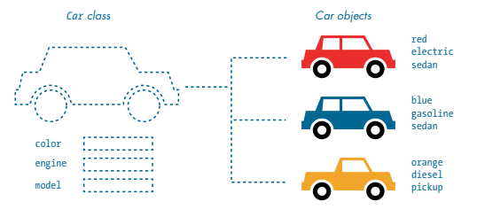

---
jupytext:
  formats: ipynb,md:myst
  text_representation:
    extension: .md
    format_name: myst
    format_version: 0.13
    jupytext_version: 1.14.0
kernelspec:
  display_name: py5
  language: python
  name: py5
---

In other tutorials in this series, you have likely gotten used to the idea of working inside of one large file, and have used organizational techniques like labeling your code with comments to separate out different blocks. Although you may have dipped your toes into creating custom functions and a sensible "flow" for the logic of your program, there's much more that can be done in terms of keeping your code organized and making it work sensibly.

A common way to approach code is called *object-oriented programming*, and it can help enormously with laying out your code and organizing the way your functions work. 

## object-oriented programming (OOP)

Essentially, object-oriented programming (commonly shortened to OOP) involves the creation of a collection of data called an *object*. Before you create an individual *object*, though, you create a *class*, which is sort of like a template for how objects should behave and what sort of data they contain. This system lets you define the general features a certain class of object should have, and then automatically pass those traits on to each object you create. This is a very efficient way to deal with something that might have complex behaviors and might not be wholly unique. 

Of course, classes can be used to simulate real-life concepts, like vehicles, buildings, animals or people. They're also useful for more abstract concepts, like bank accounts, personality types, and physical forces like the weather. To wrap our heads around the concept more generally, we'll be spending this tutorial working on a class that simulates single-celled amoebas and their behavior. Once this class has been defined and given its own qualities, you'll be able to "spawn" individual amoebas into existence and give them their own traits. 

Because these amoebas will be responding to simulated physical forces, we'll also be exploring *vectors* as a way of tracking movement and position, using the Py5Vector class. These are a type of *Euclidean vector*, so we'll be dealing with some concepts of linear algebra... but even if your algebra skills are quite rusty, you'll find that py5 handles all of the difficult math for you. 

Finally, to aid with organizing all of this new code we'll be producing, you'll also learn to divide code into multiple files and use all of them to contribute to the same program. This will be more applicable if you're using some sort of IDE on your computer to run your code, rather than running it live on the documentation website, but is useful to explore nevertheless. 

## working with classes

A *class* is like a blueprint for an object. If you were going to set out to create a car in real life, before you began manufacturing it you'd probably start with some kind of plan that outlines the specifications and aesthetics of the vehicle. In py5, you might start with defining a *class* for your car, so that you can specify by default that cars have four wheels, an engine, a windshield, and so on. 

However, some qualities will change for each individual vehicle. For example, if you want to create a red car and a blue car, you would want to be able to set the color of this individual car whenever you create a new car object. These features that can be set for each individual object are called *attributes*. In Python, something being an *attribute* just means that it's a variable that belongs to a particular class. If your car class had attributes for color, type of engine and the shape of the vehicle itself, you could always change those attributes to create many different car objects. 



*From 'Learn Python Visually', by Tristan Bunn.*

Of course, cars don't just sit there and look pretty. They have a variety of functions they can perform, like accelerating, braking and steering. If you wanted to replicate these in Python, your "car" class could have *methods* associated with it. You've probably seen methods throughout the rest of these tutorials, and wondered what makes them different from regular *functions*. Just like attributes are variables that are associated with a particular class, a method is a function that is associated with that class. 

Although we won't immediately be diving into this aspect of classes, you should know that classes can also *inherit* qualities from each other. Inheritance means that if you might be trying to represent a variety of different vehicles in a game, you could make a more general *vehicle* class, and then classes like *car* and *motorcycle* that inherit certain qualities from the generic *vehicle*. This is a fantastic way to organize different sub-types of object, but for now, just a single class will serve our purposes. 

## amoeba simulator

We'll start by defining an *amoeba* class that will include both attributes and methods, so that you can easily control the appearance (and behavior) of individual amoeba objects. 

These won't be a scientifically accurate representation of amoebas. In fact, they'll mostly just wobble around the screen, but it will look pretty cool, and will serve as a great introduction to how classes and objects work. As an additional challenge, you can introduce *collision-detection* code that will prevent them from passing through each other. We'll be starting with the most basic form of our `Amoeba` class, and adding attributes and methods to it as we progress. 

The very first thing we'll do is create the class itself. If you're using an IDE on your computer to run your sketch, put this Amoeba class in its own file. Before we declare this class, we do two things: first, with the line `from py5 import *` we import all of the special functions and structures associated with py5 into this file, so we can use all of the features we expect. Then, with the line `cs = get_current_sketch()` we give this file some awareness of the currently running sketch, so that our files will easily be able to "talk to each other" even when the amoeba file is not running.

```{code-cell} ipython3
# Setting this amoeba file up so that it can be plugged in to a different file, as a module!
from py5 import *
cs = get_current_sketch()

# Defining a new class called Amoeba...
class Amoeba():
    # ... and giving it a method, "init", which will run when a new amoeba is created or "initialized"
    def __init__(self):
        print('amoeba initialized')
```

You might save this file as *amoeba.py*, since its only purpose will be defining the Amoeba class. That strange looking method, `__init__()`, is automatically called when the amoeba is actually created.

We'll also be creating a sketch for everything else we're planning on doing, like setting up a background color and spawning our amoebas. I've named mine *microscope.py*, since the experience will be not unlike looking into a microscope focused on a slide. Either way, the very first thing I'll be doing is importing the Amoeba class I've just created (and put in a file called amoeba.py). 

Next, we actually want to create an amoeba *object* from this class we defined. Since it's meant to represent a living thing (even a single-celled living thing), why not give this individual amoeba a name?

```{code-cell} ipython3
# Looking for a file called amoeba, and importing the Amoeba class from it
from amoeba import Amoeba

# Creating a new amoeba... named Bob
bob = Amoeba()
```

Of course, you don't have to put this class and the subsequent code in separate files, and you may prefer to keep things together. This version of the code will work, too.

```{code-cell} ipython3
# All in one file

# Defining a new class called Amoeba...
class Amoeba():
    # ... and giving it a method, "init", which will run when a new amoeba is created or "initialized"
    def __init__(self):
        print('amoeba initialized')
        
# Creating a new amoeba... named Bob
bob = Amoeba()
```

No matter how you choose to format it, running the all-in-one code or your *microscope.py* file will print the line "amoeba initialized" to the console. We can't see it yet, but py5 has created a new amoeba object, which is of course based on the class we defined. To get some visual output associated with our amoeba, we're going to need to give it some attributes. 

As discussed in the tutorial for creating your own functions, most functions (including methods) will have *parameters* defined when you create them, which correspond to *arguments* you provide whenever you use that function. Right now, when the amoeba is initialized and `__init__()` is run, it only has a single possible parameter, `self`. This parameter is used to store everything associated with a specific amoeba, like Bob, rather than amoebas as a class. Let's add a few more parameters into `__init__()`, and then pass them as arguments when we create Bob. 

First, we'll actually add those parameters to `__init__()`. Inside of the method, we'll take them and make sure they're applied to some *attributes* of `self`, in this case Bob. Once we've given Bob an attribute like `self.x`, we'll be able to reference it with `bob.x` and get that value back.

Here's where things will start to get a bit more visual. We'll also add `setup()` and `draw()` into our sketch so that we can see the amoeba. If you'll recall from other tutorials, `setup()` runs once at the start of the sketch, and `draw()` runs every frame. 

(The three sections below will correspond to amoeba.py, microscope.py, and an all-in-one file. Use whichever setup you prefer.)

```{code-cell} ipython3
# amoeba.py

from py5 import *
cs = get_current_sketch()

class Amoeba():
    def __init__(self, x, y, diameter):
        self.x = x
        self.y = y
        self.d = diameter
        print('amoeba initialized')
```

```{code-cell} ipython3
# microscope.py

from amoeba import Amoeba

bob = Amoeba(400, 200, 100)

def setup():
    size(800, 400)

def draw():
    background('#004477')
    # cell membrane
    fill(0x880099FF)
    stroke('#FFFFFF')
    stroke_weight(3)
    circle(bob.x, bob.y, bob.d)
```

```{code-cell} ipython3
# all-in-one file

class Amoeba():
    def __init__(self, x, y, diameter): 
        self.x = x
        self.y = y
        self.d = diameter
        print('amoeba initialized')
        
bob = Amoeba(400, 200, 100)

def setup():
    size(800, 400)

def draw():
    background('#004477')
    # cell membrane
    fill(0x880099FF)
    stroke('#FFFFFF')
    stroke_weight(3)
    circle(bob.x, bob.y, bob.d)
```

Run this sketch. Believe it or not, that's Bob. 


Bob isn't very exciting yet, because we haven't given them anything to do. However, you can already see the relationship between class, object and sketch: we've given an `Amoeba` the ability to have an x and y position and a diameter, created Bob with some values for these attributes, and then drew a circle corresponding to Bob's attributes. 

Not all attributes have to be passed in as arguments. In fact, there are many times where you'll want to have attributes which are always the same, or at the very least all start at the same value. As an example, let's give each `Amoeba` a *nucleus*, with a default red color. We'll do this by adding a `self.nucleus` attribute into our `Amoeba` class, and drawing it in our sketch.

```{code-cell} ipython3
# amoeba.py

from py5 import *
cs = get_current_sketch()

class Amoeba():
    def __init__(self, x, y, diameter):
        self.x = x
        self.y = y
        self.d = diameter
        self.nucleus = '#FF0000'
        print('amoeba initialized')
```

```{code-cell} ipython3
# microscope.py

from amoeba import Amoeba

bob = Amoeba(400, 200, 100)

def setup():
    size(800, 400)

def draw():
    background('#004477')
    # nucleus
    fill(bob.nucleus)
    no_stroke()
    circle(bob.x, bob.y, bob.d/2.5)
    # cell membrane
    fill(0x880099FF)
    stroke('#FFFFFF')
    stroke_weight(3)
    circle(bob.x, bob.y, bob.d)
```

```{code-cell} ipython3
# all-in-one file

class Amoeba():
    def __init__(self, x, y, diameter): 
        self.x = x
        self.y = y
        self.d = diameter
        self.nucleus = '#FF0000'
        print('amoeba initialized')
        
bob = Amoeba(400, 200, 100)

def setup():
    size(800, 400)

def draw():
    background('#004477')
    # nucleus
    fill(bob.nucleus)
    no_stroke()
    circle(bob.x, bob.y, bob.d/2.5)
    # cell membrane
    fill(0x880099FF)
    stroke('#FFFFFF')
    stroke_weight(3)
    circle(bob.x, bob.y, bob.d)
```


What if you don't want Bob to have a red nucleus? Not a problem. If you add a line to change one of Bob's attributes somewhere after the line to create Bob in the first place, it will still work. For example, adding the line `bob.nucleus = '#00FF00'` somewhere will make Bob's nucleus green.


Rather than a nucleus always being red, or being manually defined, it might be nice to randomly select from a set of colors. First, we'll be changing the value of the nucleus from a single string (the hexadecimal code for red) to an entire dictionary, which stores many different values for the nucleus. This is an easy way to keep track of all of these different values by name, since dictionaries store things by a keyword which you define. 

One of the values inside this dictionary, `fill`, will be for the fill color of the nucleus. To randomly select the color of our nucleus, we'll have a list of five different colors, and use a `random()` function to pick one of them. While we're here, we can make the nucleus's shape and location a bit more random, too. Just make sure to change the code you're using to draw the nucleus, as well.

```{code-cell} ipython3
# amoeba.py

from py5 import *
cs = get_current_sketch()

class Amoeba():
    def __init__(self, x, y, diameter):
        self.x = x
        self.y = y
        self.d = diameter
        
        # the nucleus has been transformed into a dictionary!
        self.nucleus = {
        'fill': ['#FF0000', '#FF9900', '#FFFF00',
        '#00FF00', '#0099FF'][int(random(5))],
        'x': self.d * random(-0.15, 0.15),
        'y': self.d * random(-0.15, 0.15),
        'd': self.d / random(2.5, 4)
        }
```

```{code-cell} ipython3
# microscope.py

from amoeba import Amoeba

bob = Amoeba(400, 200, 100)

def setup():
    size(800, 400)

def draw():
    background('#004477')
    # nucleus
    fill(bob.nucleus['fill'])
    no_stroke()
    circle(
    bob.x + bob.nucleus['x'],
    bob.y + bob.nucleus['y'],
    bob.nucleus['d'])
    # cell membrane
    fill(0x880099FF)
    stroke('#FFFFFF')
    stroke_weight(3)
    circle(bob.x, bob.y, bob.d)
```

```{code-cell} ipython3
# all-in-one file

class Amoeba():
    def __init__(self, x, y, diameter):
        self.x = x
        self.y = y
        self.d = diameter
        
        # the nucleus has been transformed into a dictionary!
        self.nucleus = {
        'fill': ['#FF0000', '#FF9900', '#FFFF00',
        '#00FF00', '#0099FF'][int(random(5))],
        'x': self.d * random(-0.15, 0.15),
        'y': self.d * random(-0.15, 0.15),
        'd': self.d / random(2.5, 4)
        }
        
bob = Amoeba(400, 200, 100)

def setup():
    size(800, 400)

def draw():
    background('#004477')
    # nucleus
    fill(bob.nucleus['fill'])
    no_stroke()
    circle(
    bob.x + bob.nucleus['x'],
    bob.y + bob.nucleus['y'],
    bob.nucleus['d'])
    # cell membrane
    fill(0x880099FF)
    stroke('#FFFFFF')
    stroke_weight(3)
    circle(bob.x, bob.y, bob.d)
```

Each time you run this sketch, Bob will be created with a new set of values, so the amoeba will have a differently colored and positioned nucleus. 

However, it's not very exciting just watching an amoeba sit in the center of the screen. If you've ever had the pleasure of using a microscope in real life, you'll know that part of the excitement is watching single-celled creatures flitting around. 

We'll need to add some methods to our `Amoeba` class to control its movement. While we're here, it would be a good idea to take some of that code for displaying the individual amoeba and move it out of our `draw()` function and into a method for our Amoeba class. It'd be much more convenient if we could simply tell the program "create an amoeba named Bob, and then display them" rather than manually drawing circles with Bob's values. Let's create a method called `display()` that takes the values attached to an amoeba and draws them for us each time. 

Once we've created this new method, and put all our old code to draw Bob in there (replacing "bob" with "self" each time), we can call this method with `bob.display()` inside of our `draw()` function instead.

```{code-cell} ipython3
# amoeba.py

from py5 import *
cs = get_current_sketch()

class Amoeba():
    def __init__(self, x, y, diameter):
        self.x = x
        self.y = y
        self.d = diameter
        
        self.nucleus = {
        'fill': ['#FF0000', '#FF9900', '#FFFF00',
        '#00FF00', '#0099FF'][int(random(5))],
        'x': self.d * random(-0.15, 0.15),
        'y': self.d * random(-0.15, 0.15),
        'd': self.d / random(2.5, 4)
        }
        
    def display(self):
        # nucleus
        fill(self.nucleus['fill'])
        no_stroke()
        circle(
        self.x + self.nucleus['x'],
        self.y + self.nucleus['y'],
        self.nucleus['d'])
        
        # cell membrane
        fill(0x880099FF)
        stroke('#FFFFFF')
        stroke_weight(3)
        circle(self.x, self.y, self.d)
```

```{code-cell} ipython3
# microscope.py

from amoeba import Amoeba

bob = Amoeba(400, 200, 100)

def setup():
    size(800, 400)

def draw():
    background('#004477')
    bob.display()
```

```{code-cell} ipython3
# all-in-one file

class Amoeba():
    def __init__(self, x, y, diameter):
        self.x = x
        self.y = y
        self.d = diameter
        
        self.nucleus = {
        'fill': ['#FF0000', '#FF9900', '#FFFF00',
        '#00FF00', '#0099FF'][int(random(5))],
        'x': self.d * random(-0.15, 0.15),
        'y': self.d * random(-0.15, 0.15),
        'd': self.d / random(2.5, 4)
        }
        
    def display(self):
        # nucleus
        fill(self.nucleus['fill'])
        no_stroke()
        circle(
        self.x + self.nucleus['x'],
        self.y + self.nucleus['y'],
        self.nucleus['d'])
        
        # cell membrane
        fill(0x880099FF)
        stroke('#FFFFFF')
        stroke_weight(3)
        circle(self.x, self.y, self.d)
        
bob = Amoeba(400, 200, 100)

def setup():
    size(800, 400)

def draw():
    background('#004477')
    bob.display()
```

There's one more change we'll have to make before we start letting our amoebas run around the screen. In the real world, an amoeba is not perfectly circular -- its surface ripples and distorts like a water balloon. We'll be replacing our `circle()` function with a series of Bezier curves to draw a wobbly amoeba. To stop us from having to calculate these points manually, we'll also be adding a new method to do a bit of that math for us. 

This new `circle_point()` method will go inside our `Amoeba` class, and use the radius of the amoeba, plus a bit of clever trigonometry, to find us the right x and y positions. By passing it an argument based on the current frame count in our sketch, we'll get an amoeba that ripples and wiggles as time passes. You'll only need to modify your *amoeba.py* file (or the methods inside of the `Amoeba` class, if you're using a single file) to see the changes. 

One important thing to note: below, when we use `frame_count` to get the current number of elapsed frames, we actually write `cs.frame_count` because we've defined `cs` as the *current sketch* at the top of the window. If you're working in a single file, omit this `cs.` reference.

```{code-cell} ipython3
# amoeba.py

from py5 import *
cs = get_current_sketch()

class Amoeba():
    def __init__(self, x, y, diameter):
        self.x = x
        self.y = y
        self.d = diameter
        
        self.nucleus = {
        'fill': ['#FF0000', '#FF9900', '#FFFF00',
        '#00FF00', '#0099FF'][int(random(5))],
        'x': self.d * random(-0.15, 0.15),
        'y': self.d * random(-0.15, 0.15),
        'd': self.d / random(2.5, 4)
        }
        
    def circle_point(self, t, r):
        x = cos(t) * r
        y = sin(t) * r
        return [x, y]
        
    def display(self):
        # nucleus
        fill(self.nucleus['fill'])
        no_stroke()
        circle(
        self.x + self.nucleus['x'],
        self.y + self.nucleus['y'],
        self.nucleus['d'])
        
        # cell membrane
        fill(0x880099FF)
        stroke('#FFFFFF')
        stroke_weight(3)
        
        # new bezier version of our amoeba!
        r = self.d / 2.0 # radius is diameter divided by 2
        cpl = r * 0.55 # distance from the center of the circle to our bezier "control points"
        cpx, cpy = self.circle_point(cs.frame_count/(r/2), r/8) # calculating new circle_point x and y
        xp, xm = self.x+cpx, self.x-cpx
        yp, ym = self.y+cpy, self.y-cpy
        begin_shape()
        vertex(
        self.x, self.y-r # top vertex
        )
        bezier_vertex(
        xp+cpl, yp-r, xm+r, ym-cpl,
        self.x+r, self.y # right vertex
        )
        bezier_vertex(
        xp+r, yp+cpl, xm+cpl, ym+r,
        self.x, self.y+r # bottom vertex
        )
        bezier_vertex(
        xp-cpl, yp+r, xm-r, ym+cpl,
        self.x-r, self.y # left vertex
        )
        bezier_vertex(
        xp-r, yp-cpl, xm-cpl, ym-r,
        self.x, self.y-r # (back to) top vertex
        )
        end_shape()
```


We've got a pleasantly wobbly amoeba now. To continue this exercise, let's move on to learning about Py5vector and vector movement in general.
