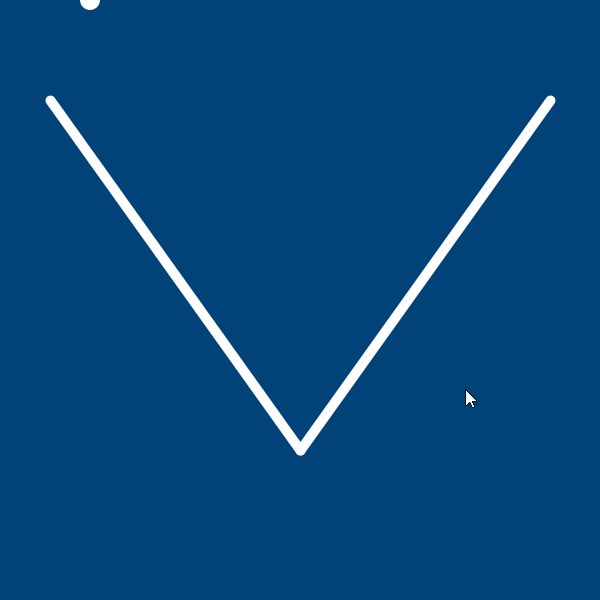

---
jupytext:
  formats: ipynb,md:myst
  text_representation:
    extension: .md
    format_name: myst
    format_version: 0.13
    jupytext_version: 1.14.0
kernelspec:
  display_name: py5
  language: python
  name: py5
---

## physics simulations

In this tutorial, we'll be exploring some features outside of py5's usual toolbox; namely, a library we can import in order to simulate two-dimensional physics. More specifically, we'll be simulating *rigid bodies* which have a variety of forces applied to them, such as gravity. You can think of a rigid body as any object that doesn't deform at all when it hits things or moves around. Although a *perfectly* rigid body may not exist in the real world (everything will deform if it's moving fast enough, or is hit with enough force), a metal spoon is much closer to being a rigid body than a gummy bear. For the purposes of simplified simulations that don't need to be perfectly accurate, such as those in video games, simulating these kinds of stiff objects is done with rigid bodies to save on computational power.

The library we'll be using in this tutorial is called *[Pymunk](http://www.pymunk.org/en/latest/)*. Pymunk will give us access to four basic classes -- the *space* is like the world in which we'll be simulating some physics, and inside of this space we'll have rigid bodies, *collision shapes* (to manually define which parts of a rigid body will be able to collide with other entities) and *constraints/joints* (which can connect two rigid bodies, or restrict how far they can get from each other). 

There are multiple different ways to use the Pymunk library, and you can find more information on these methods on the [Pymunk installation page](http://www.pymunk.org/en/latest/installation.html). However, for the sake of simplicity, we'll be using the Thonny IDE and its ability to manage packages for us. 

## py5 in Thonny

Thonny is an *integrated development environment* (or IDE) for working with Python, and includes a plugin specifically for using py5. First, you'll want to [install the correct version of Thonny and the py5mode plugin](https://pypi.org/project/thonny-py5mode/). Once the process is complete, you can navigate to *Tools > Manage Packages*, search for `pymunk` and install it. As with using other files, we'll begin our sketch with an *import* line so that our program knows we want to use all the nifty features and classes included with Pymunk. 

In addition to the regular code we might use to create an animated py5 sketch (the code in `setup()` that runs once, and the code in `draw()` that runs every frame) we'll be starting by creating a Pymunk "space", and directly setting its gravity using the *gravity* attribute. Right now, this doesn't do anything visible.

```{code-cell} ipython3
import pymunk

# Creating a new pymunk space for our simulation
space = pymunk.Space()
space.gravity = (0, 900)

def setup():
    size(600,600)

def draw():
    background('#004477')
```

We'll start by creating a "floor" in this new space with its own rigid bodies. Creating Pymunk objects to use with py5 has a few steps: defining the objects themselves, adding them to the space, and finally creating a visual representation of them inside of our sketch itself. 

First, we'll be creating two `Segment` shapes. These are very similar to the py5 `line()` function, only with Pymunk physics features. When you use `pymunk.Segment()` you pass some arguments for the Pymunk body to connect to, the X and Y positions of the first point in the line, the X and Y positions of the second point in the line, and a radius for its thickness. Here, we'll be using a special case, `space.static_body`, for the body that the line is connected to. Remember when we refer to some sketches as *static* sketches, where nothing moves? In this case, a static body is a rigid body that doesn't move. 

After we define the two segments, we add them both to the space. Finally, in `draw()`, we render two lines using their attributes. 

```{code-cell} ipython3
import pymunk

# Creating a new pymunk space for our simulation
space = pymunk.Space()
space.gravity = (0, 900)

# Adding two line segments 
segment1 = pymunk.Segment(space.static_body, (50, 100), (300, 450), 5)
segment2 = pymunk.Segment(space.static_body, (550, 100), (300, 450), 5)
space.add(segment1, segment2)

def setup():
    size(600,600)

def draw():
    background('#004477')
    
    # Rendering visual representations of our new bodies
    stroke('#FFFFFF')
    stroke_weight(segment1.radius*2)
    line(segment1.a.x, segment1.a.y, segment1.b.x, segment1.b.y)
    line(segment2.a.x, segment2.a.y, segment2.b.x, segment2.b.y)
```


This won't be exciting until we add something that moves. Let's add a ball to roll down that slope. First, we'll be defining the body for the ball, with mass and momentum. Then we'll attach a Pymunk circle to that body, add it to the space, and render a py5 circle to visually represent it.


```{code-cell} ipython3
import pymunk

# Creating a new pymunk space for our simulation
space = pymunk.Space()
space.gravity = (0, 900)

# Adding two line segments 
segment1 = pymunk.Segment(space.static_body, (50, 100), (300, 450), 5)
segment2 = pymunk.Segment(space.static_body, (550, 100), (300, 450), 5)
space.add(segment1, segment2)

# Adding a ball
body = pymunk.Body(mass=1, moment=10)
body.position = 90, 0
ball = pymunk.Circle(body, radius=10)
space.add(body, ball)

def setup():
    size(600,600)

def draw():
    background('#004477')
    
    # Rendering visual representations of our new bodies
    stroke('#FFFFFF')
    stroke_weight(segment1.radius*2)
    line(segment1.a.x, segment1.a.y, segment1.b.x, segment1.b.y)
    line(segment2.a.x, segment2.a.y, segment2.b.x, segment2.b.y)
    
    # Rendering the ball 
    no_stroke()
    circle(ball.body.position.x, ball.body.position.y, ball.radius*2)
```


There's the ball... but it isn't moving yet! What gives? 

Now that we want to animate our physics simulation, there's one last thing we'll need to add to `draw()`. By default, everything in Pymunk is frozen, even when py5 is visually updating the display. Using the `.step()` method, we can make sure that the simulation is actually being updated.

```{code-cell} ipython3
import pymunk

# Creating a new pymunk space for our simulation
space = pymunk.Space()
space.gravity = (0, 900)

# Adding two line segments 
segment1 = pymunk.Segment(space.static_body, (50, 100), (300, 450), 5)
segment2 = pymunk.Segment(space.static_body, (550, 100), (300, 450), 5)
space.add(segment1, segment2)

# Adding a ball
body = pymunk.Body(mass=1, moment=10)
body.position = 90, 0
ball = pymunk.Circle(body, radius=10)
space.add(body, ball)

def setup():
    size(600,600)

def draw():
    background('#004477')
    
    # Rendering visual representations of our new bodies
    stroke('#FFFFFF')
    stroke_weight(segment1.radius*2)
    line(segment1.a.x, segment1.a.y, segment1.b.x, segment1.b.y)
    line(segment2.a.x, segment2.a.y, segment2.b.x, segment2.b.y)
    
    # Rendering the ball 
    no_stroke()
    circle(ball.body.position.x, ball.body.position.y, ball.radius*2)
    
    # Advancing the simulation!
    space.step(1/get_frame_rate())
```



As you can see, physics simulations with py5 are not necessarily straightforward -- you have to create the physics objects themselves, represent them visually, and update the simulation each frame. If you're missing any of these steps, things won't work out. 

Currently, there's only one force being applied to this ball; gravity. Because it's being pulled downwards, it can roll around its environment if there's a sufficient slope. However, Pymunk allows you to apply forces directly to a body (like the one our ball is using). Let's use the `.apply_impulse_at_world_point()` method for now. Pymunk uses *impulse* to mean a force that has occurred instantaneously, so this force is added directly to the velocity of the object. You can also use `.apply_force_at_world_point()` (though it won't have nearly as dramatic an impact). 

How do you use `.apply_impulse_at_world_point()`? It's a method, so it's applied directly to a body (in this case, the one on our ball). You can pass it two arguments -- the force to apply (in the form of a *vector*, with an X and Y direction) and the point at which to apply it. 

If we add just a few lines, we can hold the mouse button to launch the ball up in the air. 

```{code-cell} ipython3
import pymunk

# Creating a new pymunk space for our simulation
space = pymunk.Space()
space.gravity = (0, 900)

# Adding two line segments 
segment1 = pymunk.Segment(space.static_body, (50, 100), (300, 450), 5)
segment2 = pymunk.Segment(space.static_body, (550, 100), (300, 450), 5)
space.add(segment1, segment2)

# Adding a ball
body = pymunk.Body(mass=1, moment=10)
body.position = 90, 0
ball = pymunk.Circle(body, radius=10)
space.add(body, ball)

def setup():
    size(600,600)

def draw():
    background('#004477')
    
    # Rendering visual representations of our new bodies
    stroke('#FFFFFF')
    stroke_weight(segment1.radius*2)
    line(segment1.a.x, segment1.a.y, segment1.b.x, segment1.b.y)
    line(segment2.a.x, segment2.a.y, segment2.b.x, segment2.b.y)
    
    # Rendering the ball 
    no_stroke()
    circle(ball.body.position.x, ball.body.position.y, ball.radius*2)
    
    # Launching our ball on mouse press
    if (is_mouse_pressed):
        ball.body.apply_impulse_at_world_point( (0,-50), (mouse_x,mouse_y) )
    
    # Advancing the simulation!
    space.step(1/get_frame_rate())
```


This is a force of (0, -50), which means the ball is pushed in a strong upwards direction, and not to the left or right. However, we can use the position of the mouse compared to the ball to "push" it away from the cursor, if we choose. You can store this value as two variables if you want, but I've chosen to use a Py5Vector I called `ball_force`. 

```{code-cell} ipython3
import pymunk

# Creating a new pymunk space for our simulation
space = pymunk.Space()
space.gravity = (0, 900)

# Adding two line segments 
segment1 = pymunk.Segment(space.static_body, (50, 100), (300, 450), 5)
segment2 = pymunk.Segment(space.static_body, (550, 100), (300, 450), 5)
space.add(segment1, segment2)

# Adding a ball
body = pymunk.Body(mass=1, moment=10)
body.position = 90, 0
ball = pymunk.Circle(body, radius=10)
space.add(body, ball)

def setup():
    size(600,600)

def draw():
    background('#004477')
    
    # Rendering visual representations of our new bodies
    stroke('#FFFFFF')
    stroke_weight(segment1.radius*2)
    line(segment1.a.x, segment1.a.y, segment1.b.x, segment1.b.y)
    line(segment2.a.x, segment2.a.y, segment2.b.x, segment2.b.y)
    
    # Rendering the ball 
    no_stroke()
    circle(ball.body.position.x, ball.body.position.y, ball.radius*2)
    
    # Launching our ball... based on mouse position
    # Let's create a vector to easily store the force we want to apply.
    ball_force = Py5Vector(0, 0)
    if (is_mouse_pressed):
        if (mouse_x > ball.body.position.x):
            # If the mouse is to the right of the ball, let's push it left
            ball_force.x = -15
        if (mouse_x < ball.body.position.x):
            # Otherwise, let's push it right
            ball_force.x = 15
            
        if (mouse_y > ball.body.position.y):
            # If the mouse is below the ball, let's push it up
            ball_force.y = -15
        if (mouse_y < ball.body.position.y):
            # Otherwise, let's push it down
            ball_force.y = 15
            
        ball.body.apply_impulse_at_world_point( (ball_force.x,ball_force.y), (mouse_x,mouse_y) )
    
    # Advancing the simulation!
    space.step(1/get_frame_rate())
```


Of course, the way that we're applying this force is hardly sophisticated. It's worth digging into the [Pymunk examples](http://www.pymunk.org/en/latest/examples.html) to see some of the interesting things you can do with these sorts of physics simulation. 

Since each of our objects in this sketch has a rigid body associated with it, we can set up something to happen when they collide with each other. We'll be using Pymunk's `.add_collision_handler()` method to define the types of collisions we want to record, as well as something that needs to happen when those collisions occur. 

First, though, we'll want to create a list of the *types* of objects in your space, so that we can define specific things to happen when these types of objects collide with each other. We'll make a special dictionary that exists to list off the different types of rigid bodies in our scene. For now, we only have a ball and a "ground" surface for the ball to hit. After we define this dictionary, `collider_types`, we'll need to make sure that we add the right type to each rigid body in our space.

```{code-cell} ipython3
import pymunk

# Creating a new pymunk space for our simulation
space = pymunk.Space()
space.gravity = (0, 900)

# Defining our collider types
collider_types = {
    "ball": 1,
    "ground": 2
}

# Adding two line segments 
segment1 = pymunk.Segment(space.static_body, (50, 100), (300, 450), 5)
segment2 = pymunk.Segment(space.static_body, (550, 100), (300, 450), 5)

# Adding the right collider to the segments
segment1.collision_type = collider_types["ground"]
segment2.collision_type = collider_types["ground"]

space.add(segment1, segment2)

# Adding a ball
body = pymunk.Body(mass=1, moment=10)
body.position = 90, 0
ball = pymunk.Circle(body, radius=10)

# Adding the right collider to the ball
ball.collision_type = collider_types["ball"]

space.add(body, ball)

def setup():
    size(600,600)

def draw():
    background('#004477')
    
    # Rendering visual representations of our new bodies
    stroke('#FFFFFF')
    stroke_weight(segment1.radius*2)
    line(segment1.a.x, segment1.a.y, segment1.b.x, segment1.b.y)
    line(segment2.a.x, segment2.a.y, segment2.b.x, segment2.b.y)
    
    # Rendering the ball 
    no_stroke()
    circle(ball.body.position.x, ball.body.position.y, ball.radius*2)
    
    # Launching our ball... based on mouse position
    # Let's create a vector to easily store the force we want to apply.
    ball_force = Py5Vector(0, 0)
    if (is_mouse_pressed):
        if (mouse_x > ball.body.position.x):
            # If the mouse is to the right of the ball, let's push it left
            ball_force.x = -15
        if (mouse_x < ball.body.position.x):
            # Otherwise, let's push it right
            ball_force.x = 15
            
        if (mouse_y > ball.body.position.y):
            # If the mouse is below the ball, let's push it up
            ball_force.y = -15
        if (mouse_y < ball.body.position.y):
            # Otherwise, let's push it down
            ball_force.y = 15
            
        ball.body.apply_impulse_at_world_point( (ball_force.x,ball_force.y), (mouse_x,mouse_y) )
    
    # Advancing the simulation!
    space.step(1/get_frame_rate())
```

Now, before adding the two segments and the ball to the space, we've also given them each a `collision_type` attribute corresponding to our `collider_types` dictionary. 

With that setup out of the way, we can add a real collision handler to our space. Let's define a function, `ball_hit()`, with access to the Pymunk space, the Pymunk "arbiter" (which tracks different collisions in the space) and the data from the collision. Right now, we aren't using any of these arguments in the `ball_hit()` function itself. We're just using `print()` to give ourselves an indication the ball has hit the ground (which we'll receive every new simulation step, so get ready to see a lot of messages!) 

After we've defined this new function, we can add the collision handler itself to the space. I've called it *ch* here, but you can call it anything you like. *ch* is looking out for collisions between the ground and a ball. After this collision has been detected and processed (`post_solve`), it will move on into our `ball_hit()` function, automatically carrying over the required arguments.

```{code-cell} ipython3
import pymunk

# Creating a new pymunk space for our simulation
space = pymunk.Space()
space.gravity = (0, 900)

# Defining our collider types
collider_types = {
    "ball": 1,
    "ground": 2
}

# Adding two line segments 
segment1 = pymunk.Segment(space.static_body, (50, 100), (300, 450), 5)
segment2 = pymunk.Segment(space.static_body, (550, 100), (300, 450), 5)

# Adding the right collider to the segments
segment1.collision_type = collider_types["ground"]
segment2.collision_type = collider_types["ground"]

space.add(segment1, segment2)

# Adding a ball
body = pymunk.Body(mass=1, moment=10)
body.position = 90, 0
ball = pymunk.Circle(body, radius=10)

# Adding the right collider to the ball
ball.collision_type = collider_types["ball"]

space.add(body, ball)

# New function for the ball hitting the ground
def ball_hit(space, arbiter, data):
    print('The ball hit the ground')
    
# Adding a collision handler
ch = space.add_collision_handler(collider_types["ground"], collider_types["ball"])
# Defining something to happen when the ground and ball collide
ch.post_solve = ball_hit

def setup():
    size(600,600)

def draw():
    background('#004477')
    
    # Rendering visual representations of our new bodies
    stroke('#FFFFFF')
    stroke_weight(segment1.radius*2)
    line(segment1.a.x, segment1.a.y, segment1.b.x, segment1.b.y)
    line(segment2.a.x, segment2.a.y, segment2.b.x, segment2.b.y)
    
    # Rendering the ball 
    no_stroke()
    circle(ball.body.position.x, ball.body.position.y, ball.radius*2)
    
    # Launching our ball... based on mouse position
    # Let's create a vector to easily store the force we want to apply.
    ball_force = Py5Vector(0, 0)
    if (is_mouse_pressed):
        if (mouse_x > ball.body.position.x):
            # If the mouse is to the right of the ball, let's push it left
            ball_force.x = -15
        if (mouse_x < ball.body.position.x):
            # Otherwise, let's push it right
            ball_force.x = 15
            
        if (mouse_y > ball.body.position.y):
            # If the mouse is below the ball, let's push it up
            ball_force.y = -15
        if (mouse_y < ball.body.position.y):
            # Otherwise, let's push it down
            ball_force.y = 15
            
        ball.body.apply_impulse_at_world_point( (ball_force.x,ball_force.y), (mouse_x,mouse_y) )
    
    # Advancing the simulation!
    space.step(1/get_frame_rate())
```

What's a more visual way to show this collision? Right now, the ball always has a white fill colour. If we tie this to a global variable, we can change that variable with our `ball_hit()` function and have the ball turn red when it's touching the ground.

```{code-cell} ipython3
import pymunk

# Creating a new pymunk space for our simulation
space = pymunk.Space()
space.gravity = (0, 900)

# Defining our collider types
collider_types = {
    "ball": 1,
    "ground": 2
}

# Adding two line segments 
segment1 = pymunk.Segment(space.static_body, (50, 100), (300, 450), 5)
segment2 = pymunk.Segment(space.static_body, (550, 100), (300, 450), 5)

# Adding the right collider to the segments
segment1.collision_type = collider_types["ground"]
segment2.collision_type = collider_types["ground"]

space.add(segment1, segment2)

# Adding a ball
body = pymunk.Body(mass=1, moment=10)
body.position = 90, 0
ball = pymunk.Circle(body, radius=10)

# Adding the right collider to the ball
ball.collision_type = collider_types["ball"]

space.add(body, ball)

# Adding a global variable for the ball color
ball_color = '#FFFFFF'

# New function for the ball hitting the ground
def ball_hit(space, arbiter, data):
    global ball_color
    ball_color = '#FF0000'
    
# Adding a collision handler
ch = space.add_collision_handler(collider_types["ground"], collider_types["ball"])
# Defining something to happen when the ground and ball collide
ch.post_solve = ball_hit

def setup():
    size(600,600)

def draw():
    background('#004477')
    
    # Rendering visual representations of our new bodies
    stroke('#FFFFFF')
    stroke_weight(segment1.radius*2)
    line(segment1.a.x, segment1.a.y, segment1.b.x, segment1.b.y)
    line(segment2.a.x, segment2.a.y, segment2.b.x, segment2.b.y)
    
    # Rendering the ball 
    no_stroke()
    fill(ball_color)
    circle(ball.body.position.x, ball.body.position.y, ball.radius*2)
    
    # Launching our ball... based on mouse position
    # Let's create a vector to easily store the force we want to apply.
    ball_force = Py5Vector(0, 0)
    if (is_mouse_pressed):
        if (mouse_x > ball.body.position.x):
            # If the mouse is to the right of the ball, let's push it left
            ball_force.x = -15
        if (mouse_x < ball.body.position.x):
            # Otherwise, let's push it right
            ball_force.x = 15
            
        if (mouse_y > ball.body.position.y):
            # If the mouse is below the ball, let's push it up
            ball_force.y = -15
        if (mouse_y < ball.body.position.y):
            # Otherwise, let's push it down
            ball_force.y = 15
            
        ball.body.apply_impulse_at_world_point( (ball_force.x,ball_force.y), (mouse_x,mouse_y) )
    
    # Advancing the simulation!
    space.step(1/get_frame_rate())
```

This works, but the ball never changes back, even when it stops touching the ground. We can add another function, `ball_no_hit()`, that changes the fill color back to white. We'll also need to add another possible event to our collision handler, `separate`, which is triggered whenever the collision stops. 

```{code-cell} ipython3
import pymunk

# Creating a new pymunk space for our simulation
space = pymunk.Space()
space.gravity = (0, 900)

# Defining our collider types
collider_types = {
    "ball": 1,
    "ground": 2
}

# Adding two line segments 
segment1 = pymunk.Segment(space.static_body, (50, 100), (300, 450), 5)
segment2 = pymunk.Segment(space.static_body, (550, 100), (300, 450), 5)

# Adding the right collider to the segments
segment1.collision_type = collider_types["ground"]
segment2.collision_type = collider_types["ground"]

space.add(segment1, segment2)

# Adding a ball
body = pymunk.Body(mass=1, moment=10)
body.position = 90, 0
ball = pymunk.Circle(body, radius=10)

# Adding the right collider to the ball
ball.collision_type = collider_types["ball"]

space.add(body, ball)

# Adding a global variable for the ball color
ball_color = '#FFFFFF'

# New function for the ball hitting the ground
def ball_hit(space, arbiter, data):
    global ball_color
    ball_color = '#FF0000'
    
def ball_no_hit(space, arbiter, data):
    global ball_color
    ball_color = '#FFFFFF'
    
# Adding a collision handler
ch = space.add_collision_handler(collider_types["ground"], collider_types["ball"])
# Defining something to happen when the ground and ball collide
ch.post_solve = ball_hit
ch.separate = ball_no_hit

def setup():
    size(600,600)

def draw():
    background('#004477')
    
    # Rendering visual representations of our new bodies
    stroke('#FFFFFF')
    stroke_weight(segment1.radius*2)
    line(segment1.a.x, segment1.a.y, segment1.b.x, segment1.b.y)
    line(segment2.a.x, segment2.a.y, segment2.b.x, segment2.b.y)
    
    # Rendering the ball 
    no_stroke()
    fill(ball_color)
    circle(ball.body.position.x, ball.body.position.y, ball.radius*2)
    
    # Launching our ball... based on mouse position
    # Let's create a vector to easily store the force we want to apply.
    ball_force = Py5Vector(0, 0)
    if (is_mouse_pressed):
        if (mouse_x > ball.body.position.x):
            # If the mouse is to the right of the ball, let's push it left
            ball_force.x = -15
        if (mouse_x < ball.body.position.x):
            # Otherwise, let's push it right
            ball_force.x = 15
            
        if (mouse_y > ball.body.position.y):
            # If the mouse is below the ball, let's push it up
            ball_force.y = -15
        if (mouse_y < ball.body.position.y):
            # Otherwise, let's push it down
            ball_force.y = 15
            
        ball.body.apply_impulse_at_world_point( (ball_force.x,ball_force.y), (mouse_x,mouse_y) )
    
    # Advancing the simulation!
    space.step(1/get_frame_rate())
```


Our collision handler is working. To make sure you have your head around these neat functions, you can always try adding a second ball, and a second collision handler to deal with the collision between both of them. 

When should you use a library like Pymunk? As with many coding questions, there's no right answer. For certain sketches, you may find a combination of vectors and your own collision detection functions will get the job done perfectly well. However, if you're trying to simulate a large amount of moving objects in a space together, plugging in these sorts of simulation libraries stops you from having to reinvent functions that already exist.
