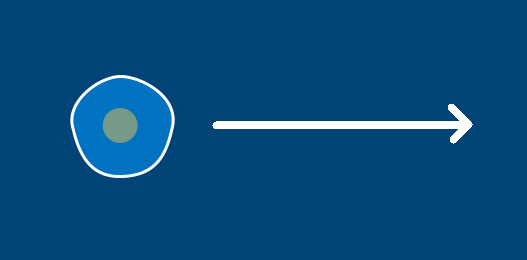

---
jupytext:
  formats: ipynb,md:myst
  text_representation:
    extension: .md
    format_name: myst
    format_version: 0.13
    jupytext_version: 1.14.0
kernelspec:
  display_name: py5
  language: python
  name: py5
---

# vector movement and Py5vector

This tutorial is best paired with the tutorial on Object-Oriented Programming, and will use the code created within that tutorial. If you aren't yet familiar with this concept, it's worth going back and reading through the OOP tutorial. 

The word *vector* is used in a few different ways, so let's clarify: these are not the vectors used in *vector graphics*, but Euclidean vectors, also known as *geometric vectors* or *spatial vectors*. Essentially, a vector is just a way of measuring direction and magnitude (or strength) of movement. 

When we're discussing movement in a real or virtual space, we might refer to the *force* at which something moves, or the *speed*, or the *distance*. If we give something (say, an amoeba, as we'll be using in the following exercises) ten seconds to move, the *distance* that it covers in that time will depend on how fast it's going (which depends on the strength of the force that was pushing it that way). This strength of movement is the *magnitude* of the vector. It doesn't inherently say anything about the distance traveled, or the direction, but it can tell you how hard something is being "pushed" in that direction. 

If the amoeba below is going to move 400 pixels to the right, we don't necessarily know how fast it's moving. However, we do know its *direction* -- to the right, along the X axis of this two-dimensional space. If we wanted to move it this direction in py5, we'd say that its X position is *increasing*. 



Of course, much of the time directional movement isn't along just a single axis. The amoeba below is moving up and to the right, so it's moving along both the X and Y axis. Again, even without knowing its *magnitude*, we can at least know its *direction*. In py5, its X position would be *increasing* and its Y position would be *decreasing*. To accomodate for this sort of diagonal movement, two-dimensional vectors can store both an X and a Y value. In this case, the vector might be `(1, -1)` to represent movement to the right and upwards. You might not know its magnitude just by looking at it, but you can use the `.mag` method (appended to the end of any vector) to find out. In general, it's enough to point your vector in the right direction, and increase the values (like `(3, -3)`) to increase the magnitude of movement. 

We'll be using the amoeba code from our OOP tutorial to start us off. Depending on if you want to have your `Amoeba` class as a separate *module* file, you'll either have two files (my suggestions for names are at the top of the following code snippets) or a single, consolidated, all-in-one file. Either will work.

```{code-cell} ipython3
# amoeba.py

from py5 import *
cs = get_current_sketch()

class Amoeba():
    def __init__(self, x, y, diameter):
        self.x = x
        self.y = y
        self.d = diameter
        
        self.nucleus = {
        'fill': ['#FF0000', '#FF9900', '#FFFF00',
        '#00FF00', '#0099FF'][int(random(5))],
        'x': self.d * random(-0.15, 0.15),
        'y': self.d * random(-0.15, 0.15),
        'd': self.d / random(2.5, 4)
        }
        
    def circle_point(self, t, r):
        x = cos(t) * r
        y = sin(t) * r
        return [x, y]
        
    def display(self):
        # nucleus
        fill(self.nucleus['fill'])
        no_stroke()
        circle(
        self.x + self.nucleus['x'],
        self.y + self.nucleus['y'],
        self.nucleus['d'])
        
        # cell membrane
        fill(0x880099FF)
        stroke('#FFFFFF')
        stroke_weight(3)
        
        r = self.d / 2.0
        cpl = r * 0.55 
        cpx, cpy = self.circle_point(cs.frame_count/(r/2), r/8) 
        xp, xm = self.x+cpx, self.x-cpx
        yp, ym = self.y+cpy, self.y-cpy
        begin_shape()
        vertex(
        self.x, self.y-r # top vertex
        )
        bezier_vertex(
        xp+cpl, yp-r, xm+r, ym-cpl,
        self.x+r, self.y # right vertex
        )
        bezier_vertex(
        xp+r, yp+cpl, xm+cpl, ym+r,
        self.x, self.y+r # bottom vertex
        )
        bezier_vertex(
        xp-cpl, yp+r, xm-r, ym+cpl,
        self.x-r, self.y # left vertex
        )
        bezier_vertex(
        xp-r, yp-cpl, xm-cpl, ym-r,
        self.x, self.y-r # (back to) top vertex
        )
        end_shape()
```

```{code-cell} ipython3
# microscope.py

from amoeba import Amoeba

bob = Amoeba(400, 200, 100)

def setup():
    size(800, 400)

def draw():
    background('#004477')
    bob.display()
```

```{code-cell} ipython3
# all-in-one file

class Amoeba():
    def __init__(self, x, y, diameter):
        self.x = x
        self.y = y
        self.d = diameter
        
        self.nucleus = {
        'fill': ['#FF0000', '#FF9900', '#FFFF00',
        '#00FF00', '#0099FF'][int(random(5))],
        'x': self.d * random(-0.15, 0.15),
        'y': self.d * random(-0.15, 0.15),
        'd': self.d / random(2.5, 4)
        }
        
    def circle_point(self, t, r):
        x = cos(t) * r
        y = sin(t) * r
        return [x, y]
        
    def display(self):
        # nucleus
        fill(self.nucleus['fill'])
        no_stroke()
        circle(
        self.x + self.nucleus['x'],
        self.y + self.nucleus['y'],
        self.nucleus['d'])
        
        # cell membrane
        fill(0x880099FF)
        stroke('#FFFFFF')
        stroke_weight(3)
        
        r = self.d / 2.0
        cpl = r * 0.55 
        cpx, cpy = self.circle_point(frame_count/(r/2), r/8) 
        xp, xm = self.x+cpx, self.x-cpx
        yp, ym = self.y+cpy, self.y-cpy
        begin_shape()
        vertex(
        self.x, self.y-r # top vertex
        )
        bezier_vertex(
        xp+cpl, yp-r, xm+r, ym-cpl,
        self.x+r, self.y # right vertex
        )
        bezier_vertex(
        xp+r, yp+cpl, xm+cpl, ym+r,
        self.x, self.y+r # bottom vertex
        )
        bezier_vertex(
        xp-cpl, yp+r, xm-r, ym+cpl,
        self.x-r, self.y # left vertex
        )
        bezier_vertex(
        xp-r, yp-cpl, xm-cpl, ym-r,
        self.x, self.y-r # (back to) top vertex
        )
        end_shape()
        
bob = Amoeba(400, 200, 100)

def setup():
    size(800, 400)

def draw():
    background('#004477')
    bob.display()
```

Whatever method you use, the above code will display a single amoeba, Bob, on the screen. Let's define a new vector and use it to give Bob some movement. 

First, we'll be adding two new parameters, `xspeed` and `yspeed`, to our `Amoeba` class's initialization method. We'll then use these to form a new attribute, *propulsion*, that determines our amoeba's movement. 

We'll also need to pass those new arguments in when Bob is created. Next, in our `draw()` function in the main sketch, we'll actually adjust Bob's X and Y position based on that propulsion stat.

```{code-cell} ipython3
# all-in-one file

class Amoeba():
    def __init__(self, x, y, diameter, xspeed, yspeed):
        self.x = x
        self.y = y
        self.d = diameter
        self.propulsion = Py5Vector(xspeed, yspeed) # Look! A vector!
        
        self.nucleus = {
        'fill': ['#FF0000', '#FF9900', '#FFFF00',
        '#00FF00', '#0099FF'][int(random(5))],
        'x': self.d * random(-0.15, 0.15),
        'y': self.d * random(-0.15, 0.15),
        'd': self.d / random(2.5, 4)
        }
        
    def circle_point(self, t, r):
        x = cos(t) * r
        y = sin(t) * r
        return [x, y]
        
    def display(self):
        # nucleus
        fill(self.nucleus['fill'])
        no_stroke()
        circle(
        self.x + self.nucleus['x'],
        self.y + self.nucleus['y'],
        self.nucleus['d'])
        
        # cell membrane
        fill(0x880099FF)
        stroke('#FFFFFF')
        stroke_weight(3)
        
        r = self.d / 2.0
        cpl = r * 0.55 
        cpx, cpy = self.circle_point(frame_count/(r/2), r/8) 
        xp, xm = self.x+cpx, self.x-cpx
        yp, ym = self.y+cpy, self.y-cpy
        begin_shape()
        vertex(
        self.x, self.y-r # top vertex
        )
        bezier_vertex(
        xp+cpl, yp-r, xm+r, ym-cpl,
        self.x+r, self.y # right vertex
        )
        bezier_vertex(
        xp+r, yp+cpl, xm+cpl, ym+r,
        self.x, self.y+r # bottom vertex
        )
        bezier_vertex(
        xp-cpl, yp+r, xm-r, ym+cpl,
        self.x-r, self.y # left vertex
        )
        bezier_vertex(
        xp-r, yp-cpl, xm-cpl, ym-r,
        self.x, self.y-r # (back to) top vertex
        )
        end_shape()
        
bob = Amoeba(400, 200, 100, 3, -1)

def setup():
    size(800, 400)

def draw():
    background('#004477')
    bob.x += bob.propulsion.x
    bob.y += bob.propulsion.y
    bob.display()
```

Run this sketch, and Bob will fly off the screen. Each frame, their X position is increasing by 3 pixels, and their Y position is decreasing by 1 pixel. 

We've got a lot of code referencing Bob's X and Y position now, and you can notice that we add to these values separately on these lines:

```
bob.x += bob.propulsion.x
bob.y += bob.propulsion.y
```

If we also store the amoeba's *position* with a vector, we can do this a little more efficiently. First, let's define a new attribute, *location*, inside of `__init__()`, and use it instead of those x and y variables. After that, we'll just have to find and replace each instance of `self.x` and `self.y` with `self.location.x` and `self.location.y`. (If you're using a dedicated IDE or even a text editing program, you may have a find-and-replace feature to make things easier.) 

After that, those two lines can be replaced with just one:

```
bob.location += bob.propulsion
```

```{code-cell} ipython3
# all-in-one file

class Amoeba():
    def __init__(self, x, y, diameter, xspeed, yspeed):
        self.location = Py5Vector(x, y)
        self.d = diameter
        self.propulsion = Py5Vector(xspeed, yspeed) # Look! A vector!
        
        self.nucleus = {
        'fill': ['#FF0000', '#FF9900', '#FFFF00',
        '#00FF00', '#0099FF'][int(random(5))],
        'x': self.d * random(-0.15, 0.15),
        'y': self.d * random(-0.15, 0.15),
        'd': self.d / random(2.5, 4)
        }
        
    def circle_point(self, t, r):
        x = cos(t) * r
        y = sin(t) * r
        return [x, y]
        
    def display(self):
        # nucleus
        fill(self.nucleus['fill'])
        no_stroke()
        circle(
        self.location.x + self.nucleus['x'],
        self.location.y + self.nucleus['y'],
        self.nucleus['d'])
        
        # cell membrane
        fill(0x880099FF)
        stroke('#FFFFFF')
        stroke_weight(3)
        
        r = self.d / 2.0
        cpl = r * 0.55 
        cpx, cpy = self.circle_point(frame_count/(r/2), r/8) 
        xp, xm = self.location.x+cpx, self.location.x-cpx
        yp, ym = self.location.y+cpy, self.location.y-cpy
        begin_shape()
        vertex(
        self.location.x, self.location.y-r # top vertex
        )
        bezier_vertex(
        xp+cpl, yp-r, xm+r, ym-cpl,
        self.location.x+r, self.location.y # right vertex
        )
        bezier_vertex(
        xp+r, yp+cpl, xm+cpl, ym+r,
        self.location.x, self.location.y+r # bottom vertex
        )
        bezier_vertex(
        xp-cpl, yp+r, xm-r, ym+cpl,
        self.location.x-r, self.location.y # left vertex
        )
        bezier_vertex(
        xp-r, yp-cpl, xm-cpl, ym-r,
        self.location.x, self.location.y-r # (back to) top vertex
        )
        end_shape()
        
bob = Amoeba(400, 200, 100, 3, -1)

def setup():
    size(800, 400)

def draw():
    background('#004477')
    bob.location += bob.propulsion
    bob.display()
```

If you like, you can add additional forces to this simulation by adding more vectors. For example, since many single-celled organisms live in water, you could define some vector for a *current* and add this *current* to Bob's location each frame, too. Of course, in addition to adding vectors, you can always subtract them. This can be useful for the reasons you might expect (like a force that pushes your amoeba in the opposite direction), but we can also use it to force our amoebas to move towards the mouse pointer. 

In py5, we have access to the `mouse_x` and `mouse_y` variables, which track the position of the mouse cursor. Since we're using vectors, and thus directions (instead of absolute positions), we won't simply be moving the amoeba to this location; we want to move it *towards* the position of `mouse_x` and `mouse_y`. This means that we'll do a bit of subtraction to find the *difference* in space between the current location of the amoeba and the position of the mouse, and move the amoeba in that direction.

```{code-cell} ipython3
# all-in-one file

class Amoeba():
    def __init__(self, x, y, diameter, xspeed, yspeed):
        self.location = Py5Vector(x, y)
        self.d = diameter
        self.propulsion = Py5Vector(xspeed, yspeed) # Look! A vector!
        
        self.nucleus = {
        'fill': ['#FF0000', '#FF9900', '#FFFF00',
        '#00FF00', '#0099FF'][int(random(5))],
        'x': self.d * random(-0.15, 0.15),
        'y': self.d * random(-0.15, 0.15),
        'd': self.d / random(2.5, 4)
        }
        
    def circle_point(self, t, r):
        x = cos(t) * r
        y = sin(t) * r
        return [x, y]
        
    def display(self):
        # nucleus
        fill(self.nucleus['fill'])
        no_stroke()
        circle(
        self.location.x + self.nucleus['x'],
        self.location.y + self.nucleus['y'],
        self.nucleus['d'])
        
        # cell membrane
        fill(0x880099FF)
        stroke('#FFFFFF')
        stroke_weight(3)
        
        r = self.d / 2.0
        cpl = r * 0.55 
        cpx, cpy = self.circle_point(frame_count/(r/2), r/8) 
        xp, xm = self.location.x+cpx, self.location.x-cpx
        yp, ym = self.location.y+cpy, self.location.y-cpy
        begin_shape()
        vertex(
        self.location.x, self.location.y-r # top vertex
        )
        bezier_vertex(
        xp+cpl, yp-r, xm+r, ym-cpl,
        self.location.x+r, self.location.y # right vertex
        )
        bezier_vertex(
        xp+r, yp+cpl, xm+cpl, ym+r,
        self.location.x, self.location.y+r # bottom vertex
        )
        bezier_vertex(
        xp-cpl, yp+r, xm-r, ym+cpl,
        self.location.x-r, self.location.y # left vertex
        )
        bezier_vertex(
        xp-r, yp-cpl, xm-cpl, ym-r,
        self.location.x, self.location.y-r # (back to) top vertex
        )
        end_shape()
        
bob = Amoeba(400, 200, 100, 3, -1)

def setup():
    size(800, 400)

def draw():
    background('#004477')
    pointer = Py5Vector(mouse_x, mouse_y)
    difference = pointer - bob.location
    bob.location += difference
    bob.display()
```

Currently, the magnitude of this movement is a little too high. Bob will instantly "jump" to the mouse pointer, and stay there. 


Luckily, there's a method for this. We can use the `.set_limit()` method on any vector to limit its magnitude. By setting the limit of our *difference* vector to a small number, we can make this a bit more sensible.

```{code-cell} ipython3
# all-in-one file

class Amoeba():
    def __init__(self, x, y, diameter, xspeed, yspeed):
        self.location = Py5Vector(x, y)
        self.d = diameter
        self.propulsion = Py5Vector(xspeed, yspeed) # Look! A vector!
        
        self.nucleus = {
        'fill': ['#FF0000', '#FF9900', '#FFFF00',
        '#00FF00', '#0099FF'][int(random(5))],
        'x': self.d * random(-0.15, 0.15),
        'y': self.d * random(-0.15, 0.15),
        'd': self.d / random(2.5, 4)
        }
        
    def circle_point(self, t, r):
        x = cos(t) * r
        y = sin(t) * r
        return [x, y]
        
    def display(self):
        # nucleus
        fill(self.nucleus['fill'])
        no_stroke()
        circle(
        self.location.x + self.nucleus['x'],
        self.location.y + self.nucleus['y'],
        self.nucleus['d'])
        
        # cell membrane
        fill(0x880099FF)
        stroke('#FFFFFF')
        stroke_weight(3)
        
        r = self.d / 2.0
        cpl = r * 0.55 
        cpx, cpy = self.circle_point(frame_count/(r/2), r/8) 
        xp, xm = self.location.x+cpx, self.location.x-cpx
        yp, ym = self.location.y+cpy, self.location.y-cpy
        begin_shape()
        vertex(
        self.location.x, self.location.y-r # top vertex
        )
        bezier_vertex(
        xp+cpl, yp-r, xm+r, ym-cpl,
        self.location.x+r, self.location.y # right vertex
        )
        bezier_vertex(
        xp+r, yp+cpl, xm+cpl, ym+r,
        self.location.x, self.location.y+r # bottom vertex
        )
        bezier_vertex(
        xp-cpl, yp+r, xm-r, ym+cpl,
        self.location.x-r, self.location.y # left vertex
        )
        bezier_vertex(
        xp-r, yp-cpl, xm-cpl, ym-r,
        self.location.x, self.location.y-r # (back to) top vertex
        )
        end_shape()
        
bob = Amoeba(400, 200, 100, 3, -1)

def setup():
    size(800, 400)

def draw():
    background('#004477')
    pointer = Py5Vector(mouse_x, mouse_y)
    difference = pointer - bob.location
    bob.location += difference.set_limit(1)
    bob.display()
```

Now, the movement added to the amoeba's location each frame is clamped at a sensibly low value. 


We have one amoeba on the screen, but there's no reason we can't have a dozen. You *could* manually go through naming each amoeba, creating it, updating its position... and so on, and so forth. However, we can automate this process using a *for loop*. We'll replace our current line to create Bob with a loop creating many amoebas (and storing them in a list), and then replace our lines in `draw()` to move Bob with a loop accessing this list of amoebas and calling the correct methods on all of them.

```{code-cell} ipython3
# all-in-one file

class Amoeba():
    def __init__(self, x, y, diameter, xspeed, yspeed):
        self.location = Py5Vector(x, y)
        self.d = diameter
        self.propulsion = Py5Vector(xspeed, yspeed) # Look! A vector!
        
        self.nucleus = {
        'fill': ['#FF0000', '#FF9900', '#FFFF00',
        '#00FF00', '#0099FF'][int(random(5))],
        'x': self.d * random(-0.15, 0.15),
        'y': self.d * random(-0.15, 0.15),
        'd': self.d / random(2.5, 4)
        }
        
    def circle_point(self, t, r):
        x = cos(t) * r
        y = sin(t) * r
        return [x, y]
        
    def display(self):
        # nucleus
        fill(self.nucleus['fill'])
        no_stroke()
        circle(
        self.location.x + self.nucleus['x'],
        self.location.y + self.nucleus['y'],
        self.nucleus['d'])
        
        # cell membrane
        fill(0x880099FF)
        stroke('#FFFFFF')
        stroke_weight(3)
        
        r = self.d / 2.0
        cpl = r * 0.55 
        cpx, cpy = self.circle_point(frame_count/(r/2), r/8) 
        xp, xm = self.location.x+cpx, self.location.x-cpx
        yp, ym = self.location.y+cpy, self.location.y-cpy
        begin_shape()
        vertex(
        self.location.x, self.location.y-r # top vertex
        )
        bezier_vertex(
        xp+cpl, yp-r, xm+r, ym-cpl,
        self.location.x+r, self.location.y # right vertex
        )
        bezier_vertex(
        xp+r, yp+cpl, xm+cpl, ym+r,
        self.location.x, self.location.y+r # bottom vertex
        )
        bezier_vertex(
        xp-cpl, yp+r, xm-r, ym+cpl,
        self.location.x-r, self.location.y # left vertex
        )
        bezier_vertex(
        xp-r, yp-cpl, xm-cpl, ym-r,
        self.location.x, self.location.y-r # (back to) top vertex
        )
        end_shape()
        
amoebas = []

for i in range(12):
    diameter = random(50, 200)
    speed = 1000 / (diameter * 50)
    x, y = random(800), random(400)
    amoebas.append(Amoeba(x, y, diameter, speed, speed))

def setup():
    size(800, 400)

def draw():
    background('#004477')
    pointer = Py5Vector(mouse_x, mouse_y)
    for a in amoebas:
        difference = pointer - a.location
        a.location += difference.set_limit(1)
        a.display()
```

So that we can fully appreciate the differing movements of all of these randomized amoebas, we'll make a couple of changes. First, let's give each amoeba another attribute, a *direction* vector (created with the arguments `xdirection` and `ydirection`), that will kick in when it isn't following the mouse. 

So that we actually get to see this behavior, we'll also add a new *if* statement where the difference is being calculated. If the mouse is being held down, the amoebas will move towards it. Otherwise, they can use this new *direction* vector to move towards instead.

```{code-cell} ipython3
# all-in-one file

class Amoeba():
    def __init__(self, x, y, diameter, xspeed, yspeed, xdirection, ydirection):
        self.direction = Py5Vector(xdirection, ydirection)
        self.location = Py5Vector(x, y)
        self.d = diameter
        self.propulsion = Py5Vector(xspeed, yspeed) # Look! A vector!
        
        self.nucleus = {
        'fill': ['#FF0000', '#FF9900', '#FFFF00',
        '#00FF00', '#0099FF'][int(random(5))],
        'x': self.d * random(-0.15, 0.15),
        'y': self.d * random(-0.15, 0.15),
        'd': self.d / random(2.5, 4)
        }
        
    def circle_point(self, t, r):
        x = cos(t) * r
        y = sin(t) * r
        return [x, y]
        
    def display(self):
        # nucleus
        fill(self.nucleus['fill'])
        no_stroke()
        circle(
        self.location.x + self.nucleus['x'],
        self.location.y + self.nucleus['y'],
        self.nucleus['d'])
        
        # cell membrane
        fill(0x880099FF)
        stroke('#FFFFFF')
        stroke_weight(3)
        
        r = self.d / 2.0
        cpl = r * 0.55 
        cpx, cpy = self.circle_point(frame_count/(r/2), r/8) 
        xp, xm = self.location.x+cpx, self.location.x-cpx
        yp, ym = self.location.y+cpy, self.location.y-cpy
        begin_shape()
        vertex(
        self.location.x, self.location.y-r # top vertex
        )
        bezier_vertex(
        xp+cpl, yp-r, xm+r, ym-cpl,
        self.location.x+r, self.location.y # right vertex
        )
        bezier_vertex(
        xp+r, yp+cpl, xm+cpl, ym+r,
        self.location.x, self.location.y+r # bottom vertex
        )
        bezier_vertex(
        xp-cpl, yp+r, xm-r, ym+cpl,
        self.location.x-r, self.location.y # left vertex
        )
        bezier_vertex(
        xp-r, yp-cpl, xm-cpl, ym-r,
        self.location.x, self.location.y-r # (back to) top vertex
        )
        end_shape()
        
amoebas = []

for i in range(12):
    diameter = random(50, 200)
    speed = 1000 / (diameter * 50)
    x, y = random(800), random(400)
    xdirection, ydirection = random(-5, 5), random(-5, 5)
    amoebas.append(Amoeba(x, y, diameter, speed, speed, xdirection, ydirection))

def setup():
    size(800, 400)

def draw():
    background('#004477')
    pointer = Py5Vector(mouse_x, mouse_y)
    for a in amoebas:
        if is_mouse_pressed:
            difference = pointer - a.location
        else:
            difference = a.direction
        a.location += difference.set_limit(1)
        a.display()
```


Of course, now the amoebas are liable to drift off the screen entirely, and it can take a while for them to move back to your mouse cursor. To fix this, we can add some code so that if an amoeba exits the screen, it reappears on the opposite side of the window, preserving its original momentum.

```{code-cell} ipython3
# all-in-one file

class Amoeba():
    def __init__(self, x, y, diameter, xspeed, yspeed, xdirection, ydirection):
        self.direction = Py5Vector(xdirection, ydirection)
        self.location = Py5Vector(x, y)
        self.d = diameter
        self.propulsion = Py5Vector(xspeed, yspeed) # Look! A vector!
        
        self.nucleus = {
        'fill': ['#FF0000', '#FF9900', '#FFFF00',
        '#00FF00', '#0099FF'][int(random(5))],
        'x': self.d * random(-0.15, 0.15),
        'y': self.d * random(-0.15, 0.15),
        'd': self.d / random(2.5, 4)
        }
        
    def circle_point(self, t, r):
        x = cos(t) * r
        y = sin(t) * r
        return [x, y]
        
    def display(self):
        # nucleus
        fill(self.nucleus['fill'])
        no_stroke()
        circle(
        self.location.x + self.nucleus['x'],
        self.location.y + self.nucleus['y'],
        self.nucleus['d'])
        
        # cell membrane
        fill(0x880099FF)
        stroke('#FFFFFF')
        stroke_weight(3)
        
        r = self.d / 2.0
        cpl = r * 0.55 
        cpx, cpy = self.circle_point(frame_count/(r/2), r/8) 
        xp, xm = self.location.x+cpx, self.location.x-cpx
        yp, ym = self.location.y+cpy, self.location.y-cpy
        begin_shape()
        vertex(
        self.location.x, self.location.y-r # top vertex
        )
        bezier_vertex(
        xp+cpl, yp-r, xm+r, ym-cpl,
        self.location.x+r, self.location.y # right vertex
        )
        bezier_vertex(
        xp+r, yp+cpl, xm+cpl, ym+r,
        self.location.x, self.location.y+r # bottom vertex
        )
        bezier_vertex(
        xp-cpl, yp+r, xm-r, ym+cpl,
        self.location.x-r, self.location.y # left vertex
        )
        bezier_vertex(
        xp-r, yp-cpl, xm-cpl, ym-r,
        self.location.x, self.location.y-r # (back to) top vertex
        )
        end_shape()
        
amoebas = []

for i in range(12):
    diameter = random(50, 200)
    speed = 1000 / (diameter * 50)
    x, y = random(800), random(400)
    xdirection, ydirection = random(-5, 5), random(-5, 5)
    amoebas.append(Amoeba(x, y, diameter, speed, speed, xdirection, ydirection))

def setup():
    size(800, 400)

def draw():
    background('#004477')
    pointer = Py5Vector(mouse_x, mouse_y)
    for a in amoebas:
        if is_mouse_pressed:
            difference = pointer - a.location
        else:
            difference = a.direction
        a.location += difference.set_limit(1)
        
        # Wrapping around to the opposite edge of the screen!
        r = a.d / 2
        if a.location.x - r > width:
            a.location.x = 0 - r
        if a.location.x + r < 0:
            a.location.x = width + r
        if a.location.y - r > height:
            a.location.y = 0 - r
        if a.location.y + r < 0:
            a.location.y = height + r

        a.display()
```

These new *if* statements check the X and Y positions of the amoeba, and its radius, against the size of the window (with the 0 values representing the top and left sides of the screen, and *height* and *width* representing the bottom and right sides). If an amoeba crosses over, they'll appear on the opposite side of the screen -- but the position they're heading towards is preserved, since it relies on the direction of a vector!


## collision detection task

Currently, the amoebas can overlap freely, but it would be interesting if they avoided or even bounced off of each other. Your challenge is to add a *collision detection* feature to facilitate this. 

To test whether an amoeba is overlapping another amoeba, you'll add another *for loop* inside of the `a in amoebas` loop. (Remember, *a* is a name we decide ourselves, to refer to a single amoeba in the loop.) We'll also want to add some code to prevent trying to compare an amoeba's location to itself. This will use the `continue` keyword, which moves to the next iteration of the loop.

```{code-cell} ipython3
# all-in-one file

class Amoeba():
    def __init__(self, x, y, diameter, xspeed, yspeed, xdirection, ydirection):
        self.direction = Py5Vector(xdirection, ydirection)
        self.location = Py5Vector(x, y)
        self.d = diameter
        self.propulsion = Py5Vector(xspeed, yspeed) # Look! A vector!
        
        self.nucleus = {
        'fill': ['#FF0000', '#FF9900', '#FFFF00',
        '#00FF00', '#0099FF'][int(random(5))],
        'x': self.d * random(-0.15, 0.15),
        'y': self.d * random(-0.15, 0.15),
        'd': self.d / random(2.5, 4)
        }
        
    def circle_point(self, t, r):
        x = cos(t) * r
        y = sin(t) * r
        return [x, y]
        
    def display(self):
        # nucleus
        fill(self.nucleus['fill'])
        no_stroke()
        circle(
        self.location.x + self.nucleus['x'],
        self.location.y + self.nucleus['y'],
        self.nucleus['d'])
        
        # cell membrane
        fill(0x880099FF)
        stroke('#FFFFFF')
        stroke_weight(3)
        
        r = self.d / 2.0
        cpl = r * 0.55 
        cpx, cpy = self.circle_point(frame_count/(r/2), r/8) 
        xp, xm = self.location.x+cpx, self.location.x-cpx
        yp, ym = self.location.y+cpy, self.location.y-cpy
        begin_shape()
        vertex(
        self.location.x, self.location.y-r # top vertex
        )
        bezier_vertex(
        xp+cpl, yp-r, xm+r, ym-cpl,
        self.location.x+r, self.location.y # right vertex
        )
        bezier_vertex(
        xp+r, yp+cpl, xm+cpl, ym+r,
        self.location.x, self.location.y+r # bottom vertex
        )
        bezier_vertex(
        xp-cpl, yp+r, xm-r, ym+cpl,
        self.location.x-r, self.location.y # left vertex
        )
        bezier_vertex(
        xp-r, yp-cpl, xm-cpl, ym-r,
        self.location.x, self.location.y-r # (back to) top vertex
        )
        end_shape()
        
amoebas = []

for i in range(10):
    diameter = random(50, 200)
    speed = 1000 / (diameter * 50)
    x, y = random(800), random(400)
    xdirection, ydirection = random(-5, 5), random(-5, 5)
    amoebas.append(Amoeba(x, y, diameter, speed, speed, xdirection, ydirection))

def setup():
    size(800, 400)

def draw():
    background('#004477')
    pointer = Py5Vector(mouse_x, mouse_y)
    for a in amoebas:
        if is_mouse_pressed:
            difference = pointer - a.location
        else:
            difference = a.direction
        a.location += difference.set_limit(1)
        
        # Wrapping around to the opposite edge of the screen!
        r = a.d / 2
        if a.location.x - r > width:
            a.location.x = 0 - r
        if a.location.x + r < 0:
            a.location.x = width + r
        if a.location.y - r > height:
            a.location.y = 0 - r
        if a.location.y + r < 0:
            a.location.y = height + r
            

        a.display()
        
        for b in amoebas:

            if a is b:
                continue

            # ... otherwise, what should happen?
```

Think about how you might use a vector to push apart two overlapping amoeba. You can use the radius of each amoeba (which you might already know you can get by dividing the diameter of each amoeba by two - `a.d/2` and `b.d/2`) to determine if they're overlapping. If the distance between their locations is less than their radii added together, they're overlapping. Otherwise, they're far enough away to avoid an overlap. 

To test what happens when an overlap does occur, you can always draw just *two* amoebas (by changing the loop to use `range(2)` and get them to move towards your mouse cursor until they intersect. 

You may find it helpful to draw a line between their locations, or to calculate a *distance* vector somehow and print the value of `distance.mag` to see how it changes as they move closer to each other. 

Good luck!
