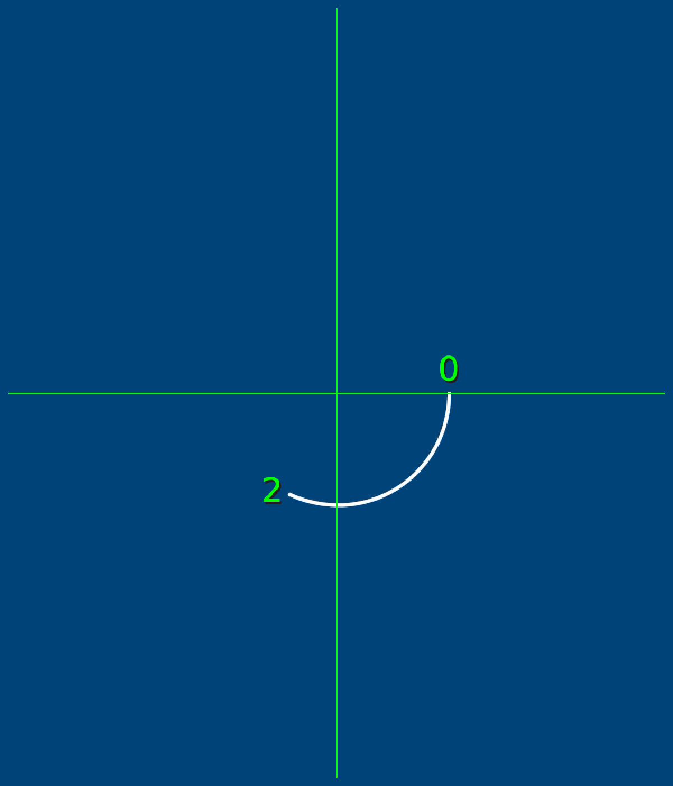
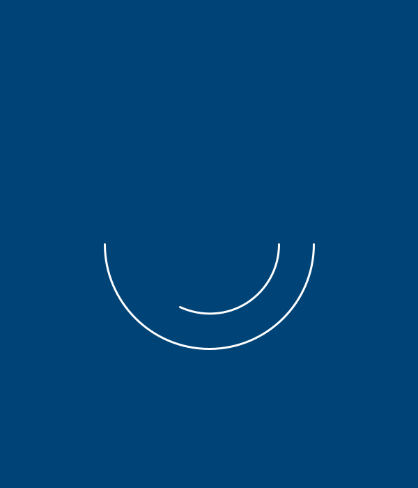
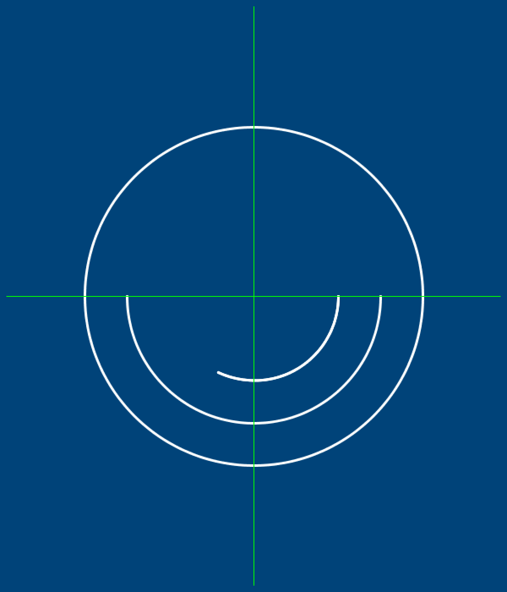
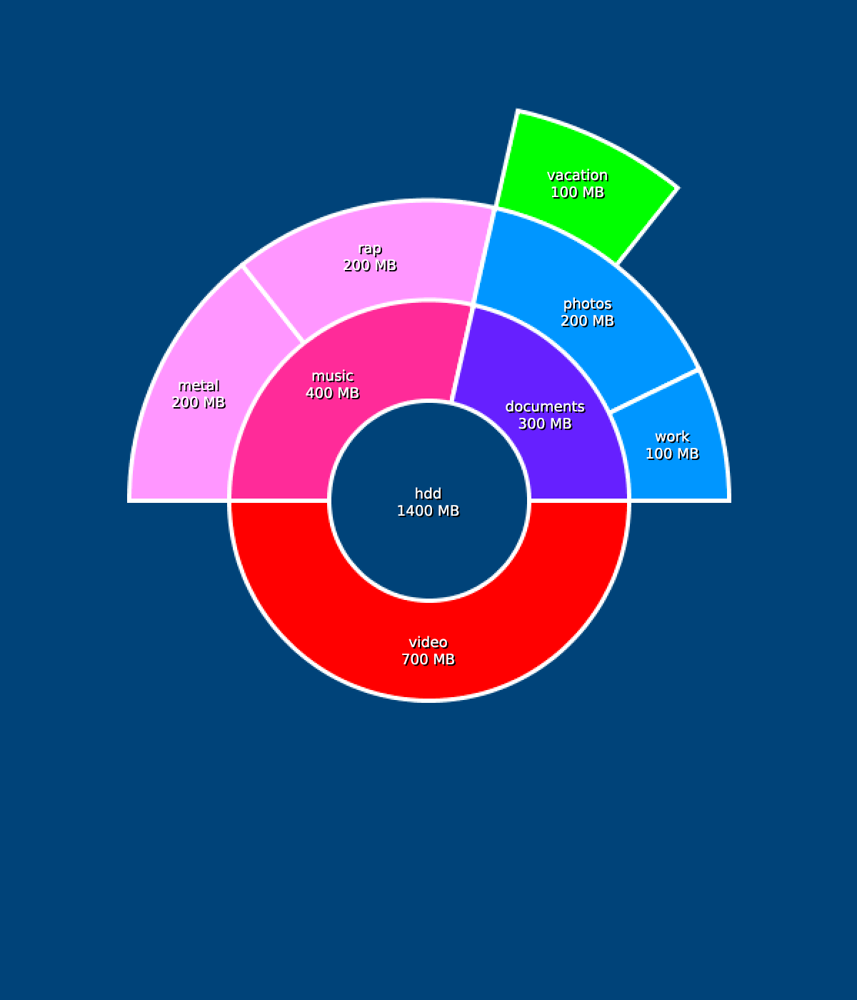

---
jupytext:
  formats: ipynb,md:myst
  text_representation:
    extension: .md
    format_name: myst
    format_version: 0.13
    jupytext_version: 1.14.0
kernelspec:
  display_name: py5bot
  language: python
  name: py5bot
---

## storing data in py5

When you begin using py5 for more advanced programs and visual output, including sketches that have their own internal "logic", you start working with a surprising amount of data. Even when you're only drawing basic shapes, you have to decide where they're positioned, what colors to apply to them, and how they're sized. For the sake of not having to repeat yourself, and for making your code easier to read and understand, you can store these kinds of data in *variables* that can be used repeatedly.

## variables

Variables in programming are basically just placeholder names for information. It's a lot like using letters in algebra -- you can name a variable and store pretty much anything you like in it, whether that's numerical values, hex codes, mathematical formulas or something else entirely. If you're using the same values over and over in your code, or you need to have more control over changing a value as your program runs, variables are the way to go. 

We're going to be utilizing the *print* function to look at the data stored in different variables. First, let's take a look at some of the variables that already exist in py5; they are *built-in*. See what the following code spits out...

```{code-cell} ipython3
size(600, 400)
background('#004477')

print(width)
print(height)
```

We set the width and height of the window to 600 and 400 pixels using `size()`, and py5 has built-in variables for the width and height of the window. By printing those variables, we were able to quickly see what they were set to (or what information was stored in them). 

Of course, you don't have to use the system's built-in variables. Creating your own variable is called *declaring* it. Storing information in that variable is called *assigning*. You can even declare and assign a variable at the same time:

```{code-cell} ipython3
size(600, 400)
background('#004477')

x = 1 # Declaring a variable called x and assigning 1 to it
print(x) # You can imagine what this will do
```

You can name variables anything you like, with some exceptions. Some variables, like `width` and `height`, are already taken by py5, and clashing with them will cause problems. Variable names cannot start with a number, or contain a space, hyphen or special symbol.

```
playerlives = 3  # correct
playerLives = 3  # correct
player_lives = 3 # correct
5playerlives = 3 # incorrect
player lives = 3 # incorrect
player-lives = 3 # incorrect 
player&live$ = 3 # incorrect
```

You'll see many variables in other development environments using camelCase, where the first letter is lowercase and subsequent words are capitalized. py5 (and much of Python coding) prefers to use underscores to separate words in functions and variables. Whatever method you use, use it consistently to avoid confusion. 

After you declare and assign variables, you can go ahead and use them as arguments for functions. Try adding three more variables, and using them to draw a `rect()`:

```{code-cell} ipython3
size(600, 400)
background('#004477')

x = 1 # Declaring a variable called x and assigning 1 to it
y = 30
w = 20
h = w
<img srect(x,y, w,h)
```


We created a variable, *h*, and in the same line gave it the value we already assigned to *w* - so the width and height are the same, and we've drawn a square. Because we're using variables, if you wanted to change any of those arguments in your `rect()`, you could just change them in your variable assignments, without touching the `rect()` function at all. This becomes really important when you re-use the same variables throughout your code! 

## doing math with your variables

Variables that store a number can do all the things numbers do - like add, subtract, multiply and divide. Multiplication uses an asterisk (\*), and division uses a forward slash (/). Try adding these lines to your code:

```
print(x + 2)       # displays 3
print(x - 2)       # displays -1
print(x * 5)       # displays 5
print(4 / 2)       # displays 2
```

What will this next line spit out?

```
print(1 + 2 * 3)   # displays ???
```

It displays a 7 (and not a 9, as you would expect, if you simply did each operation in order) because py5 follows the [order of operations](https://en.wikipedia.org/wiki/Order_of_operations) you may vaguely recall from previous schooling. Whether you call it BEDMAS, PEMDAS, or BODMAS, it works here, too. Since brackets/parenthesis are always checked first, if you need your maths to go a little differently you can always cheat the system by adding some:

```
print(1 + 2 * 3)   # displays 7
print((1 + 2) * 3) # displays 9
```

These are all whole numbers, which in the world of programming are usually called *integers*. You'll also find references to *floating-point numbers* or *floats*, which are just numbers with a decimal point (like 1.5). In fact, Python used to always return an integer from dividing other integers, rounding down to the nearest whole number. You can see this old behavior by adding a second slash to your division:

```
print(3 / 2)   # prints 1.5
print(3 // 2)  # prints 1
```

And, of course, don't try to divide by zero... you'll get a special error for that. 

+++

## modulo

You may not have encountered the modulo operator before, but it's very useful in this course and deserves its own introduction. Modulo (represented by the percentage sign, %) calculates the *remainder* of a division operation. For example, 2 / 5 is 2.5 - but if we're just talking about how many times 5 can be divided into whole numbers, that's 2, and you will have a leftover (remainder) of 1 that can't be evenly divided among two people. Modulo is a shortcut to figuring out that remainder.

```
print(5.0 / 2)     # displays 2.5
print(5.0 % 2)     # displays 1
```

One way modulo can be useful is quickly determining if any number is odd or even, without having to have human eyes on it:

```
print(7 % 2)       # displays 1, therefore 7 is odd
print(6 % 2)       # displays 0, therefore 6 is even
```

If a modulo operation results in 0, you can know that something has been divided up perfectly. This will become very useful when you begin trying to draw things in rows and columns - using modulo will let you write instructions for py5 that can trigger every *x* steps, no matter what *x* is, since any multiple of a number will have the same modulo result as that number. 

## image reveal task

Here's another challenge. Let's give you a series of instructions and see if you can use them to draw a particular symbol. What is the symbol? You won't know until you try it out... Here's some code to start you off.

```{code-cell} ipython3
size(600, 740)
background('#004477')
no_fill()
stroke('#FFFFFF')
stroke_weight(3)

xco = 400
yco = 440
```

You'll be given six steps, and following them will reveal the correct shape. To make things a little easier, the first step will also give you the code to use. You'll have to figure out the next five yourself!

1. Draw a line beginning at an x-coordinate of half the display window width, and y-coordinate of a third of the window height. The endpoint must have an x/y-coordinate equal to xco & yco.

```
line(width/2,height/3, xco,yco)
```

```{code-cell} ipython3
size(600, 740)
background('#004477')
no_fill()
stroke('#FFFFFF')
stroke_weight(3)

xco = 400
yco = 440

# Step 1
line(width/2,height/3, xco,yco)
```


*(See how that worked? To get half of width, you just use width/2, and so on. Break each instruction down into pieces and you'll figure it out quickly.)*

2. Draw a centred ellipse with a width that's an eleventh of the display window width, and a height that's a fourteenth of the window height. 

3. Draw a centred ellipse with a width that's a nineteenth of the display window width, and a height that's a twenty-second of the window height. 

4. Draw a line beginning at an x/y-coordinate equal to xco & yco respectively. The endpoint must have an x-coordinate of the display window width minus xco, and a y-coordinate equal to yco. 

5. Draw a line beginning at an x-coordinate of the display window width minus xco, and y-coordinate equal to yco. The endpoint must have an x-coordinate of half the display window width, and a y-coordinate of a third of the window height. 

6. Draw a centred ellipse with a width that's a fifth of the display window width, and height that's a twelfth of the display window height. 

*(A clue: if this seems like a conspiracy, you're on the right track.)*

## disk space analyser task

Here's one last challenge. Before we get to the task at hand, let's introduce the `arc()` function. This is used to draw elliptical arcs - and it's best to try it out to understand how it works. 

Breaking the `arc()` down across multiple lines will make it a little easier to examine its parts. Here are its required arguments. 

```
arc(
  x_coordinate, y_coordinate,
  width, height,
  start_angle, end_angle
)
```

We use *radians* to measure where an arc ends and begins. Let's start with an arc with a starting angle of zero radians and an ending angle of two radians:

```{code-cell} ipython3
size(600,700)
background('#004477')
stroke('#FFFFFF')
stroke_weight(3)
no_fill()

arc(width/2,height/2, 200,200, 0,2)
```



We started at zero radians, and our arc is being drawn clockwise. You may notice 2 radians is... well, a little more than a quarter of a way around the circle, which can feel quite unhelpful. Rather than trying to strictly remember exactly how much a single radian is, it can be better to remember that halfway around a circle is *pi* radians - that funny number starting with 3.1415. This animated diagram from Wikipedia is also helpful:


*Lucas V. Barbosa [Public domain], from [Wikimedia Commons](https://commons.wikimedia.org/wiki/File:Circle_radians.gif)*

py5 actually has a built-in understanding of how much *pi* is. Anywhere you want to use pi, type `PI`.

```{code-cell} ipython3
size(600,700)
background('#004477')
stroke('#FFFFFF')
stroke_weight(3)
no_fill()

arc(width/2,height/2, 200,200, 0,2)
arc(width/2,height/2, 300,300, 0,PI) # half-circle
```



You can of course use this in mathematical operations too - a complete circle is PI\*2 radians. However, there's also a special name for the mathematical concept of PI\*2, which is called *tau*, and py5 has a built-in variable for that, too.

```{code-cell} ipython3
size(600,700)
background('#004477')
stroke('#FFFFFF')
stroke_weight(3)
no_fill()

arc(width/2,height/2, 200,200, 0,2)
arc(width/2,height/2, 300,300, 0,PI)  # half-circle
arc(width/2,height/2, 400,400, 0,TAU) # full-circle
```



Of course, this means that, instead of worrying about calculating radians, you could just know `TAU / 4` will always be a fourth of a circle, and so on. This is a case where being able to do arithmetic with variables is really useful!

Many functions have optional arguments. In the case of `arc()`, there is a final MODE variable that can change the way the arc appears. If you want to close off the arc, so it looks like a slice of pie, you add one last argument called... PIE. We'll also take a look at another built-in variable here, HALF_PI. HALF_PI is, of course, the same as PI/2. 

```{code-cell} ipython3
size(600,700)
background('#004477')
stroke('#FFFFFF')
stroke_weight(3)
no_fill()

arc(width/2,height/2, 200,200, 0,2)
arc(width/2,height/2, 300,300, 0,PI)  # half-circle
arc(width/2,height/2, 400,400, 0,TAU) # full-circle
arc(width/2,height/2, 350,350, 3.4,TAU - HALF_PI, PIE) # a pie slice!
```


This brings us to the next task. You may have seen *disk usage analysers* that break up the data on a hard drive into a funny pie charts or ring charts. One example is the Linux [GNOME Disk Usage Analyzer](https://en.wikipedia.org/wiki/Disk_Usage_Analyzer). Using what you know about arcs and drawing shapes in general, you'll be trying to recreate the image below:



Remember that you can cover shapes with other shapes to create that "donut hole" in the center, and don't worry about adding the text or even perfectly matching the colors. This is more about grasping arcs and using variables like PI, HALF_PI and TAU!
