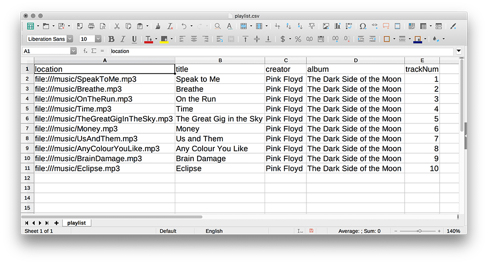
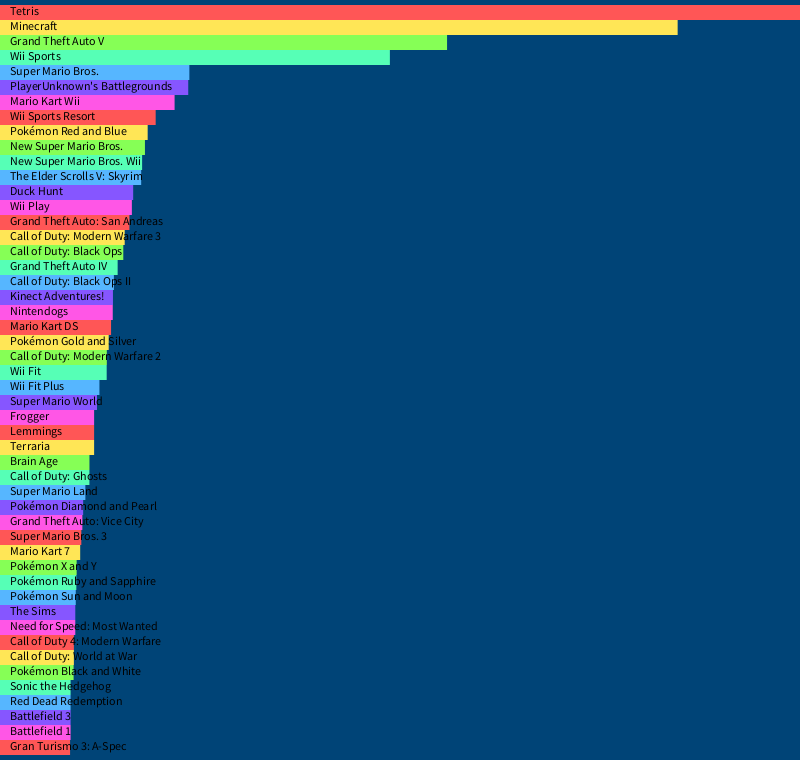
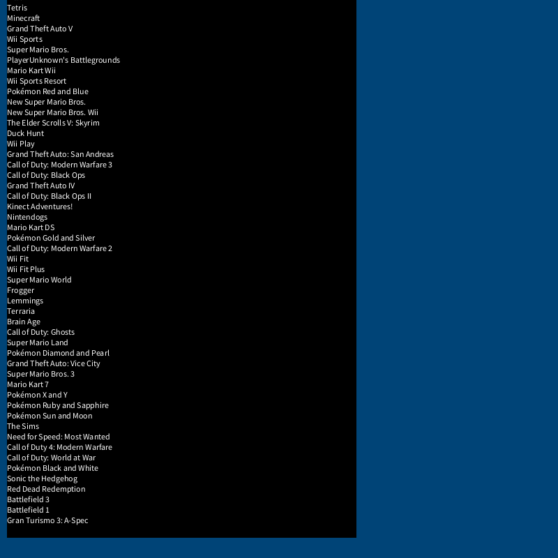
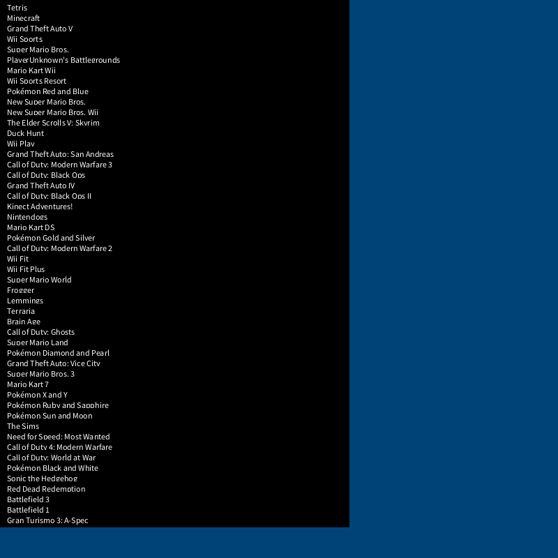

---
jupytext:
  formats: ipynb,md:myst
  text_representation:
    extension: .md
    format_name: myst
    format_version: 0.13
    jupytext_version: 1.14.0
kernelspec:
  display_name: py5
  language: python
  name: py5
---

## reading external data

When you're storing data in py5 - whether that data is lines of text, mathematical formulas or image files - you'll often find that manually inserting all this data into the code itself is unnecessarily time-consuming, or doesn't quite fit your needs. This is especially noticeable if you begin using py5 for purposes of data visualization. If you were taking data from a spreadsheet and trying to manually insert it into lists so you could visualize it, you'd get frustrated very quickly (especially when the data in that spreadsheet might change!)

Luckily, there are ways to use external data inside of py5. Other tutorials may have asked you to display images in your sketch using the `load_image()` and `image()` functions. In this tutorial, we'll discuss how to read text data into py5 from external files, and utilize it for data visualization. 

It's important to clarify that we're talking about *plain text*, which has no special visual styling by itself. Plain text can come in many different forms, however. These could be files ending in .txt, .html, .xml... and even the .py files that py5 produces. Opening any of these files up in a standard text editor will allow you to read the contents, even if the structure can differ greatly between file formats. For example, opening a list of your favorite songs you've saved in a .txt file may look like:

```
Breathe, by Pink Floyd, on the album The Dark Side of the Moon
Speak To Me, by Pink Floyd, on the album The Dark Side of the Moon
...
```

An .html file you'd created to list these songs on your webpage would probably include extra formatting information:

```
<b>Breathe</b>, by <em>Pink Floyd</em>, on the album <u>The Dark Side of the Moon</u>
<b>Speak To Me</b>, by <em>Pink Floyd</em>, on the album <u>The Dark Side of the Moon</u>
...
```

And if you'd asked an audio player like VLC to export your playlist as XML, it would have even more contextual information:

```
<?xml version="1.0" encoding="UTF-8"?>
<playlist version="1" xmlns="http://xspf.org/ns/0/">
  <title>Pink Floyd Playlist</title>
  <trackList>
    <track>
      <location>file:///music/SpeakToMe.mp3</location>
      <title>Speak to Me</title>
      <creator>Pink Floyd</creator>
      <album>The Dark Side of the Moon</album>
      <trackNum>1</trackNum>
    </track>
    <track>
      <location>file:///music/Breathe.mp3</location>
      <title>Breathe</title>
      <creator>Pink Floyd</creator>
      <album>The Dark Side of the Moon</album>
      <trackNum>2</trackNum>
    </track>
...
```

You may have never seen XML before, but you can likely understand some of the structure by looking at it. These labels and triangular brackets describe their contents and make it easier to use this information in other programs. Another option is *JavaScript Object Notation*, represented by .json files. The contents of these files closely resembles Python dictionaries, which you may have used already in py5.

```


{
  "playlist" : {
    "title"    : "Pink Floyd Playlist",
    "track"    : [
      {
        "location"    : ["file:///music/SpeakToMe.mp3"],
        "title"       : "Speak to Me",
        "creator"     : "Pink Floyd",
        "album"       : "The Dark Side of the Moon"
        "trackNum"    : "1"
      },
      {
        "location"    : ["file:///music/Breathe.mp3"],
        "title"       : "Breathe",
        "creator"     : "Pink Floyd",
        "album"       : "The Dark Side of the Moon"
        "trackNum"    : "2"
      },
      ...
```

Because these types of formats are standardized and easy to understand, they're often used to use data across different programs. Python has libraries for interacting with XML and JSON, and using it in programs. To introduce you to the concept, however, we'll be looking at a format that has a much simpler syntax -- *Comma-Separated Value* files. These are .csv files, and they might be the simplest way to store something like a spreadsheet or database in plain text. 

As you might guess from the name, CSV files contain values that are separated by commas. Each line is its own entry, and the first line is often used to provide the *headings*, that contextual labeling that would otherwise be attached to each individual value in something like XML or JSON. The same files above might be represented something like...

```
location,title,creator,album,trackNum
file:///music/SpeakToMe.mp3,Speak to Me,Pink Floyd,The Dark Side of the Moon,1
file:///music/Breathe.mp3,Breathe,Pink Floyd,The Dark Side of the Moon,2
...
```

Although this is a very simple setup, and is easy enough to write manually, you'll also find that if you try to open a .csv file in a software made for working with spreadsheets (like Microsoft Office or LibreOffice Calc) will automatically interpret it with the traditional column-row format you might expect. 



Funny as it seems, you don't need to use a comma as your separator in a CSV file. You could also separate values by hitting the tab key or even using a space -- what works best will depend on the data you're storing.

We'll be using this <a href="images/reading_external_data/playlist.csv">playlist.csv</a> file to play around with importing text data into py5. To follow along, you'll want to save this file to your computer (either in the same folder as your sketch, or a folder called DATA next to that sketch). 

## loading strings of text in py5

We'll be using a Python function to open text files here, `open()`, and giving it the filename of our CSV file. You can just print the result of `open()`, but it won't be very useful -- don't be surprised if you get something like `<_io.TextIOWrapper name='images/reading_external_data/playlist.csv' mode='r' encoding='cp1252'>` instead of the text it contains!

```{code-cell} ipython3
def setup():
    csv = open('images/reading_external_data/playlist.csv')
    print(csv) # This output won't be particularly helpful...
    
run_sketch()
```

We've opened this file, but haven't done anything meaningful with its contents. However, we can use the `.read()` method on this file we've just opened, and that will give us the actual text in the file. Running this code should print each line in the CSV to the console.

```{code-cell} ipython3
def setup():
    csv = open('images/reading_external_data/playlist.csv')
    print(csv) # This output won't be particularly helpful...
    
    playlist = csv.read() # Reading the text content...
    print(playlist) # This looks much more like it!
    
run_sketch()
```

Let's go one step further. To work with this data, we need to split it at each line, and split each line at the commas. Modify your code so that in addition to using the `.read()` method on, we also use `.splitlines()` -- which does just what you'd expect, splitting the text input for each new line. Run this code again. What's changed? The output is now in a *list*, with each line being its own list item.

```{code-cell} ipython3
def setup():
    csv = open('images/reading_external_data/playlist.csv')
    print(csv) # This output won't be particularly helpful...
    
    playlist = csv.read().splitlines() # Reading AND splitting the text content...
    print(playlist) # This looks much more like it!
    
run_sketch()
```

In addition to `.splitlines()`, we can use the regular `.split()` method. Instead of separating these strings at each new line, we can give it an argument to tell it exactly where we'd like it to separate the strings. Since this is a comma-separated list of values, let's use a comma as our argument and see how it neatly divides up our text. 

If we do this using a loop, we can make sure it happens to each line of the file in sequence. Remember that *entry* could be called anything; it's simply how we're referring to each one of those lines, or list items.

```{code-cell} ipython3
def setup():
    csv = open('images/reading_external_data/playlist.csv')
    
    playlist = csv.read().splitlines() # Reading AND splitting the text content...
    
    for entry in playlist:
        print( entry.split(',') )
    
run_sketch()
```

This code should now output the following:

```
['location', 'title', 'creator', 'album', 'trackNum']
['file:///music/SpeakToMe.mp3', 'Speak to Me', 'Pink Floyd', 'The Dark Side of the Moon', '1']
['file:///music/Breathe.mp3', 'Breathe', 'Pink Floyd', 'The Dark Side of the Moon', '2']
['file:///music/OnTheRun.mp3', 'On the Run', 'Pink Floyd', 'The Dark Side of the Moon', '3']
['file:///music/Time.mp3', 'Time', 'Pink Floyd', 'The Dark Side of the Moon', '4']
['file:///music/TheGreatGigInTheSky.mp3', 'The Great Gig in the Sky', 'Pink Floyd', 'The Dark Side of the Moon', '5']
['file:///music/Money.mp3', 'Money', 'Pink Floyd', 'The Dark Side of the Moon', '6']
['file:///music/UsAndThem.mp3', 'Us and Them', 'Pink Floyd', 'The Dark Side of the Moon', '7']
['file:///music/AnyColourYouLike.mp3', 'Any Colour You Like', 'Pink Floyd', 'The Dark Side of the Moon', '8']
['file:///music/BrainDamage.mp3', 'Brain Damage', 'Pink Floyd', 'The Dark Side of the Moon', '9']
['file:///music/Eclipse.mp3', 'Eclipse', 'Pink Floyd', 'The Dark Side of the Moon', '10']
```

You can see with just a few functions and methods, we've turned an external CSV file into a list of lists. It's much better than having to do that in py5 ourselves! Since these are now lists, we can do all sorts of list-related things with them to change how things are output. Let's reference the index position `[1]` in each list to return only the titles of each track.

```{code-cell} ipython3
def setup():
    csv = open('images/reading_external_data/playlist.csv')
    
    playlist = csv.read().splitlines() # Reading AND splitting the text content...
    
    for entry in playlist:
        # print( entry.split(',') )
        print( entry.split(',')[1] )
    
run_sketch()
```

CSV is a simple format, but it's a great way to store a huge amount of data as long as that data is *one-dimensional*. If you need things to be in a particular hierarchy, you may prefer using XML or JSON. For now, knowing how to manipulate CSV data will help you with the following task...

## game sales chart task

For this challenge, you'll be generating a bar chart of the best selling games of all time. This list has originally come from <a href="https://en.wikipedia.org/wiki/List_of_best-selling_video_games">Wikipedia</a>, though it's a bit out of date. (Our list still has *Tetris* at the top. *Minecraft* has now far outpaced it.) It's been converted from an HTML table to some tab-separated values, still stored in a CSV file. In addition to putting it with your Sketch, you may want to open it up and take a look at the data inside.

<a href="images/reading_external_data/list_of_best-selling_video_games.csv">list_of_best-selling_video_games.csv</a>

If you take a look at even the top few lines, you can see how this works -- the very first line contains our headings, describing each of the columns in our table, and the lines below have the values, separated by an invisible tab character. Since this is plain text and they all have different character lengths, they won't perfectly line up.

```
Rank 	Sales 	Title 	Developer 	Publisher
1 	170000000 	Tetris 	Elektronorgtechnica 	Spectrum HoloByte
2 	144000000 	Minecraft  	Mojang 	Mojang
3 	95000000 	Grand Theft Auto V  	Rockstar North 	Rockstar Games
4 	82850000 	Wii Sports  	Nintendo EAD 	Nintendo
5 	40240000 	Super Mario Bros.  	Nintendo 	Nintendo
```

Let's start reading this data out into a py5 file to better understand what we're working with, and how we can utilize it to create a bar chart. Let's use a modified version of the code above (with the correct CSV file referenced, and *playlist* changed to *games_list* for the sake of accuracy) to begin, and then print just the sales number for the top game, Tetris. You'll also notice we changed our comma separator, in `split()`, into this `\t` thing - that's how we're representing the tab character in our code. 

```{code-cell} ipython3
def setup():
    csv = open('images/reading_external_data/list_of_best-selling_video_games.csv')
    
    games_list = csv.read().splitlines() # Reading AND splitting the text content...
    
    tetris_entry = games_list[1].split('\t') # Fetching the Tetris line, splitting by tab character
    
    tetris_sales = tetris_entry[1] # Fetching just the sales number at index 1
    
    print(tetris_sales)
    
run_sketch()
```

This should print the (outdated) number of sales, `170000000`, to the console. Something that's important to note is that although this *looks* like an integer, it isn't. You can force an error by trying to perform arithmetic with it.

```{code-cell} ipython3
def setup():
    csv = open('images/reading_external_data/list_of_best-selling_video_games.csv')
    
    games_list = csv.read().splitlines() # Reading AND splitting the text content...
    
    tetris_entry = games_list[1].split('\t') # Fetching the Tetris line, splitting by tab character
    
    tetris_sales = tetris_entry[1] # Fetching just the sales number at index 1
    
    print(tetris_sales + 1)
    
run_sketch()
```

The problem is that this number is being stored as a *string* of text by default, since it came from a plaintext document, but 1 is of course an integer -- py5 doesn't know whether to concatenate two strings, or add up two numbers here, and in the end it can do neither! Luckily, there's a simple solution. We can just use the `int()` function on our output to make sure it is transformed into an integer before we add anything to it.

```{code-cell} ipython3
def setup():
    csv = open('images/reading_external_data/list_of_best-selling_video_games.csv')
    
    games_list = csv.read().splitlines() # Reading AND splitting the text content...
    
    tetris_entry = games_list[1].split('\t') # Fetching the Tetris line, splitting by tab character
    
    tetris_sales = tetris_entry[1] # Fetching just the sales number at index 1
    
    print( int(tetris_sales) + 1)
    
run_sketch()
```

Let's start on the challenge. You'll be recreating the following image: 



To start you off, let's go through printing the titles of each game together, and discuss how to tackle representing the sales of each game as a bar.

A good first step is to simply print each entry to the console, like we did with our playlist CSV.

```{code-cell} ipython3
def setup():
    csv = open('images/reading_external_data/list_of_best-selling_video_games.csv')
    
    games_list = csv.read().splitlines() # Reading AND splitting the text content...

    for entry in games_list:
        print( entry.split('\t') )
    
run_sketch()
```

Taking a look at your output, you can see that the title of each of these games is at the third position, or index `[2]`. We can modify our `print()` function accordingly:

```{code-cell} ipython3
def setup():
    csv = open('images/reading_external_data/list_of_best-selling_video_games.csv')
    
    games_list = csv.read().splitlines() # Reading AND splitting the text content...

    for entry in games_list:
        print( entry.split('\t')[2] )
    
run_sketch()
```

But we don't need these titles printed to the console - we need them drawn on the screen. Thankfully, we can just use py5's text functions do to this. We'll also need to set up our code for a more graphical output, which means adding in `size()` and `background()` functions. Here, I've given `text()` the value we were previously using in `print()`, and an X, Y position of 10, 10. 

```{code-cell} ipython3
def setup():
    size(800,800)
    background('#004477')
    csv = open('images/reading_external_data/list_of_best-selling_video_games.csv')
    
    games_list = csv.read().splitlines() # Reading AND splitting the text content...

    for entry in games_list:
        # print( entry.split('\t')[2] )
        text(entry.split('\t')[2], 10, 10) # Let's just throw some values in here...
    
run_sketch()
```


It works! The mess is because we're printing all of these text values on top of each other. You could go with a Y variable here, and increment it each time the loop runs, but I'll use the more elegant `enumerate()` method, which allows me to inherently have a variable associated with the row we're currently on. 

```{code-cell} ipython3
def setup():
    size(800,760)
    background('#004477')
    csv = open('images/reading_external_data/list_of_best-selling_video_games.csv')
    
    games_list = csv.read().splitlines() # Reading AND splitting the text content...

    for row, entry in enumerate(games_list):
        # print( entry.split('\t')[2] )
        text(entry.split('\t')[2], 10, row * 15) # Let's just throw some values in here...
    
run_sketch()
```


That's looking much more sensible. Next up, we have to figure out how to create bars corresponding to the game's sales. We won't worry about the colors - that can come at the end, since it's easy enough to slot a `fill()` function before any shapes we draw. 

```{code-cell} ipython3
def setup():
    size(800,800)
    background('#004477')
    csv = open('images/reading_external_data/list_of_best-selling_video_games.csv')
    
    games_list = csv.read().splitlines() # Reading AND splitting the text content...

    for row, entry in enumerate(games_list):
        fill('#000000') # Black bars, for now 
        rect(10, row * 15, 500, 15) # A rect at the same position as our text, with a width of 500
        fill('#FFFFFF') # White text again
        text(entry.split('\t')[2], 10, row * 15) # Let's just throw some values in here...
    
run_sketch()
```



We're dealing with a lot of fiddly parts now, and you'll notice not all of them are behaving exactly as you'd like -- the position of the bars, for example. If we set variables for some of these values we'll be modifying again and again, we can work with them a bit more easily and understand what we're doing. I've chosen to set variables for the width of the bar and the current x and y position of the line we're working with. By strategically reducing the x abnd y values when we draw the bar with `rect()`, it will look a bit nicer behind the text.

```{code-cell} ipython3
def setup():
    size(800,760)
    background('#004477')
    csv = open('images/reading_external_data/list_of_best-selling_video_games.csv')
    
    games_list = csv.read().splitlines() # Reading AND splitting the text content...

    for row, entry in enumerate(games_list):
        bar_width = 500
        y = row * 15
        x = 10
        
        fill('#000000') # Black bars, for now 
        rect(x - 10, y - 10, # We want the X and Y values to be a bit lower for just the bar.
            bar_width, 15) # Now we're using bar_width instead of just a number.
        
        fill('#FFFFFF') # White text on top!
        text(entry.split('\t')[2], x, y) 
    
run_sketch()
```



How can we alter this `bar_width` variable to correspond to our game sales? We know how to actually get the number for those sales, with `entry.split('\t')[1]`, but they're way too big to represent in our graph, since we only have a width of 800 pixels to work with. 

If we just decide to represent the biggest value on the graph -- `170000000`, or the number of sales of the game Tetris -- with the entire width of the sketch window, we can scale everything else down appropriately. So how do you scale 170,000,000 down to 800? 

If you actually whip out a calculator and divide 170,000,000 by 800, you're left with 212,500. This means that if you divided each sales value by this same number, you could get an appropriately scaled value to show on our graph. 

An easy way to do this is to make a variable inside your loop, `game_sales`, that is `entry.split('\t')[1]` turned into an integer with the `int()` function. Then, you can use this variable, divided by our magic number `212500`, to determine the value of `bar_width`. 

We'll have to do something about the very first line of our CSV file, however. Right now, the data in there is just the headings, which won't match any assumptions we make that sales are always an integer. You'll have to add an if statement somewhere to handle that first row of headings. Of course, you could do something like:

```
for row, entry in enumerate(games_list):
    if row == 0: 
        # something special happens here?
    else: 
        # all the regular code in your loop runs
```

...but if you remember *logical operators*, you can save yourself the trouble:

```
for row, entry in enumerate(games_list):
    if not row == 0: 
        # all the regular code in your loop runs
```
