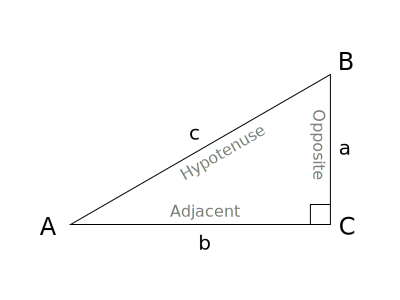
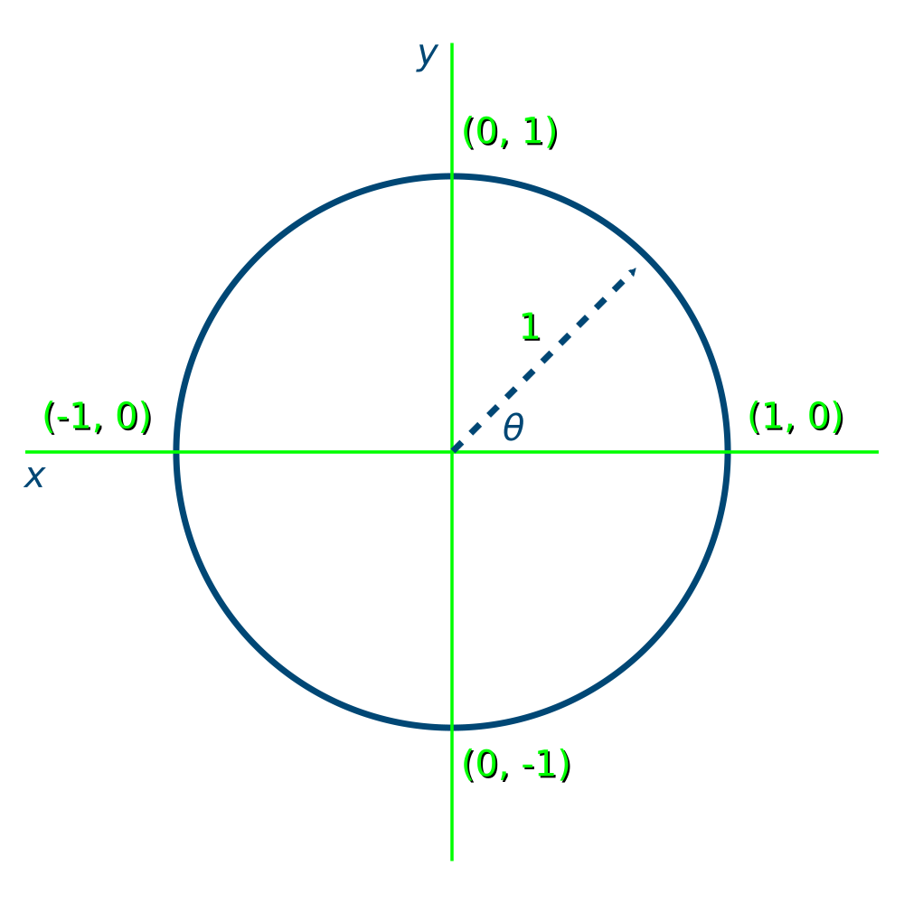
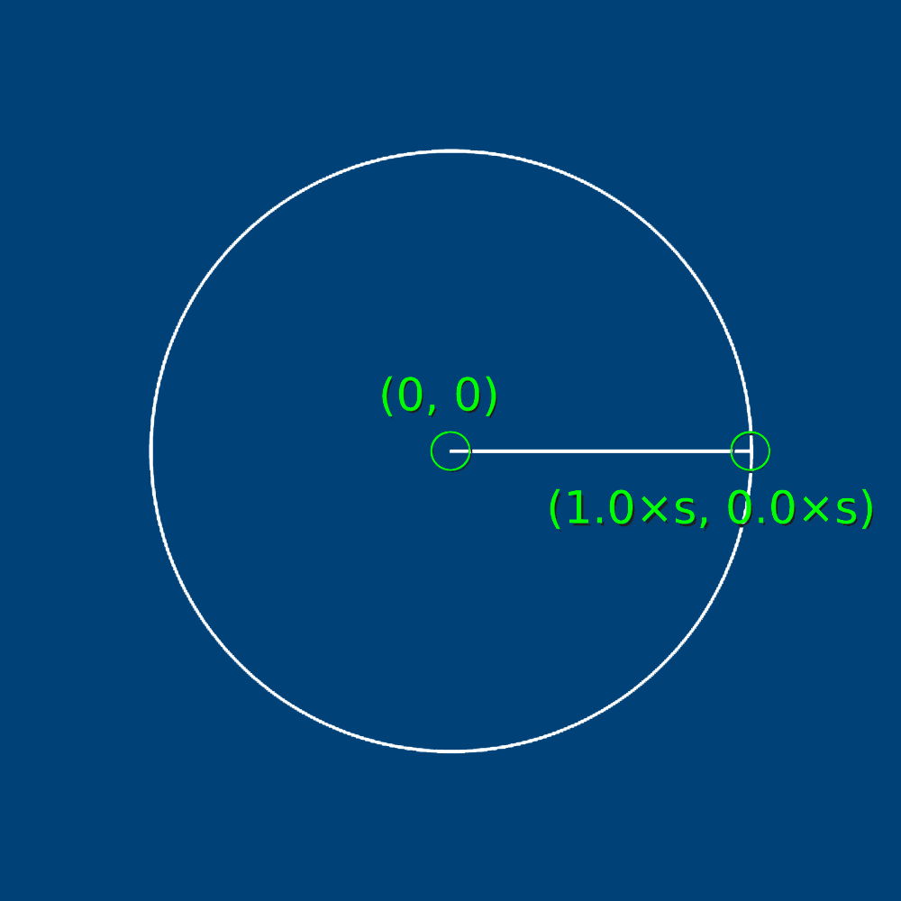
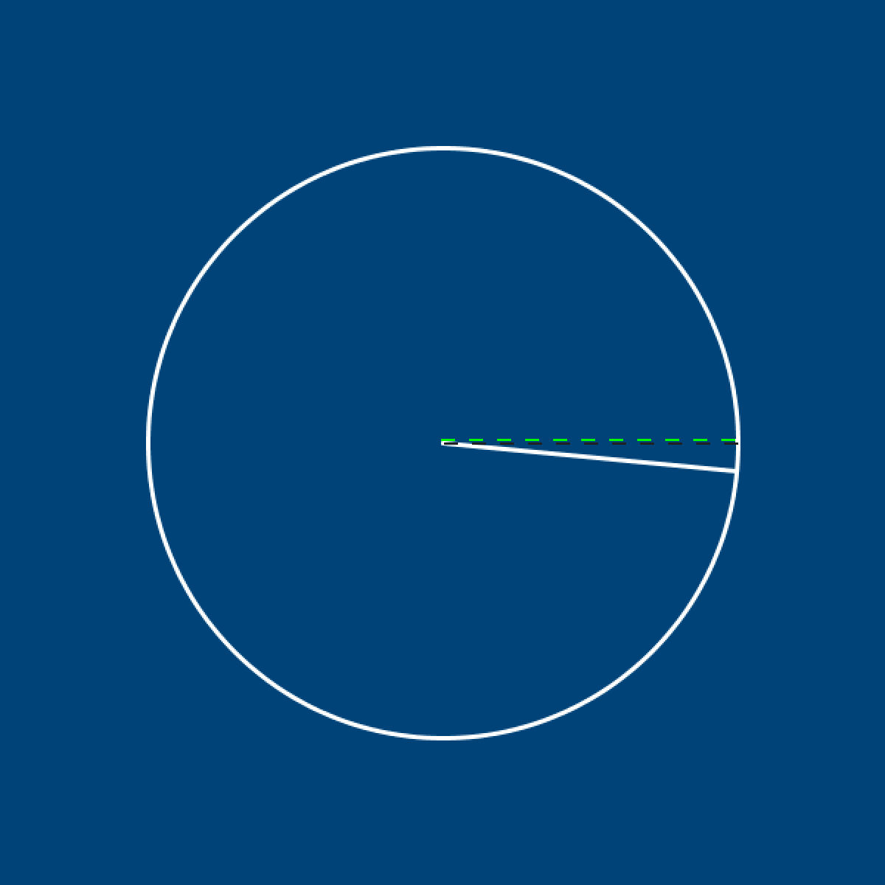
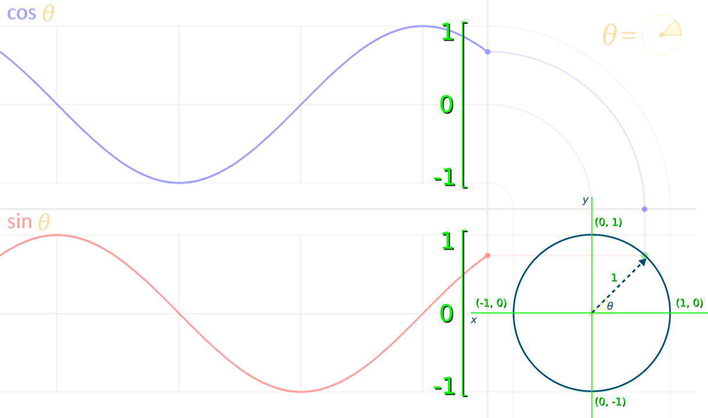
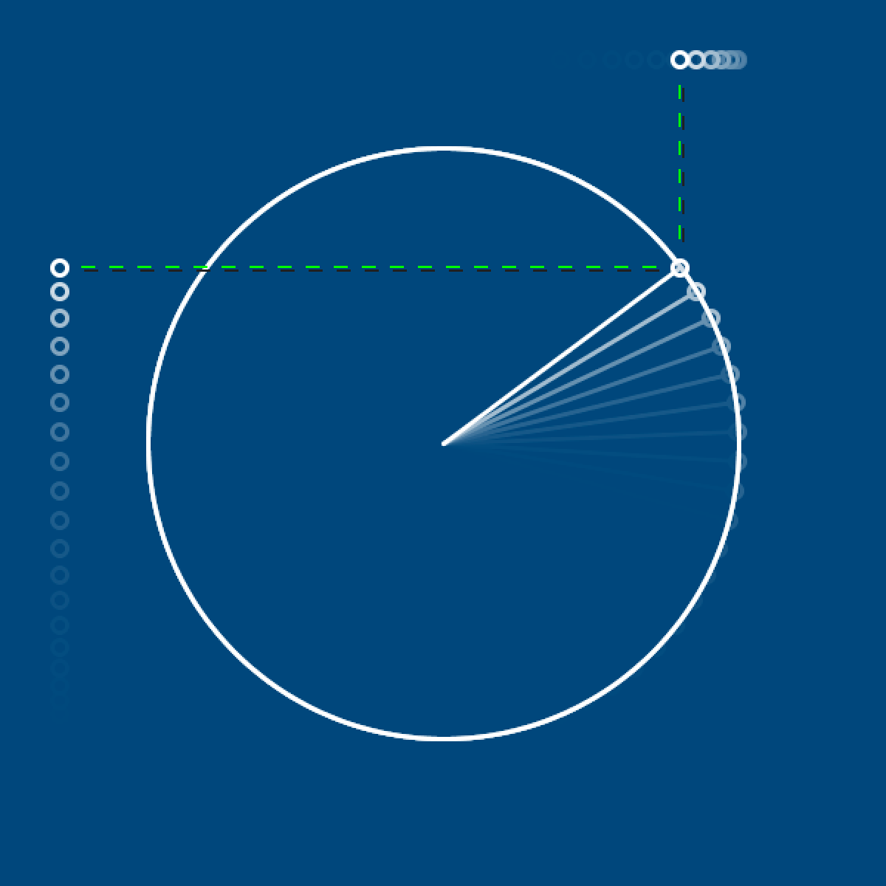
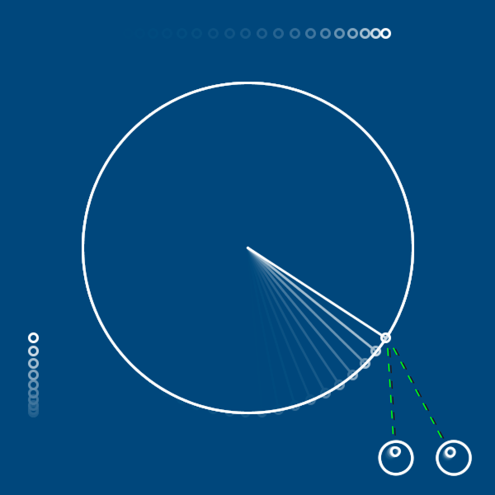
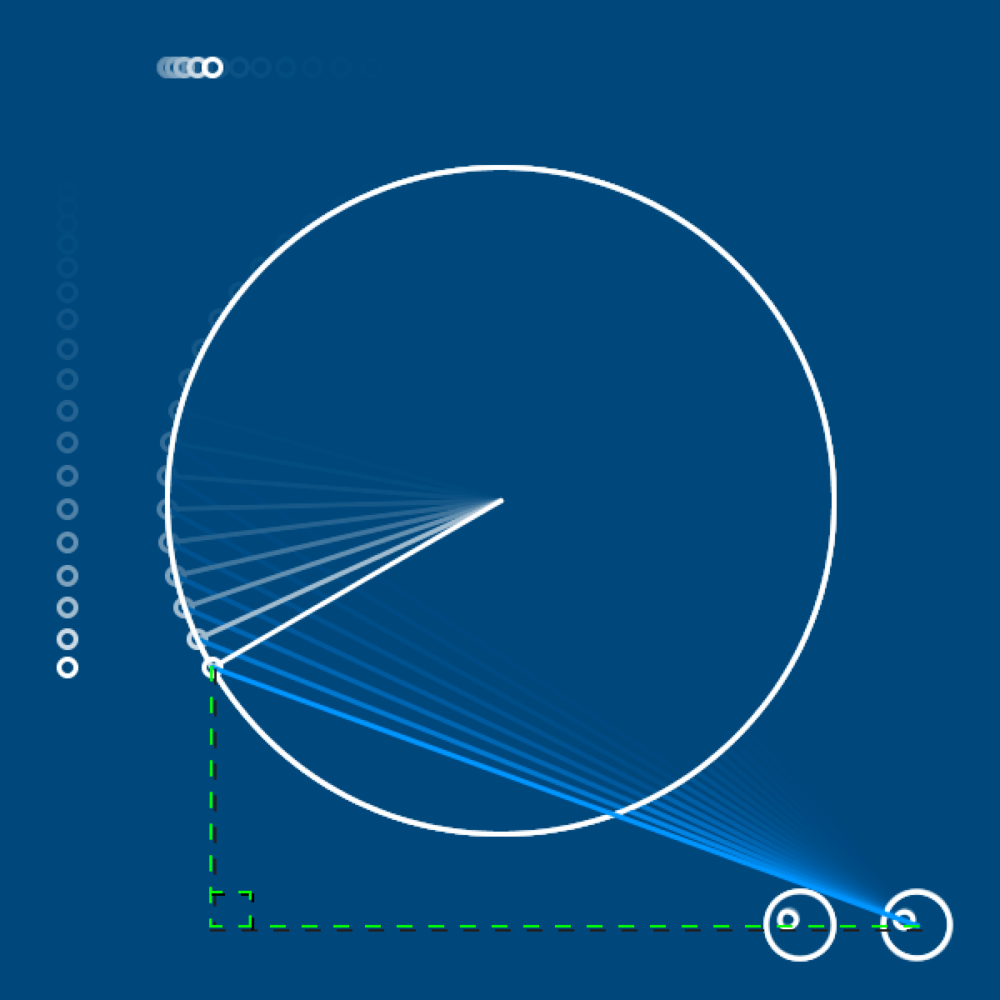
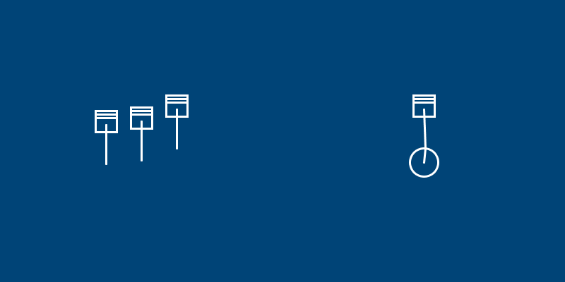

---
jupytext:
  formats: ipynb,md:myst
  text_representation:
    extension: .md
    format_name: myst
    format_version: 0.13
    jupytext_version: 1.14.0
kernelspec:
  display_name: py5
  language: python
  name: py5
---

Trigonometry (often shortened just to *trig*) is a branch of mathematics that studies triangles and uses various mathematical functions, such as *sine*, *cosine* and *tangent*, to calculate angles and distances. You may have taken classes covering trigonometry concepts before, but you won't be expected to know it by heart to use it in py5.

In digital spaces, like games or py5 sketches, trigonometry can be great for simulating physics, such as *periodic motion*. This refers to any motion that repeats itself at regular intervals, like the swinging of a pendulum or the orbit of the moon around the Earth. When we discuss periodic motion, each *cycle* is one complete repetition of this motion, and each *period* is the time it takes for that cycle to complete.

A basic application of trigonometry (from which we can derive other, more complex, mathematical functions) uses the relationship between sides of a right triangle, and their lengths, to determine the angle of a corner. We use *theta*, or its symbol $\theta$, to represent this unknown angle (A, in the diagram below). 



*A simple trigonometric triangle. Note the naming of each side relative to angle A.
TheOtherJesse (Public domain), from [Wikimedia Commons](https://commons.wikimedia.org/wiki/File:TrigonometryTriangle.svg)*

If you know the lengths of any two of these triangular sides, finding the angle of A is easy! Which sides you are already aware of will determine which trigonometric function you have to use.

$sine = opposite \div hypotenuse$

$cosine = adjacent \div hypotenuse$

$tangent = opposite \div adjacent$

Why might you need to know this angle? Well, any two points can be represented with this sort of triangular relationship - just draw a right angle between them, and by using trigonometry, you can determine how to point a line from one to the other. This sort of sine or cosine calculation might be useful when programming an enemy in a game to aim a laser at the player character, or when simulating forces like gravity. Let's demonstrate the relationship between these sorts of calculations and rotations, using py5's `sin()` and `cos()` functions. 

Firstly, to make our calculations easier, we'll use a variable for the scale of our circle - so that we can do our math based on this idea of the *unit circle* (a circle with a radius of 1) while still being able to see it. As long as we use this scale consistently, the math will still work!

You'll also notice we start this code (at least, the `draw()` half) with a `translate()` function, which will place the 0,0 point in the exact center of the screen. Not only is this a good way to manage rotations, but this will also make our grid space resemble [Cartesian coordinates](https://en.wikipedia.org/wiki/Cartesian_coordinate_system), which are common for plotting graphs. 



```{code-cell} ipython3
theta = 0
radius = 1
s = 200 # scale variable

def setup():
    size(600,600)
    no_fill()
    stroke('#FFFFFF')
    stroke_weight(3)

def draw():
    global theta
    background('#004477')
    translate(width/2, height/2)
    diameter = radius*s*2
    ellipse(0,0, diameter,diameter)
    x = cos(theta)
    y = sin(theta)
    print(
      round(x,1),
      round(y,1)
    )
    line(0, 0, x*s, y*s)
    
run_sketch()
```

We've used `round()` here, with two arguments - the variable we're rounding down, and the number of decimal places to round to. If you run this code now, in addition to seeing the `cos()` and `sin()` values of 1.0 and 0.0 respectively, you'll see a line at the position of zero radians of rotation.



If you increase the value of *theta* slightly, to 0.1, this line's angle will increase in the clockwise direction.



Want to mimic the 45 degree angle in that first unit circle diagram? If you recall, traversing half of the circle - 90 degrees of rotation - is half of $\pi$, so we can use py5's built-in `QUARTER_PI` variable here. 

Let's also slightly alter how we draw our line - from `line(0, 0, x*s, y*s)` to `line(0, 0, x*s, y*s*-1)`, reversing the *y* variable - so that this rotation moves counter-clockwise instead of in the clockwise direction.

```{code-cell} ipython3
theta = QUARTER_PI
radius = 1
s = 200 # scale variable

def setup():
    size(600,600)
    no_fill()
    stroke('#FFFFFF')
    stroke_weight(3)

def draw():
    global theta
    background('#004477')
    translate(width/2, height/2)
    diameter = radius*s*2
    ellipse(0,0, diameter,diameter)
    x = cos(theta)
    y = sin(theta)
    print(
      round(x,1),
      round(y,1)
    )
    line(0, 0, x*s, y*s*-1)
    
run_sketch()
```

If you run this code, you'll also notice that both `sin()` and `cos()` return 0.7. At a theta value of 45 degrees, sine and cosine are equal. These values will diverge as theta changes, with perfectly opposite values at 135 degrees. 


Here's a lovely visualization of the way these values change along with the angle of theta:


*LucasVB (Public domain), from [Wikimedia Commons](https://commons.wikimedia.org/wiki/File:Circle_cos_sin.gif)*

How do these waves correspond to the values being output now by `print()`? Here's the annotated version, at that magical 45-degree moment:



Here, both these values are at roughly 0.7. The *sine wave* created by `sin()` represents the Y coordinate of the tip of the arrow, where it touches the circumference of the circle, in a range between -1 and 1. The *cos wave* created by `cos()` represents the X value of that arrowhead in the same range.

Let's make a change to theta inside of our `draw()` function, so that we can actually see this movement in our sketch. Just a small increment each frame will do - something like 0.05.

```{code-cell} ipython3
theta = QUARTER_PI
radius = 1
s = 200 # scale variable

def setup():
    size(600,600)
    no_fill()
    stroke('#FFFFFF')
    stroke_weight(3)

def draw():
    global theta
    theta += 0.05
    background('#004477')
    translate(width/2, height/2)
    diameter = radius*s*2
    ellipse(0,0, diameter,diameter)
    x = cos(theta)
    y = sin(theta)
    print(
      round(x,1),
      round(y,1)
    )
    line(0, 0, x*s, y*s*-1)
    
run_sketch()
```

If we add a few ellipses in the right places, it might help us visualize how this is all working. We'll be adding one that follows the horizontal motion of `cos()`, one that captures the vertical motion of `sin()`, and one that connects the two to the point where our line intersects with the circumference of the circle.

```{code-cell} ipython3
theta = QUARTER_PI
radius = 1
s = 200 # scale variable

def setup():
    size(600,600)
    no_fill()
    stroke('#FFFFFF')
    stroke_weight(3)

def draw():
    global theta
    theta += 0.05
    background('#004477')
    translate(width/2, height/2)
    diameter = radius*s*2
    ellipse(0,0, diameter,diameter)
    x = cos(theta)
    y = sin(theta)
    print(
      round(x,1),
      round(y,1)
    )
    line(0, 0, x*s, y*s*-1)
    
    # These might help...
    ellipse(-width/2+40, y*s*-1, 10, 10) # Sine
    ellipse(x*s, -height/2+40, 10, 10) # Cosine
    ellipse(x*s, y*s*-1, 10, 10) # Where the circumference and line meet!
    
run_sketch()
```



Demonstrating the use of *tangent* is slightly less obvious, but there's a neat application for its inverse function, *arctangent*, that we can demonstrate here. The *X Window System* for the operating system Linux includes a feature called *xeyes*, with a pair of eyes that follow your mouse pointer. This is especially useful when you have multiple large displays, and might lose your cursor somewhere! Using py5's arctangent function, `atan2()` to determine the rotation of each eye, we can make our own pair that will follow theta.

```{code-cell} ipython3
theta = QUARTER_PI
radius = 1
s = 200 # scale variable

def setup():
    size(600,600)
    no_fill()
    stroke('#FFFFFF')
    stroke_weight(3)

def draw():
    global theta
    theta += 0.05
    background('#004477')
    translate(width/2, height/2)
    diameter = radius*s*2
    ellipse(0,0, diameter,diameter)
    x = cos(theta)
    y = sin(theta)
    print(
      round(x,1),
      round(y,1)
    )
    line(0, 0, x*s, y*s*-1)
    
    # Ellipses showing sine, cosine and where they meet
    ellipse(-width/2+40, y*s*-1, 10, 10) 
    ellipse(x*s, -height/2+40, 10, 10) 
    ellipse(x*s, y*s*-1, 10, 10) 
    
    # left eye
    leftx = 180
    lefty = 255
    leftr = atan2(
      y*s*-1 + lefty*-1,
      x*s + leftx*-1
    )
    push_matrix()
    translate(leftx,lefty)
    rotate(leftr)
    ellipse(0,0, 40,40)
    ellipse(8,0, 10,10)
    pop_matrix()

    # right eye
    rightx = 250
    righty = 255
    rightr = atan2(
      y*s*-1 + righty*-1,
      x*s + rightx*-1
    )
    push_matrix()
    translate(rightx,righty)
    rotate(rightr)
    ellipse(0,0, 40,40)
    ellipse(8,0, 10,10)
    pop_matrix()
    
run_sketch()
```



How does `atan2()` work? It's the opposite of the *tangent* calculation from earlier - $tangent = opposite \div adjacent $. Tangent takes the angle, and gives you back the ratio between those sides. Arctangent instead takes a ratio and returns the angle. So by positioning each eye, then adding their values to our existing `sin()` and `cos()` values, we gave it the missing ingredients to determine the angle to theta.



Feeling frazzled by all this math? We'll only use sine and cosine in this upcoming task - not tangents or arctangents.

## Engine task

For this challenge, you'll be recreating the diagram below, which is similar to pistons in an engine.



There's a few different components here, so here's some tips for tackling them. 

You'll need a `setup()` and `draw()` function, of course, and you should also create a variable for theta. It might also be a good idea to have some variable for the speed of your engine, so that fine-tuning it is possible.

```{code-cell} ipython3
theta = 0
speed = 0.05

def setup():
    size(600,600)
    no_fill()
    stroke('#FFFFFF')
    stroke_weight(3)
    
def draw():
    global theta, speed
    theta += speed
    background('#004477')
```

For the three pieces on the left - representing a cross section of the engine - the exact shapes aren't important, and can be drawn however you like. What will allow you to represent their movement is by wrapping them each in a `push_matrix()` and `pop_matrix()` function, and making sure that `sin(theta)` (which we already know represents vertical movement) is used to *translate* them. 

For the circle on the right, where the piston is connecting to a crankshaft and spinning it, you'll need both `sin()` and `cos()`, exactly as we used above. Use a different matrix for this crankshaft and the piston above it, so the piston can be translated here, too - as long as they are both connected in some way via `sin()` and `cos()`, they'll move in sync!

Together with matrices, this is likely the most math-heavy of these py5 tutorials. Good job on making it this far. Looking for a further challenge? Consider other types of engine components - like the [Scotch yoke](https://en.wikipedia.org/wiki/Scotch_yoke#/media/File:Scotch_yoke_animation.gif) - and how you might animate them using trigonometry.
