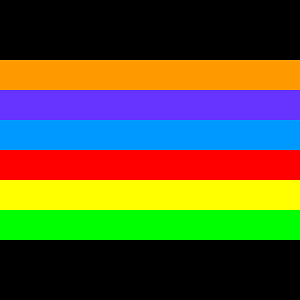
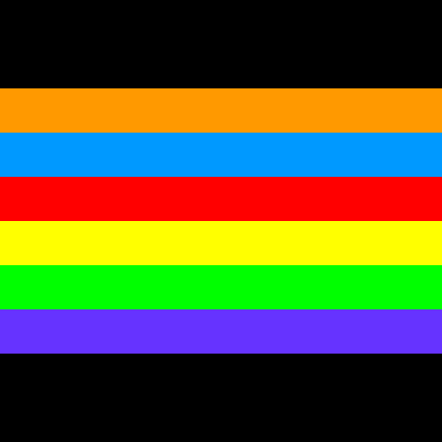
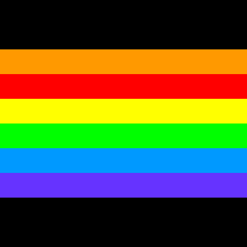
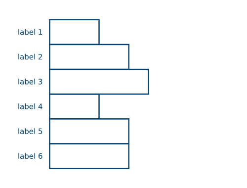
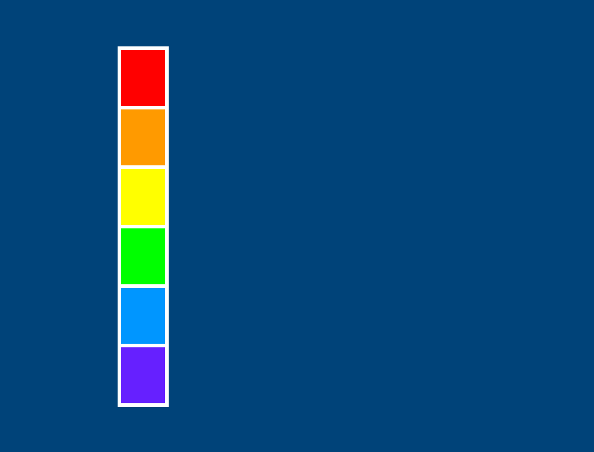
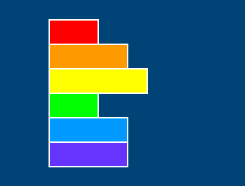
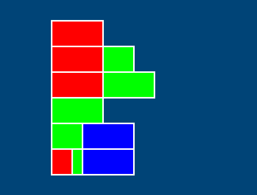
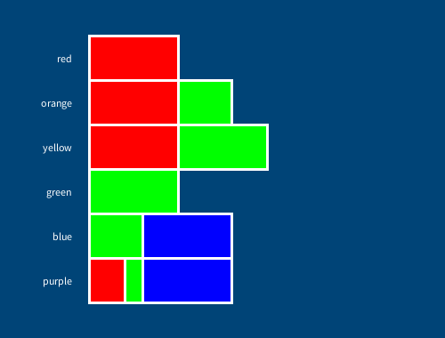
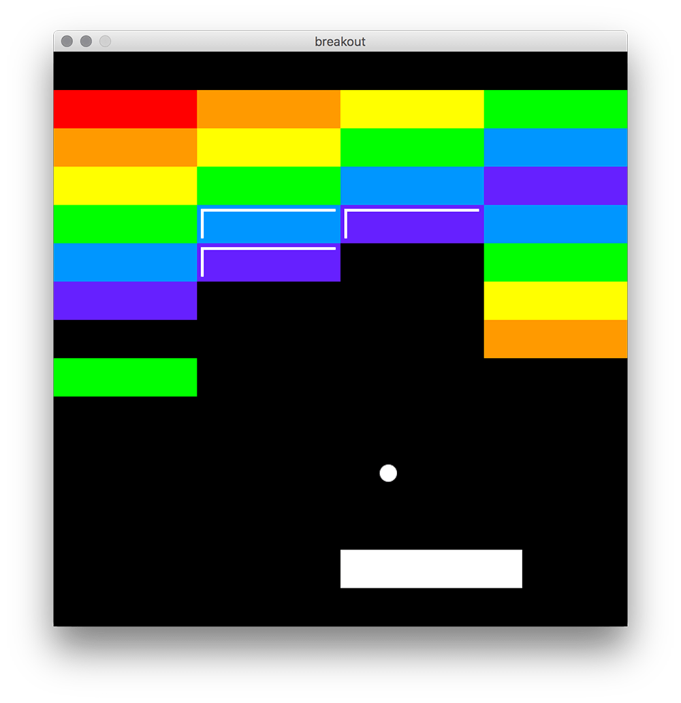
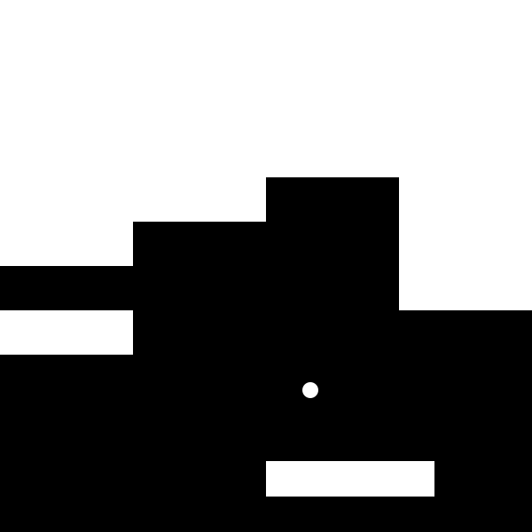

---
jupytext:
  formats: ipynb,md:myst
  text_representation:
    extension: .md
    format_name: myst
    format_version: 0.13
    jupytext_version: 1.14.0
kernelspec:
  display_name: py5
  language: python
  name: py5
---

## lists

Unlike most other data types, *lists* can store multiple values at the same time. Normally, if you wanted to store linked pieces of data, you might use a few different variables to do it. For example, if you were storing the name and age of a student to be used later in your program, you could have a *string* variable for their name, and an *integer* for their age.

```
student = 'Sam'
age = 24
```

With a list, however, you can store both of these data types in the same variable. 

```
student = ['Sam', 24]
```

These square brackets, representing the start and end of the list, contain both our string of text and our integer values. You may have never worked with a list before, but you can probably get some idea of the syntax just by looking at it. A key thing to know about lists is that they are *ordered*, and this order stays the same. If you wanted to store all of your students in a single list, you might just know that the order will always be a student name followed by their age, and these values won't ever float between students or become mixed up. 

```
students = [ 'Sam', 24, 
            'Kim', 23, 
            'Tia', 25, 
            'Val', 21
          ]
```

In addition, many lists will have contents where the ordering of the list is important in itself, like ordering colors in a sequence that you then hope to use.

```
rainbow = [
  'red',
  'orange',
  'yellow',
  'green',
  'blue',
  'indigo',
  'violet'
]
```

So that we can get comfortable with working with lists, let's jump right into using them in py5. We'll be using the `setup()` (and later, `draw()`) function here, not static mode, but what we're doing will work either way.

```{code-cell} ipython3
def setup():
    rainbow = ['blue', 'orange', 'yellow']
    print(rainbow)
    
run_sketch()
```

Run this code, and you'll notice that the entire list - all three values, plus the brackets - is printed to the console. More often, you'll be wanting to retrieve and work with individual elements of the lists, not the entire thing. To do this, we'll be using a particular syntax to refer to just one element at a particular *index* (numbered position) in the list. This will look familiar if you've read the tutorial on working with text in py5 - it's very similar to the slice notation you can use to get specific letters out of a string of text! Computers begin counting at zero, so we can ask for the item at index zero to get the first item in the list.

```{code-cell} ipython3
def setup():
    rainbow = ['blue', 'orange', 'yellow']
    print(rainbow[0])
    
run_sketch()
```

Using this numbering system, you can think of the index number as how far away each item is from the beginning of the list. Our three item list actually has items at index numbers 0, 1 and 2. And, just like with slice notation on strings of text, you can use negative numbers to start from the end of the list, or separate values with a colon (`:`) to extract ranges of values!

```{code-cell} ipython3
def setup():
    rainbow = ['blue', 'orange', 'yellow']
    print(rainbow[-1])  # displays yellow
    print(rainbow[-2])  # displays orange
    print(rainbow[0:2]) # displays ['blue', 'orange']
    
run_sketch()
```

If you try to specify an index outside of the bounds of this list, like `rainbow[3]`, you'll get an error. Just like with strings of text, you can use the length function, `len()`, to determine the length of a list - and since we're counting from 0, you can know that whatever `len()` returns is one higher than the maximum index of your list.

```{code-cell} ipython3
def setup():
    rainbow = ['blue', 'orange', 'yellow']
    print( len(rainbow) ) # displays 3
    
run_sketch()
```

## modifying lists

So far, we've only created lists inside of `setup()`, but many lists are *dynamic*, changing while your program runs. Simply replacing one element of a list is quite easy - you can assign new values to an index number, exactly like you might access it. As an example, you can set `rainbow[0]` to "red" to replace the current value in that spot, "blue".

```{code-cell} ipython3
def setup():
    rainbow = ['blue', 'orange', 'yellow']
    rainbow[0] = 'red'
    print(rainbow) # ['red', 'orange', 'yellow']
    
run_sketch()
```

Directly assigning single values like this is not the only way to modify lists, however. If your list holds a player inventory in a game, or any number of other details that must change after things start up, you'll want to get familiar with the various *list methods*. Generally, these are not specific to py5, but work with all sorts of Python environments. We'll quickly run through a few of these methods.

*.append()* adds an element to the end of a list.

```{code-cell} ipython3
def setup():
    rainbow = ['blue', 'orange', 'yellow']
    rainbow[0] = 'red'
    rainbow.append('blue')
    print(rainbow) # ['red', 'orange', 'yellow', 'blue']
    
run_sketch()
```

*.extend()* can be used to add one list to the end of another list!

```{code-cell} ipython3
def setup():
    rainbow = ['blue', 'orange', 'yellow']
    rainbow[0] = 'red'
    rainbow.append('blue')
    extra_colors = ['indigo', 'violet']
    rainbow.extend(extra_colors)
    print(rainbow) # ['red', 'orange', 'yellow', 'blue', 'indigo', 'violet']
    
run_sketch()
```

*.index()* finds the index position of the first element in the list that matches whatever you put in, or returns an error if it can't find anything.

```{code-cell} ipython3
def setup():
    rainbow = ['blue', 'orange', 'yellow']
    rainbow[0] = 'red'
    rainbow.append('blue')
    extra_colors = ['indigo', 'violet']
    rainbow.extend(extra_colors)
    print(rainbow) # ['red', 'orange', 'yellow', 'blue', 'indigo', 'violet']
    yellowindex = rainbow.index('yellow')
    print(yellowindex)  # 2
    
run_sketch()
```

*.insert()* takes two arguments: a position in the list at which to insert something, and a value to insert.

```{code-cell} ipython3
def setup():
    rainbow = ['blue', 'orange', 'yellow']
    rainbow[0] = 'red'
    rainbow.append('blue')
    extra_colors = ['indigo', 'violet']
    rainbow.extend(extra_colors)
    rainbow.insert(3, 'green')
    print(rainbow) # ['red', 'orange', 'yellow', 'green', 'blue', 'indigo', 'violet']
    
run_sketch()
```

*.pop()* removes the value from the list at the specified index. There are two ways to use it: you can use `.pop()` by itself to simply remove something from a list, or assign a variable to the results of a `.pop()` method.

```{code-cell} ipython3
def setup():
    rainbow = ['blue', 'orange', 'yellow']
    rainbow[0] = 'red'
    rainbow.append('blue')
    extra_colors = ['indigo', 'violet']
    rainbow.extend(extra_colors)
    rainbow.insert(3, 'green')
    print(rainbow)      # ['red', 'orange', 'yellow', 'green', 'blue', 'indigo', 'violet']
    i = rainbow.pop(5)  # removes indigo and assigns it to i
    rainbow.pop(5)      # just removes violet, and gets rid of it
    print(i)            # indigo
    print(rainbow)      # ['red', 'orange', 'yellow', 'green', 'blue']
    
run_sketch()
```

*.remove()* removes the first item in the list that matches the value you give it. You'd want to use this over `.pop()` if you know the value, but not necessarily the index at which it's located.

```{code-cell} ipython3
def setup():
    rainbow = ['blue', 'orange', 'yellow']
    rainbow[0] = 'red'
    rainbow.append('blue')
    extra_colors = ['indigo', 'violet']
    rainbow.extend(extra_colors)
    rainbow.insert(3, 'green')
    print(rainbow)      # ['red', 'orange', 'yellow', 'green', 'blue', 'indigo', 'violet']
    i = rainbow.pop(5)  # removes indigo and assigns it to i
    rainbow.pop(5)      # just removes violet, and gets rid of it
    print(i)            # indigo
    print(rainbow)      # ['red', 'orange', 'yellow', 'green', 'blue']
    rainbow.remove('green')
    print(rainbow)      # ['red', 'orange', 'yellow', 'blue']
    
run_sketch()
```

*.reverse()* does just what it says on the tin, and reverses the order of a list's values.

```{code-cell} ipython3
def setup():
    rainbow = ['blue', 'orange', 'yellow']
    rainbow[0] = 'red'
    rainbow.append('blue')
    extra_colors = ['indigo', 'violet']
    rainbow.extend(extra_colors)
    rainbow.insert(3, 'green')
    rainbow.reverse()   # reverse the order of the rainbow
    print(rainbow)      # ['violet', 'indigo', 'blue', 'green', 'yellow', 'orange', 'red']
    
run_sketch()
```

There are other *list functions* in Python, which can also be used in py5, but those mentioned above will provide a useful introduction and are more than enough for now. In fact, they're all you'll need for this upcoming task. 

## rainbow sequence task

We'll be applying what we've learned so far about manipulating lists to shuffle a rainbow into the correct order. What is the correct order? You may have heard the acronym ROYGBIV - red, orange, yellow, green, blue, indigo, violet. *Indigo* is not well defined (somewhere between blue and violet), and modern color scientists tend to divide the spectrum of light only at blue and violet, without mentioning indigo - so, for the sake of brevity, we'll omit it from our rainbow. 

Let's start by setting up a basic sketch defining a list of rainbow bands, bringing that list into our `setup()` function (by referencing it as a *global* variable), and then drawing a colored rectangle with each band.

We'll be using semicolons again where we *could* use a new line, in order to make sure each `rect()` and each `fill()` is very easy to link to each other.

```{code-cell} ipython3
bands = [
  '#FF9900', # orange
  '#6633FF', # violet
  '#0099FF', # blue
  '#FF0000', # red
  '#FFFF00', # yellow
  '#00FF00', # green
]

def setup():
    global bands
    size(500,500)
    no_stroke()
    background('#000000')
    
    # Drawing our rainbow bands...
    fill(bands[0]); rect(0,100, width,50)
    fill(bands[1]); rect(0,150, width,50)
    fill(bands[2]); rect(0,200, width,50)
    fill(bands[3]); rect(0,250, width,50)
    fill(bands[4]); rect(0,300, width,50)
    fill(bands[5]); rect(0,350, width,50)
    
run_sketch()
```



As you can see, this rainbow is out of order. You can fix it by moving *blue* and *violet* to the end of the list, and swapping the places of *red* and *orange*. Of course, there are many ways to do this with the tools you've been given, so we'll be discussing just one possible sequence of methods you could use.

First, let's move *violet* to the end of the sequence. How would you do this using `.append()` and `.remove()`? If you can find the index where violet is placed, and write it into a variable, it's pretty easy.

```{code-cell} ipython3
bands = [
  '#FF9900', # orange
  '#6633FF', # violet
  '#0099FF', # blue
  '#FF0000', # red
  '#FFFF00', # yellow
  '#00FF00', # green
]

def setup():
    global bands
    size(500,500)
    no_stroke()
    background('#000000')
    
    # Moving Violet to the end of the sequence...
    violet = bands[?] # Place the correct index here!
    bands.append(violet)
    bands.remove(violet)
    
    # Drawing our rainbow bands...
    fill(bands[0]); rect(0,100, width,50)
    fill(bands[1]); rect(0,150, width,50)
    fill(bands[2]); rect(0,200, width,50)
    fill(bands[3]); rect(0,250, width,50)
    fill(bands[4]); rect(0,300, width,50)
    fill(bands[5]); rect(0,350, width,50)
    
run_sketch()
```



Next, we can move *blue* to the correct position, just before *violet*. How might you figure this out using the `.index()` method?

```{code-cell} ipython3
bands = [
  '#FF9900', # orange
  '#6633FF', # violet
  '#0099FF', # blue
  '#FF0000', # red
  '#FFFF00', # yellow
  '#00FF00', # green
]

def setup():
    global bands
    size(500,500)
    no_stroke()
    background('#000000')
    
    # Moving Violet to the end of the sequence...
    violet = bands[?] # Place the correct index here!
    bands.append(violet)
    bands.remove(violet)
    
    # Moving Blue to the second-to-last position...
    blueindex = bands.index('?') # What should go here to find the index of our blue band?
    bands.insert(4, bands.pop(blueindex))
    
    # Drawing our rainbow bands...
    fill(bands[0]); rect(0,100, width,50)
    fill(bands[1]); rect(0,150, width,50)
    fill(bands[2]); rect(0,200, width,50)
    fill(bands[3]); rect(0,250, width,50)
    fill(bands[4]); rect(0,300, width,50)
    fill(bands[5]); rect(0,350, width,50)
    
run_sketch()
```



Finally, we need to swap red and orange. You can do this all in one line if you're clever about how you use `.index()` - and if you use one other method!

```{code-cell} ipython3
bands = [
  '#FF9900', # orange
  '#6633FF', # violet
  '#0099FF', # blue
  '#FF0000', # red
  '#FFFF00', # yellow
  '#00FF00', # green
]

def setup():
    global bands
    size(500,500)
    no_stroke()
    background('#000000')
    
    # Moving Violet to the end of the sequence...
    violet = bands[?] # Place the correct index here!
    bands.append(violet)
    bands.remove(violet)
    
    # Moving Blue to the second-to-last position...
    blueindex = bands.index('?') # What should go here to find the index of our blue band?
    bands.insert(4, bands.pop(blueindex))
    
    # Swapping Orange and Red around
    bands.insert(bands.index('?'), bands.???(?)) 
    # What should we find with .index()? What other method might we need?
    
    # Drawing our rainbow bands...
    fill(bands[0]); rect(0,100, width,50)
    fill(bands[1]); rect(0,150, width,50)
    fill(bands[2]); rect(0,200, width,50)
    fill(bands[3]); rect(0,250, width,50)
    fill(bands[4]); rect(0,300, width,50)
    fill(bands[5]); rect(0,350, width,50)
    
run_sketch()
```


Nice work. Let's keep this code to use for the next challenge.

## loops and lists

The way that lists are structured, and the fact that the data in them can essentially be "swapped out" at any time, makes them particularly well-suited to iterative tasks, like you might perform using loops. If you can create a loop that does something with a particular set of data, any similarly-structured list could be swapped out and perform the same way. 

If you remember using *loops*, you know we usually give them some sort of range, or a number of times the loop should run. To use the contents of a list in a loop, you could first determine the length of that list with `len()`. You can even use the output of the `len()` function as your range directly in a for loop.

```{code-cell} ipython3
def setup():
    rainbow = ['red', 'orange', 'yellow', 'green', 'blue', 'violet']
    print( len(rainbow) ) # displays 6
    
    for i in range( len(rainbow) ): # using that length as our range!
        print(rainbow[i]) # will display a color each time the loop runs
    
run_sketch()
```

We've been using loops with a range each time, but it actually isn't necessary! You can use the list itself as the range, and it will be inherently understood. (Remember that the *band* here, which we called *i* a moment ago, can be named anything you like. Use a name that makes sense to you.)

```{code-cell} ipython3
def setup():
    rainbow = ['red', 'orange', 'yellow', 'green', 'blue', 'violet']
    
    for band in rainbow:
        print(band)
    
run_sketch()
```

However, this approach means you lose the number of the band from the equation. So if you wanted to print each color with its place in the list, you'll have to use a different approach. One option is to bring back *i* and print it as well as the band that corresponds to it. This code...

```{code-cell} ipython3
def setup():
    rainbow = ['red', 'orange', 'yellow', 'green', 'blue', 'violet']
    
    for i in range( len(rainbow) ):
        print( str(i) + ", " + rainbow[i] )
    
run_sketch()
```

...results in this output:
    
```
0, red
1, orange
2, yellow
3, green
4, blue
5, violet
```

You can also use the `enumerate()` function, which can give you both the index and value.

```{code-cell} ipython3
def setup():
    rainbow = ['red', 'orange', 'yellow', 'green', 'blue', 'violet']
    
    for i,band in enumerate(rainbow):
        print( str(i) + ", " + band )
        
run_sketch()
```

None of these three approaches are inherently superior; as with many different coding exercises, which you use will depend on what it is you're trying to do. That brings us to another small challenge.

## rainbow sequence task, revisited

Remember the rainbow code we produced above? It's got this big, ugly chunk in it:

```
fill(bands[0]); rect(0,100, width,50)
fill(bands[1]); rect(0,150, width,50)
fill(bands[2]); rect(0,200, width,50)
fill(bands[3]); rect(0,250, width,50)
fill(bands[4]); rect(0,300, width,50)
fill(bands[5]); rect(0,350, width,50)
```

Rewrite this to use a loop of some kind, instead. In addition to the syntax change, you'll want to replace those hard-coded values for the height of the band with something that increases over time. 

How you do this is up to you. If you're using *i*, you can always multiply it by some number of pixels, and add that to a starting value. If you're using an approach without *i*, you can have a variable for the height of the band, and simply add to it each time the loop runs. Either way, you'll have a much better understanding of how lists and loops interact with each other than you did when you began!

## lists of lists

What's better at organizing data than a list? A list of lists!

If you return to our very first example, with student names and ages, you'll see that we have stored information for a few different students in a single list.

```
students = [ 'Sam', 24, 
            'Kim', 23, 
            'Tia', 25, 
            'Val', 21
          ]
```

Getting information from this list is possible, but tedious. If you searched the list with the method `.index('Sam')`, you could simply know that to find Sam's age, you should also check whatever exists at `.index('Sam') + 1`. Better yet, you could assume that the first student is at `students[0]`, their age is at `students[1]`, and the second student is at `student[2]`, so "stepping" through this information is easy. However, this can become problematic if you later realize you have to add more information about each student, like their ID number. 

```
students = [ 'Sam', 24, '111111',
            'Kim', 23, '111112',
            'Tia', 25, '111113',
            'Val', 21, '111114'
          ]
```

Suddenly, any assumptions about where each student's section of the list begins and ends has been broken. One way to get around this is by using a list of lists.

```
students = [
            ['Sam', 24, '111111'],
            ['Kim', 23, '111112'],
            ['Tia', 25, '111113'],
            ['Val', 21, '111114']
           ]
```

Now it doesn't matter how much data you add to each individual student's list. By using a list of lists, you keep this information contained in categories that may make more sense. This can also be quite powerful for visualizing data, since it's easy to access these categories of values together. 

Just like a line is a one-dimensional shape and a rectangle is two-dimensional, you'll sometimes see lists referred to in terms of how many dimensions they have. A single list is one-dimensional, and this list-of-lists is two-dimensional. Adding dimensions to a list adds complexity, but can also be extremely useful. Let's use some lists of lists to create a bar chart like the one below, starting at zero dimensions (that is, no listed data at all) and working our way upwards. 



```{code-cell} ipython3
def setup():
    size(500,380)
    background('#004477')
    no_fill()
    stroke('#FFFFFF')
    stroke_weight(3)

    h = 50
    translate(100,40)

    # A "length", but no value, represents our 0-dimensional list!
    bands = 6
    rect(0,0, 40,h*bands)
        
run_sketch()
```


The height of our `rect()` relies on our *h* variable, which you can think of as the scale of our visualization (50 pixels per list item), multiplied by the number of bands in our list. Let's turn *bands* into a real *one-dimensional* list of colors. 

We can also replace our single `rect()` with a loop, to draw each band in sequence. You'll notice we use the *enumerate* function here, so that we can multiply our current band number by *h* to position the band of color. 

```{code-cell} ipython3
def setup():
    size(500,380)
    background('#004477')
    no_fill()
    stroke('#FFFFFF')
    stroke_weight(3)

    h = 50
    translate(100,40)

    # A 1-dimensional list, containing a single variable for each list item
    bands = [
      '#FF0000',
      '#FF9900',
      '#FFFF00',
      '#00FF00',
      '#0099FF',
      '#6633FF'
    ]
    
    # A loop, drawing each band in sequence, directly below the previous band
    for i,band in enumerate(bands):
        fill(band)
        rect(0,i*h, 40,h)
        
run_sketch()
```



We're now representing the data in this one-dimensional list. Each color is determining the fill for one of these bands. However, it's not much of a chart at this point. If you wanted to somehow compare these values to each other, you'll need more data. What if we wanted our chart to compare the *brightness* of each band? White is the brightest color, with 100% red, green and blue (RGB) values. 

To determine how bright each of these colored bands are, we can take their RGB values and add them together. However, we don't have enough data in our one-dimensional list to easily access those values.

What would it look like to transform this into a two-dimensional list? We'll be turning our list of bands into a list of lists, where each individual band contains the RGB values for that band. Remember that in a hex code, each pair of letters or numbers represents red, green and blue in order, with FF being the highest possible value (100%). You don't have to convert these hex codes to RGB values manually - we'll do that for you.

In addition, simply using `fill(band)` isn't going to cut it. We'll have to first use the `color_mode()` function to indicate that we're using RGB with a scale of 0 to 100, and then access the elements inside of the sub-lists inside of our list. Sound complex? It's not - our loop was already accessing each element as one `band`, so now that this element is also a list, you can use `band[0]` (and so on) to get the actual values. 

```{code-cell} ipython3
def setup():
    size(500,380)
    background('#004477')
    no_fill()
    stroke('#FFFFFF')
    stroke_weight(3)

    h = 50
    translate(100,40)

   # A 2-dimensional list, with each list item representing the RGB values of a band
    bands = [
      [ 100, 0, 0   ],
      [ 100, 60, 0  ],
      [ 100, 100, 0 ],
      [ 0, 100, 0   ],
      [ 0, 60, 100  ],
      [ 40, 20, 100 ]
    ]
    
    # Setting our color mode to use RGB values with a max scale of 100
    color_mode(RGB, 100)
    
    # A loop, drawing each band in sequence, directly below the previous band
    # Now we're getting those RGB values from inside of each band, and using them as a fill color!
    for i,band in enumerate(bands):
        r = band[0]
        g = band[1]
        b = band[2]
        fill(r, g, b)
        rect(0,i*h, 40,h)
        
run_sketch()
```

This output will look exactly the same as the previous one, but now that it's using a two-dimensional list, we can do more with those values. 

Firstly, let's lengthen the bars in our chart according to their brightness. We can do this just by adding together the R, G and B values, and then using that to determine the width of each band. 

```{code-cell} ipython3
def setup():
    size(500,380)
    background('#004477')
    no_fill()
    stroke('#FFFFFF')
    stroke_weight(3)

    h = 50
    translate(100,40)

   # A 2-dimensional list, with each list item representing the RGB values of a band
    bands = [
      [ 100, 0, 0   ],
      [ 100, 60, 0  ],
      [ 100, 100, 0 ],
      [ 0, 100, 0   ],
      [ 0, 60, 100  ],
      [ 40, 20, 100 ]
    ]
    
    # Setting our color mode to use RGB values with a max scale of 100
    color_mode(RGB, 100)
    
    # A loop, drawing each band in sequence, directly below the previous band
    # Now we're getting those RGB values from inside of each band, and using them as a fill color!
    for i,band in enumerate(bands):
        r = band[0]
        g = band[1]
        b = band[2]
        fill(r, g, b)
        # Now instead of a width of 40, we're adding up those prior values!
        sum = r + g + b
        rect(0,i*h, sum,h)
        
run_sketch()
```



Do these brightness values "feel" correct to your eye? Human visualization is not an exact science, and of course it's slightly unique to every person. You'll probably agree that the yellow is very bright, but you might disagree that the red feels just as bright as the green. In fact, even with the same brightness values, green will often look more prominent, due to the number of receptors for each color in the eye (you have more green receptors than red ones). 

There's another way to visualize this - if we take our summed value for each color and divide it by 3, we come up with the average brightness of that color. You might remember that if the value is the same for a color's red, green and blue values, that will always be a shade of grey. By using this new average value for our fill color instead, we can very easily tell the difference in the brightness of these disparate colors. Let's comment out our old `fill()` and replace it. 

```{code-cell} ipython3
def setup():
    size(500,380)
    background('#004477')
    no_fill()
    stroke('#FFFFFF')
    stroke_weight(3)

    h = 50
    translate(100,40)

   # A 2-dimensional list, with each list item representing the RGB values of a band
    bands = [
      [ 100, 0, 0   ],
      [ 100, 60, 0  ],
      [ 100, 100, 0 ],
      [ 0, 100, 0   ],
      [ 0, 60, 100  ],
      [ 40, 20, 100 ]
    ]
    
    # Setting our color mode to use RGB values with a max scale of 100
    color_mode(RGB, 100)
    
    # A loop, drawing each band in sequence, directly below the previous band
    # Now we're getting those RGB values from inside of each band, and using them as a fill color!
    for i,band in enumerate(bands):
        r = band[0]
        g = band[1]
        b = band[2]
        # fill(r, g, b)
        # Now instead of a width of 40, we're adding up those prior values!
        sum = r + g + b
        avg = sum / 3
        # Filling with our new average color... 
        fill(avg, avg, avg)
        rect(0,i*h, sum,h)
        
run_sketch()
```


For another way to visualize the components in this sub-list, we can turn each band into three different `rect()` functions - one for its red value, one for green, and one for blue. We'll have to modify our loop a bit for this. Of course, each band will need its own `fill()` now, and its own `rect()`. By adding the values of one color to the positioning of subsequent colors, we make sure they all appear side-by-side. 

```{code-cell} ipython3
def setup():
    size(500,380)
    background('#004477')
    no_fill()
    stroke('#FFFFFF')
    stroke_weight(3)

    h = 50
    translate(100,40)

    bands = [
      [ 100, 0, 0   ],
      [ 100, 60, 0  ],
      [ 100, 100, 0 ],
      [ 0, 100, 0   ],
      [ 0, 60, 100  ],
      [ 40, 20, 100 ]
    ]
    
    color_mode(RGB, 100)
    
    # A loop, drawing each band in sequence, directly below the previous band
    for i,band in enumerate(bands):
        r = band[0]
        g = band[1]
        b = band[2]
        
        # Red band
        fill(100, 0, 0)
        rect(0,i*h, r,h)
        
        # Green band
        fill(0, 100, 0)
        rect(0+r,i*h, g,h)
    
        # Blue band
        fill(0, 0, 100)
        rect(0+r+g,i*h, b,h)
        
run_sketch()
```



Now these bands really need some sort of label, to differentiate the actual colors from each other. If you wanted, you could actually use a three-dimensional list for this, where each list contains a label as well as the list with its real values...

```
bands = [
  [ [ 100, 0, 0  ], 'red'    ],
  [ [ 100, 60, 0 ], 'orange' ],
  # and so on, and so forth...
```

...but this is an inelegant solution at best, and really, it's totally overkill. We can just add another value, a label, to each of these colored bands. Then we can use py5's text display functions to print that text off to the side. 

```{code-cell} ipython3
def setup():
    size(500,380)
    background('#004477')
    no_fill()
    stroke('#FFFFFF')
    stroke_weight(3)

    h = 50
    translate(100,40)

    bands = [
      [ 100, 0, 0, 'red'     ],
      [ 100, 60, 0, 'orange' ],
      [ 100, 100, 0, 'yellow'],
      [ 0, 100, 0, 'green'   ],
      [ 0, 60, 100, 'blue'   ],
      [ 40, 20, 100, 'purple']
    ]
    
    color_mode(RGB, 100)
    
    # A loop, drawing each band in sequence, directly below the previous band
    for i,band in enumerate(bands):
        r = band[0]
        g = band[1]
        b = band[2]
        
        # Red band
        fill(100, 0, 0)
        rect(0,i*h, r,h)
        
        # Green band
        fill(0, 100, 0)
        rect(0+r,i*h, g,h)
    
        # Blue band
        fill(0, 0, 100)
        rect(0+r+g,i*h, b,h)
        
        # Text label
        fill('#FFFFFF')
        text_align(RIGHT)
        text(band[3], -20,i*h+30)
        
run_sketch()
```



There are a lot of lists that work perfectly well in one dimension, like shopping lists. Other lists, like the one above, work great in two dimensions, and become more like a grid, table or database of information as a result, which can be very useful for visualizing data. Although there are cases where three-dimensional (or higher) lists are useful, it's worth asking yourself if your data is better presented in two dimensions.

## breakout task

As a challenge, let's use a three-dimensional list to create a visualization of a level from a "breakout" style game. (You won't be able to play it without a lot of extra coding, but the visual result is quite neat!)



As you can see, these bricks are arranged in rows. The "shiny" bricks, with two extra white lines, are there to indicate a brick that must be struck twice with the ball to break through. Let's take a look at some code to start you off with and see how this corresponds to the list you're given.

```{code-cell} ipython3
r = '#FF0000' # red
o = '#FF9900' # orange
y = '#FFFF00' # yellow
g = '#00FF00' # green
b = '#0099FF' # blue
p = '#6633FF' # violet

bricks = [
  [ [0,r,1], [1,o,1], [2,y,1], [3,g,1] ], # row 0
  [ [0,o,1], [1,y,1], [2,g,1], [3,b,1] ], # row 1
  [ [0,y,1], [1,g,1], [2,b,1], [3,p,1] ], # row 2
  [ [0,g,1], [1,b,2], [2,p,2], [3,b,1] ], # row 3
  [ [0,b,1], [1,p,2],          [3,g,1] ], # row 4
  [ [0,p,1],                   [3,y,1] ], # row 5
  [                            [3,o,1] ], # row 6
  [ [0,g,1]                            ]  # row 7
]

def setup():
    global r, o, y, g, b, p, bricks
    size(600, 600)
    no_stroke()
    background('#000000')
    
    # ball and paddle
    fill('#FFFFFF')
    ellipse(350,440, 18,18)
    rect(300,520, 190,40)
```

First, we've associated a hex code with each of our six color options. The *bricks* list, at its top level, contains seven rows. Each row is a list of blocks. Each block has three values inside of it: the number of its column, its fill colour, and whether it has a hit count of 1 or 2 (to know if it needs to be shiny). We can tell from this that `bricks[0]` will give us the first row, `bricks[0][0]` will give us the first brick, and `bricks[0][0][0]` will give us the column number of the first brick - but ideally you'll use a better way to access these values! 

To help you tackle this problem, let's add a cleverly nested loop that can make it easier to deal with nested values.

```{code-cell} ipython3
r = '#FF0000' # red
o = '#FF9900' # orange
y = '#FFFF00' # yellow
g = '#00FF00' # green
b = '#0099FF' # blue
p = '#6633FF' # violet

bricks = [
  [ [0,r,1], [1,o,1], [2,y,1], [3,g,1] ], # row 0
  [ [0,o,1], [1,y,1], [2,g,1], [3,b,1] ], # row 1
  [ [0,y,1], [1,g,1], [2,b,1], [3,p,1] ], # row 2
  [ [0,g,1], [1,b,2], [2,p,2], [3,b,1] ], # row 3
  [ [0,b,1], [1,p,2],          [3,g,1] ], # row 4
  [ [0,p,1],                   [3,y,1] ], # row 5
  [                            [3,o,1] ], # row 6
  [ [0,g,1]                            ]  # row 7
]

def setup():
    global r, o, y, g, b, p, bricks
    size(600, 600)
    no_stroke()
    background('#000000')
    
    # ball and paddle
    fill('#FFFFFF')
    ellipse(350,440, 18,18)
    rect(300,520, 190,40)
    
    # Just because we often call one list item 'i' doesn't mean we always should. 
    # By giving it a descriptive name of *row*, and the nested version *brick* (singular),
    # we take a lot of the mystery out of what these individual items actually refer to.
    for row,bricks in enumerate(bricks):
        for brick in bricks:
            x = brick[0]*150 # Getting the X value from the column, times 150 pixels
            y = row*50       # Getting Y from the row, times 50 pixels
            
            # Placing a rect, 150 pixels wide and 50 pixels tall, at the correct x and y values
            rect(x, y, 150, 50)
            
run_sketch()
```



Believe it or not, those white areas are all of the bricks in the list! There's a few steps required to get it looking like the example image. 

First of all, you'll need to add a `fill()` that gets the color of the current brick.

Next, you need to add some sort of statement that checks what the hit count of that brick is... and draws a few extra lines if it's a brick requiring two hits. Good luck!
